How to Find Hidden Cameras and Spy Bugs (The Professional Way)

This is without a doubt most thorough guide to detecting hidden cameras and covert spy gear that is online.

The simple strategies that we are going to show you will effectively clear most rooms for hidden cameras and bugs without having to use super expensive countersurveillance gear or an outside company.

Most of the processes and steps that we are going to show you are adopted from some of our best government agencies, where countersurveillance is of a grave concern to them, so these techniques have been tried and tested

And the best part about this guide?

**Anyone can do it!**

This post will reveal the exact step-by-step process that we use to sweep for covert spy gear and cameras

So let's get started!  

**Sweeping For Hidden Cameras & Devices Is Becoming A Necessity**  

Just in the past couple of years, we have seen a rise in hidden cameras and spy gear being used in nefarious ways, targeting guests that stay on cruise lines, in hotel rooms, Airbnb houses, the list goes on. Unfortunately, this trend does not seem to be going away anytime soon, but you can, however, take measures to ensure that you are not a victim. In this post, we will show you exactly how to do that.

**What Type of Device Could Be Used Against Me?**

Before sweeping the room in question, you should first try to determine what type of surveillance equipment, if any, would be used against you in your specific situation.

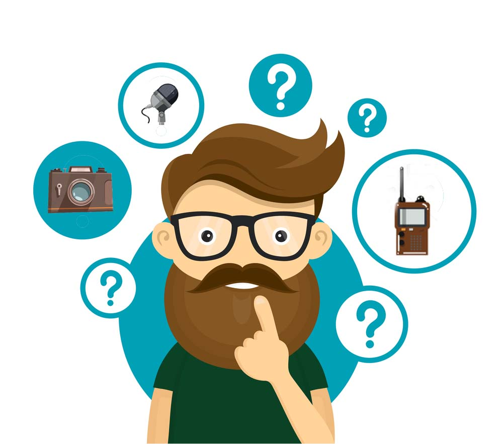

For example, if you find yourself staying at a bed and breakfast or a hotel, you would most likely find surveillance equipment that would utilize video to capture compromising clips or photos of the occupants.

If you are in a business meeting environment like a conference room, you could assume that the intelligence being gathered would encompass important conversations and interactions between parties. The most likely device to be used in this situation and environment would be an audio recorder.

When sweeping a room for surveillance equipment, Keep this in the back of your mind and pay close attention to the areas of the room that are the most vulnerable and compromising.

     

**Break Your Bug Sweep Down Into These Steps:**

                       

**Step 1: Enter The Room Assuming You Are Under Surveillance**

If this is your first time staying in a new hotel or an Airbnb, automatically assume that you are currently being recorded and surveilled.  

**But relax! No need to panic.**  

Odds are in your favor that you are not being monitored, but you still want to sweep your location to be 100% sure.

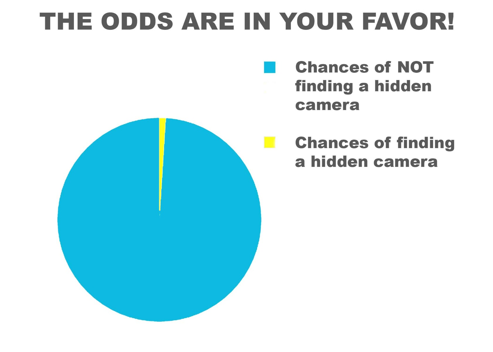

Think of it like riding in a vehicle and putting your seatbelt on. Chances are you won't need it, but you will be glad you put it on if you do.

So it is always best to just assume you are being recorded until you are 100% certain the room is clear of all surveillance equipment.

       

**Step 2: Split The Room Into Quadrants**

Start off by standing in the center of the room.

Next, split the room into quadrants.

Once you have identified your quadrants and your start points, go through each quadrant one at a time and clear it, using the techniques in this guide.

Splitting the room into sections will help you to systematically and meticulously go through the room and clear each section without skipping over any of the fine details.

            

                         

**Step 3: Start Off By Making Basic Observations**

Perform a general scan and pay attention to anything that looks out of place or appears suspicious.

Are there duplicate items in the room? Such as clocks, smoke detectors or coffee pots.

Are there any unusual holes in the walls or ceiling?

Are any of the items in the room positioned in an unusual way?

Check all of the appliances like televisions, clocks, phones, hair dryers, and coffee pots for exposed wiring, suspicious lights, or anything that looks abnormal.

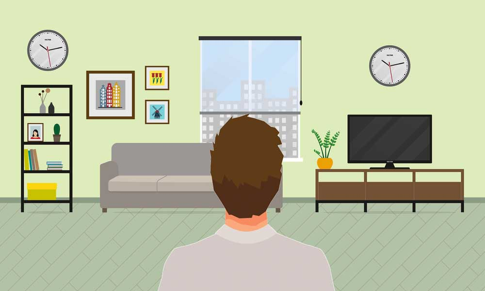

**Step 4: Check Every Outlet And Identify What Is Plugged Into Each Socket**

All surveillance devices require a power source; whether that power source is powered by an electrical outlet or a wireless battery may depend on how long you are expected to occupy the room and if the perpetrator has access to your room.

Devices that run on batteries have limited lifespans, however, those that run on electrical power can be used for constant and long-term surveillance.

Conduct a sweep of the outlets and identify everything that is plugged into them. Pay close attention to anything plugged in that may seem out of place.

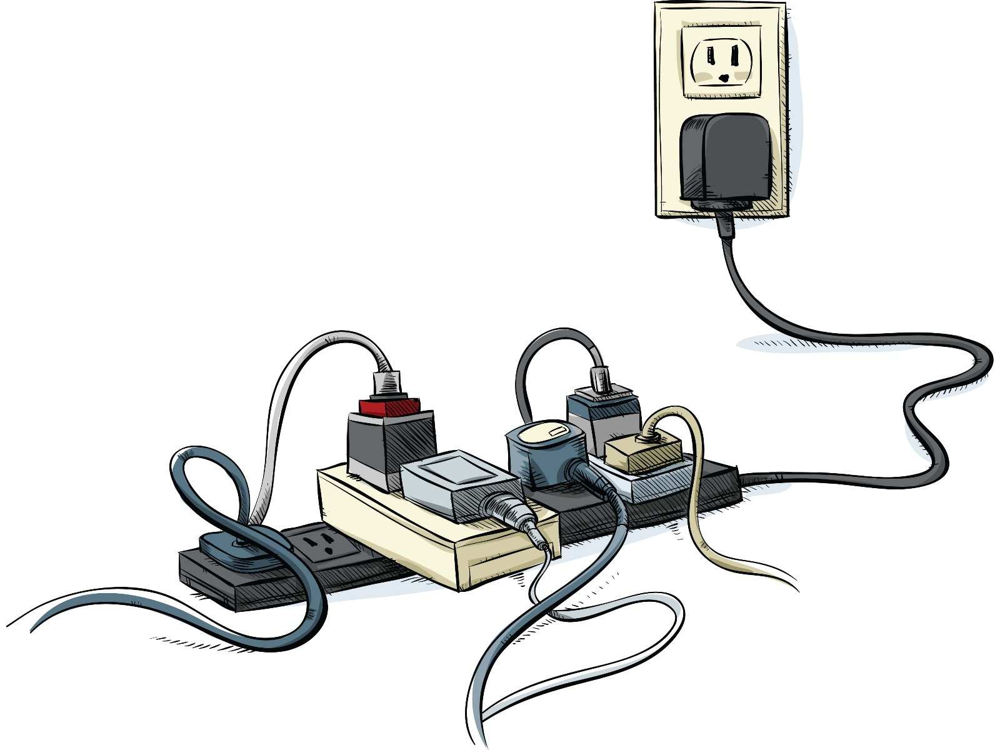

**What About Video Surveillance And Audio Recorders?**

Any type of video surveillance device would be positioned in a way that would provide the best opportunity to capture footage.

For example, a video surveillance device would be aimed at the bathroom, in front of the dresser where one would get changed, or aimed at the bed. It is important to be aware of all choke points or high traffic areas in the room that would force occupants to take a certain path or occupy a certain area in the room.

Some areas to pay attention to are the bathroom door, the front door, and all hallways.

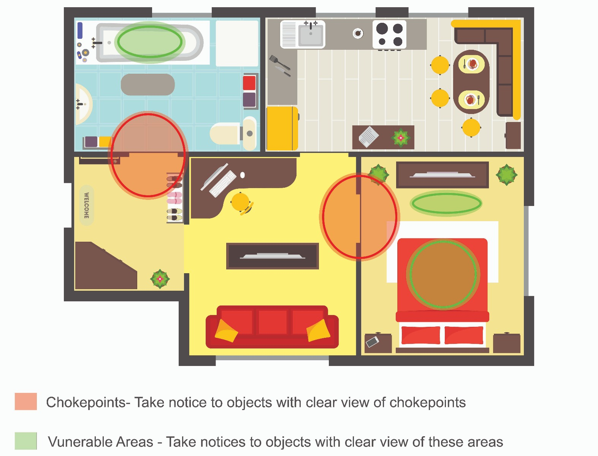

It is important to pay special attention to locations where conversations would take place.

If someone wanted to plant surveillance equipment in a room with the specific intent of capturing crystal clear audio of a conversation between parties, they would place the device(s) in any area people are expected to gather.

Some areas to pay close attention to are beds, tables, couches, chairs, desks, and balconies.  

**Objects Or Amenities That Could Be Vulnerable To Surveillance Equipment:**  

Do the devices and appliances in your room match the other devices and appliances in the rest of the room or house?

Are any of them placed in peculiar positions or locations?

Are these devices different from room to room?

Always keep an eye out for smoke detectors, thermostats, outlets, fixtures, and bulbs. Normally, common sense would suggest these devices should all match and remain relatively similar since they are usually original to the construction of the room or building.

This could suggest an anomaly that should be inspected further. More importantly, are there similar devices found from room to room that are placed in peculiar positions or locations?

This could also suggest an anomaly that should be inspected further. During your sweep, you should always ask yourself these questions and inspect further if warranted.

Does the artwork in the room match the décor or the theme of the room or house you are occupying?

It is more common than not for hotels and rented rooms to have a common theme or décor pattern.

For example, a modern hotel would have mostly modern décor, fixtures, furniture, and appliances. A rustic Bed and Breakfast might have older furniture with an old world charm. Keep an eye out for fixtures and pieces of décor that seem out of place.

**Know The Ammenties That Are Offered**  

It is always recommended to be very knowledgeable and aware of the services and amenities of the location you are staying in and compare those standards to the devices and appliances in your room.

For instance, if the room is listed to have one coffee pot, but you see two in your room, inspect them both for anomalies.

If coffee is offered downstairs, is the coffee pot in your room supposed to be there?

Do you see more than one clock in your room?

Most websites will list expected room amenities and devices, but you can always call the front desk and ask if you are unsure of what devices and amenities should be in your room.

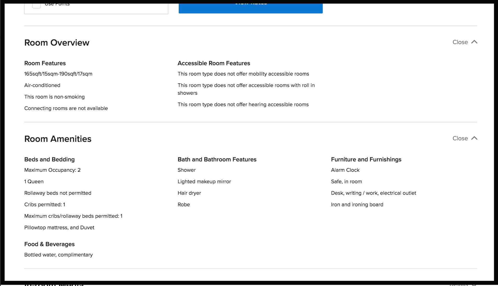

If your room has ceiling tiles, are they part of a drop ceiling system or are they build into the ceiling?

Are there any holes in them?

Do any of the tiles seem to stick out above the others or sit differently?

If your room has a drop ceiling where the ceiling tiles can easily be pushed up, inspect them and make sure there are not any surveillance devices hidden above them if you are suspicious.

**Check The Mirrors**  

It is always recommended to inspect every mirror in your room to ensure it is not a two-way mirror.

The best way to check for a two-way mirror is by using your fingertip. On most mirrors, if you place your fingertip on the mirror, the reflection of it will not touch. Instead, it will leave a quarter inch gap or so.

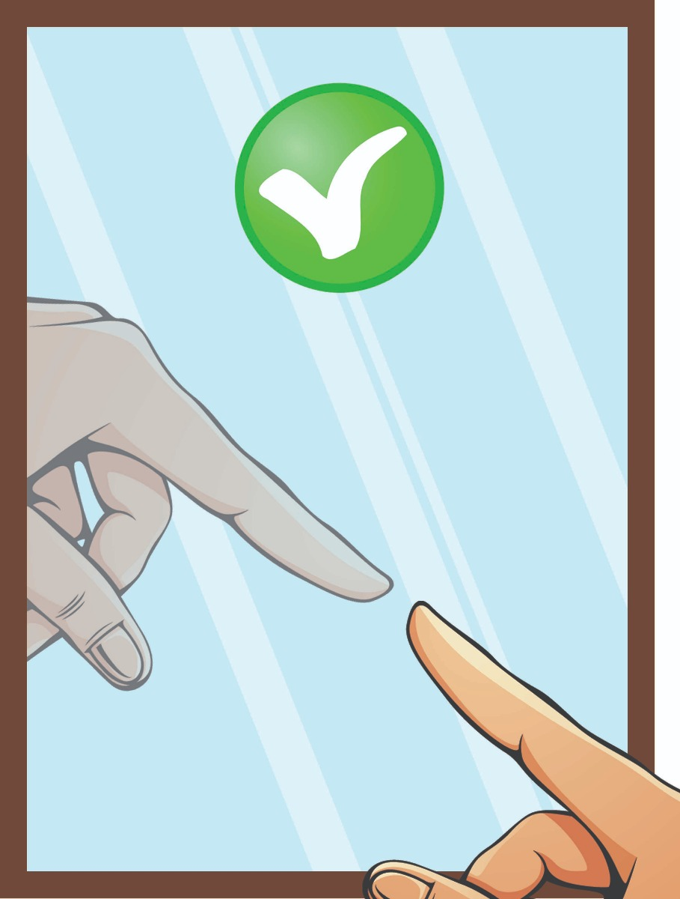

If you put your fingertip on the mirror and the reflection is touching your finger, you should inspect it further.

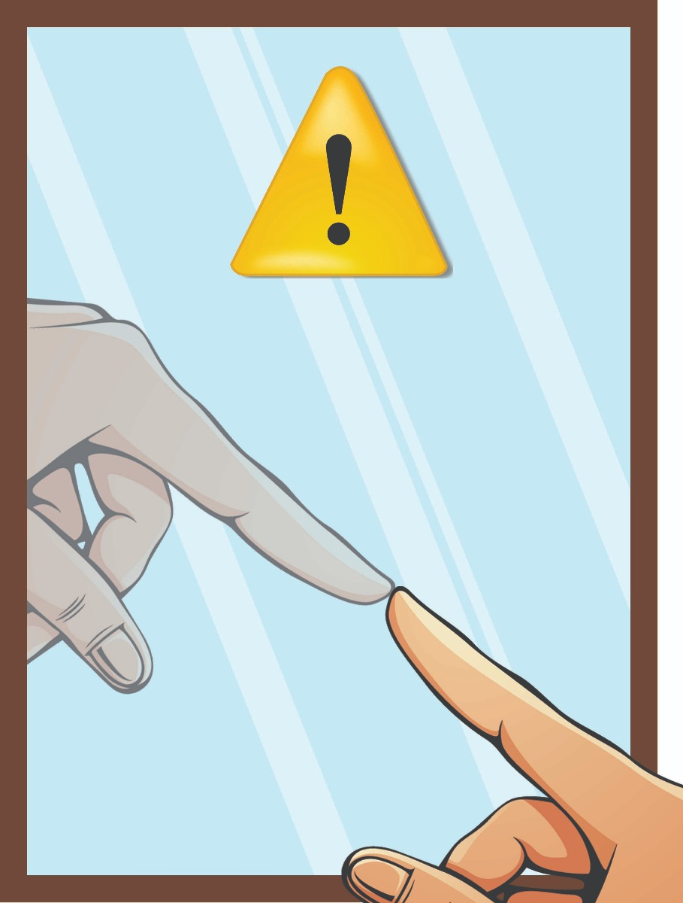

It is important to note that some establishments like bars or gas stations may use a metal back with a mirror tint instead of using a real mirror, which will give the appearance of it being a 2 way mirror. This is meant to prevent the mirror from shattering and becoming a liability for the business.

Another technique is to shut off the lights and shine a flashlight through the mirror to see if there is anything behind it.

**Let's Take A Deeper Look:**

Once you have completed a visual and physical inspection, it is suggested to take a closer look at all suspicious objects, devices, or locations, using a few countersurveillance tools that are easy to use and best of all, affordable. They will be used to find the surveillance devices that you were unable to locate with a visual inspection.

**Step 1: Purchase A Radio Frequency (RF) Detector**

Most long-term surveillance devices will need a way to transmit the information back to the surveyor.

An RF detector works by scanning the area in search of devices emitting radio waves and once detected will produce an audible tone for the user that fluctuates as the device is detected closer or further away. This will continue until the user is ultimately able to locate the device emitting radio waves.

Commercial spy devices usually transmit in a range of 10 MHz to 8 MHz. Most RF detectors will detect them and scan from 10 hertz all the way to 24 GHz. Professional Grade RF detectors have an even broader RF range in addition to a ton of specialized features. However, these devices are expensive and could cost hundreds or even thousands of dollars.

Your specific situation will determine the level of detection you would need. The average person using an RF detector to simply sweep a hotel room or an AirBnB room can get away with a simple device that will detect and locate unknown RF transmissions. You can purchase a quality [RF detector](https://www.senteltechsecurity.com/professional-audio-video-and-tracking-bug-detector.html), such as the one below, that will get the job done for a little over $100.

[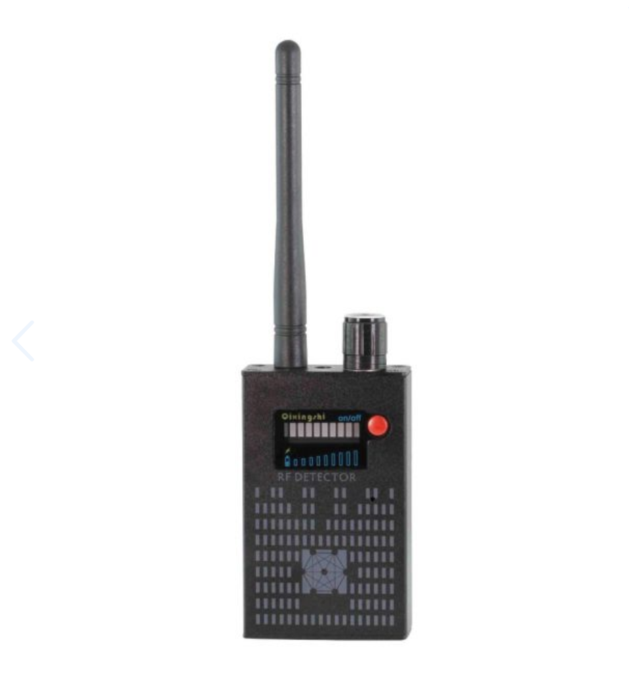](https://www.senteltechsecurity.com/professional-audio-video-and-tracking-bug-detector.html)

**Step 2: Pick Up A Camera Lens Detector**

RF detectors will only detect wireless devices that transmit information.

What about stand-alone devices that save the information to an SD card?

For that, it would be beneficial to have a camera lens detector at your disposal.

A camera lens detector works by detecting the reflection of light off of the lens of a recording camera.

When using a camera lens detector, the lens of a camera will sparkle or illuminate on the viewing screen indicating to the user that a camera may be present.

If you are looking for an all-in-one device that has the ability to detect both RF and a camera lens, the [Lawmate Defender DD802](https://www.senteltechsecurity.com/lawmate-dd802-defender.html) would be an excellent choice. This is a professional grade device that will be very effective in detecting and locating both RF and camera lenses.

[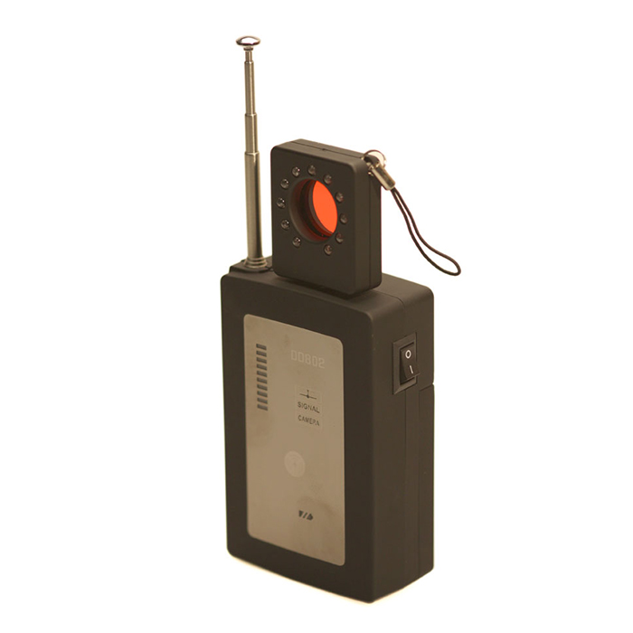](https://www.senteltechsecurity.com/lawmate-dd802-defender.html)

**Step 3: Turn Off All Emitters Before Sweeping**

Before beginning your sweep with an RF detector, it is important for you to ensure all devices that could possibly emit an RF signal be fully and completely powered down.

Be sure to power down all cell phones, Bluetooth devices, laptop computers, tablets, etc.

It is also a good idea to test your RF detector before your sweep by turning it on and sweeping over your cell phone. If your RF detector is able to detect the frequency being emitted from your cell phone, it is functioning correctly.

**Step 4: Conduct Your Sweep "Painting" The Walls**

Pick the edge of one of your quadrants and start "painting" the walls.

"Painting" the walls simply means to slowly and methodically walk up and down the walls and scan them visually and with your RF detector in a painting motion.

While completing this process, you should also be visually inspecting the walls looking for any sort of disturbances or unusual anomalies, while at the same time keeping an ear out for your RF detector.

You will paint the walls until you have reached the end of your quadrant. If nothing was detected on that pass, you should mark that quadrant clear for any transmitting devices and move to the next one.

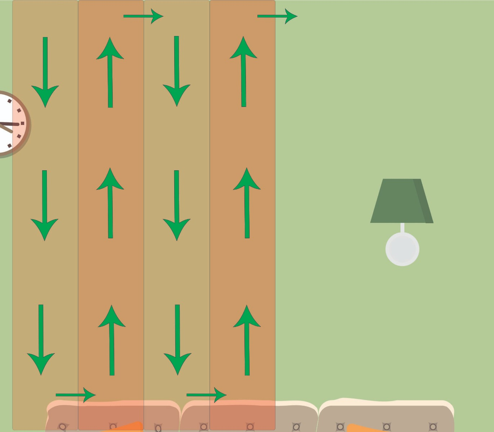

**Step 5: "Paint" The Walls Using A Camera Lens Detector**

Following the same "painting" method as before, repeat the same process in each quadrant using your camera lens detector.

**Step 6: Turn Off The Lights**

Turn off the lights and look for any tiny lights that seem out of the ordinary.

Most spy cameras have indicator lights that will tell the user if the camera is recording or powered. If the surveyor neglected to turn these indicator lights off, you can use their mistake to your advantage by easily detecting and locating them.

**Step 7: Use Your Phone**

In order to record video at night, most spy cameras will need some type of Infrared (IR) technology to effectively illuminate the scene digitally so that the footage being recorded is visible in complete darkness.

True Infrared Radiation (IR) lighting is ideal for use in covert surveillance because it is not detectable by the human eye. The visible wavelengths are from approximately 390 to 700 nm while the Infrared spectrum range is 700 nm to 1000000 nm.

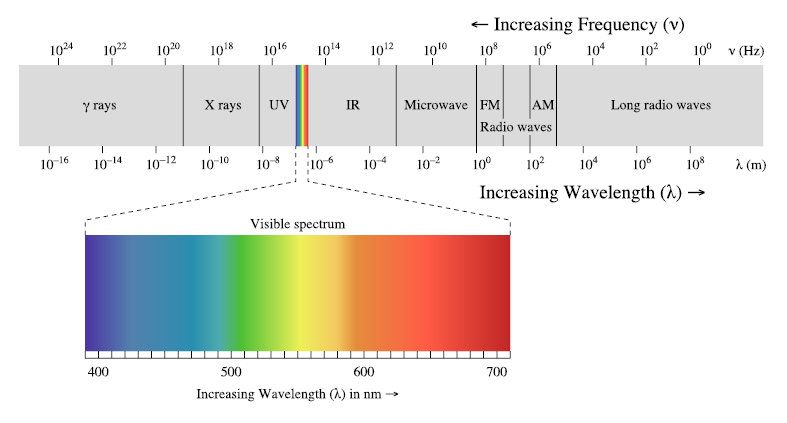

One quick and cost-effective way to detect IR light is by using the front-facing camera on your phone.

Unlike the rear-facing camera, the front-facing camera does not have an IR filter and can easily pick up IR lights in the dark.

To try this at home, grab your TV remote, which uses IR light to send information to your TV and open the front-facing camera on your phone. Next, point the front end of the remote at the camera and press any of the remote buttons. The IR light that is normally not visible will be completely visible on your camera screen. IR light is easy to conceal and hide from unsuspecting victims of surveillance. Keep this in mind when conducting your sweep.

**What About Thermal Detection?**

One more device to be aware of that will aid in the detection of surveillance equipment is a thermal imaging camera.

Any type of surveillance device, whether it is video, audio, or IR, it will emit some sort of heat signature that would be easily detected with a thermal imaging device.

Most surveillance cameras emit a fair amount of heat due to their small size and the fact that they are normally enclosed in something discreet that does not provide much ventilation.

FLIR® offers an outstanding device called the [FLIR® ONE Gen 3](https://www.flir.com/products/flir-one-gen-3/), that connects to your smartphone and allows it to be used as a thermal imaging camera.

[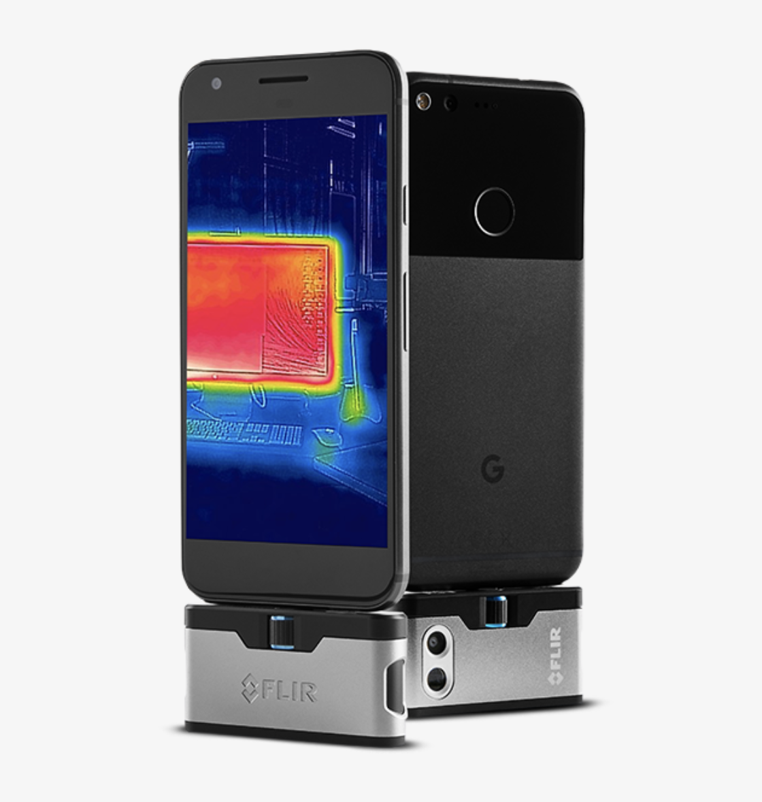](https://www.flir.com/products/flir-one-gen-3/)

A thermal imaging camera device like this will help you locate hot spots in the room directly on your phone.

If you locate a hot spot behind a wall, a picture, a smoke detector, or behind any other device or location that seems unusual or peculiar, you should be able to detect the anomaly. At that time, it would be appropriate to take a closer look and inspect for surveillance devices.

**What To Do If You Locate A Surveillance Device:**

If you do encounter a surveillance device, do not disturb it. Immediately walk out of view of the camera and call the authorities.

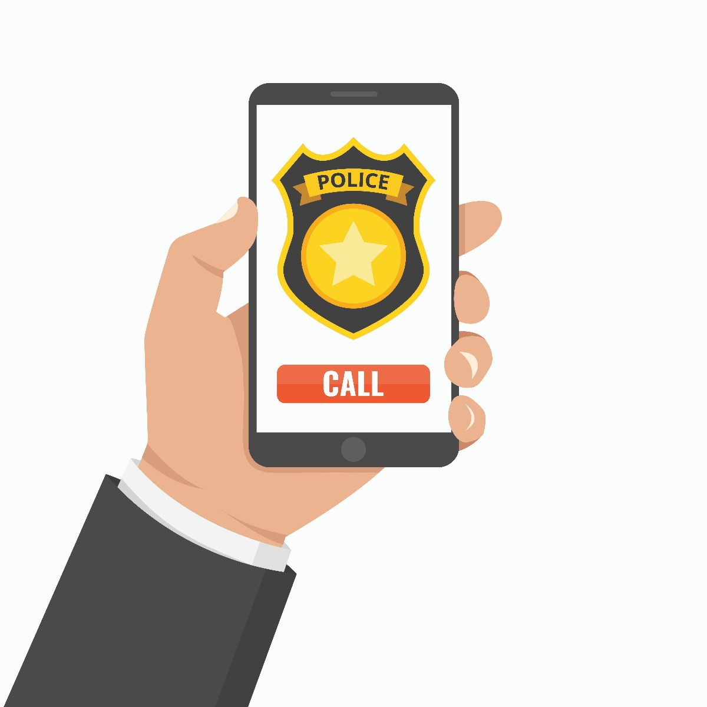

Most of the newer surveillance cameras use motion detection with a loop-recording feature for the SD card. There have been quite a few cases of the perpetrator inadvertently recording themselves placing and walking away from the device because of this feature.

By staying out of the camera view, you reduce the chance of recording over any of the old footage should the SD card become full. If the perpetrator did record themselves on the camera, it is obviously best to minimize the chance of that footage becoming recorded over.

You may ask yourself what are the legalities of a hidden camera? Check out this [Blog](https://www.senteltechsecurity.com/blog/post/blog-9/) post for more info.

I hope you find this blog useful. If you have any questions or comments feel free to leave a comment below.