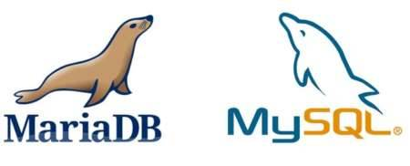

How to create a user in MySQL/MariaDB and grant permissions on a specific database

**Creating a user in MySQL or MariaDB** and **granting permissions** to him to access a specific database and be able to write data on it is a very usual task that is necessary to perform each time you install a new application based on any of these database engines, like web applications running on top of **LAMP stack**. Whether it is a simple WordPress, or a more complex application tailor made, one way or another you will always have to complete these steps at some point before its deployment.

These commands are valid to be executed both from the generic MySQL **command line interface** and from any other tool that allows to execute SQL commands against a MySQL instance such as phpMyAdmin or MySQL Workbench. They can also be run in MariaDB with identical result.

## 1. Database creation

mysql> CREATE DATABASE \`mydb\`;

## 2\. User creation

mysql> CREATE USER 'myuser' IDENTIFIED BY 'mypassword';

## 3\. Grant permissions to access and use the MySQL server

Only allow access from localhost (this is **the most secure and common configuration** you will use for a web application):

mysql> GRANT USAGE ON *.* TO 'myuser'@localhost IDENTIFIED BY 'mypassword';

To allow access to MySQL server from any other computer on the network:

mysql> GRANT USAGE ON *.* TO 'myuser'@'%' IDENTIFIED BY 'mypassword';

## 4\. Grant all privileges to a user on a specific database

mysql> GRANT ALL privileges ON \`mydb\`.* TO 'myuser'@localhost;

As in the previous command, if you want the user to work with the database from any location you will have to replace localhost with ‘%’.

## 5\. Apply changes made

To be effective the new assigned permissions you must finish with the following command:

mysql> FLUSH PRIVILEGES;

## 6\. Verify your new user has the right permissions

mysql> SHOW GRANTS FOR 'myuser'@localhost;  +--------------------------------------------------------------+  |  Grants  for myuser@localhost|  +--------------------------------------------------------------+  | GRANT USAGE ON *.* TO 'myuser'@'localhost' |  | GRANT ALL PRIVILEGES ON \`mydb\`.* TO 'myuser'@'localhost'  |  +--------------------------------------------------------------+  2 rows in  set  (0,00 sec)

If you made a mistake at some point you can undo all the steps above by executing the following commands, taking the precaution of replacing localhost with ‘%’ if you also changed it in the previous commands:

DROP USER myuser@localhost; DROP DATABASE mydb;

Finally, here is a very **simple and small script in Bash** that will help you to do all this in a much faster and direct way. Simply change your user and database names, and that’s it:

#! /bin/bash newUser='testuser' newDbPassword='testpwd' newDb='testdb' host=localhost #host='%' commands="CREATE DATABASE \\`${newDb}\\`;CREATE USER '${newUser}'@'${host}' IDENTIFIED BY '${newDbPassword}';GRANT USAGE ON *.* TO '${newUser}'@'${host}' IDENTIFIED BY '${newDbPassword}';GRANT ALL privileges ON \\`${newDb}\\`.*
TO '${newUser}'@'${host}';FLUSH PRIVILEGES;" echo "${commands}"  |  /usr/bin/mysql -u root -p

How to create a user in MySQL/MariaDB and grant permissions on a specific database06.03.2017