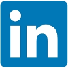
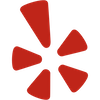
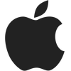

I interviewed at six top companies in Silicon Valley in six days, and stumbled into six job offers

The gauntlet

**In the six days* from August 13th to August 20th, 2018, I interviewed at LinkedIn, Yelp, Apple, Amazon, Facebook, and Google and got all six job offers.**

_Edit: wow, this got a lot more popular than I anticipated. Based on that, I plan on doing more write-ups about other parts of the process, including negotiation._ [**_Follow my new Twitter for updates :)_**](https://twitter.com/bayareabell)

All of the below is heavily inspired by [this post from last year](https://medium.com/@XiaohanZeng/i-interviewed-at-five-top-companies-in-silicon-valley-in-five-days-and-luckily-got-five-job-offers-25178cf74e0f) that originally pushed me to consider the possibility of moving companies. I didn’t want to fly across the country repeatedly to find my perfect job, so I knew I had to schedule them alongside each other and gut it out.

While the roles I was specifically pursuing were mobile positions, **the study approach, tips, and recommendations should be universal**.

Hopefully, I can inspire people that were in the same spot as me — not 100% happy with work, dreaming of life in the Bay, but lacking severely on the “study prep” front — to just go for it and see what the future brings their way.

### Introduction & Statistics

I knew  I wanted a job in the Bay Area where I could really grow from a mobile perspective at a larger company. I’ve worked at startups before and I’ve loved it, but for a few reasons, I was looking at the big fish this go-around (in terms of valuation, not strictly team size). I also knew that I wasn’t positive where I wanted to work or how much compensation I’d need to match what I’m making now. I _also_ knew I didn’t want to apply to 100+ places like I did when I was graduating from college.

All told, **I applied to 20 companies**. I was **explicitly rejected by 4** of those companies (Reddit, Nest, Stripe, Uber) after applying. Of the remaining 16, **10 companies never responded** to me either way (Lyft, Airbnb, Dropbox, Instagram, YouTube, Square, Robinhood, Twitter, Snap, Slack). Math dictates **6 companies followed up with a recruiter screen**. Of those 6 companies, I was able to get **phone screens with 6**, **onsites with 6**, and **offers from 6**.

Reviewing my Google Calendar, I believe I had (approximately):

*   7 recruiter screens in 10 days
*   7 technical screens in 11 days
*   29 onsite interviews in 8 days
*   3 follow-up phone interviews

Adding up the above says **I had 46 interviews in 73 days** (including gaps between each step). It was exhausting and it meant that most of my lunch breaks were just interviews for multiple weeks. I had to start going into work very early so I could leave earlier to take calls at home. Making sure I was still meeting all of my commitments at work was a challenge, too, but I made sure to prioritize that over interviewing, rescheduling when necessary. I wouldn’t phone it in for the purposes of interviewing. It makes you look bad, it’s unethical, and if you don’t get a job, you’re now a lower performer.

### The Companies, in order

#### LinkedIn (Sunnyvale, CA)

[Link](https://cdn-images-1.medium.com/max/600/1*3QlCJzPEg_zN9xFKl2Ssyg.png) to my heart rate during my onsite (normal resting rate of 60).

LinkedIn’s mobile apps are actually pretty slick and they have some [solid contributions](https://github.com/linkedin?utf8=%E2%9C%93&q=&type=&language=objective-c) to the open source community. I was very impressed throughout the entire interview process with LinkedIn from both a culture perspective and an engineering perspective. They rose the highest on my mental list of iOS Prestige™ from the start of the process until the end.

#### Yelp (San Francisco, CA)

[Link](https://cdn-images-1.medium.com/max/1200/1*vUn3PlFo7XjucCyHbpMY7A.png) to my heart rate during my onsite (normal resting rate of 60)

Yelp has a really beautiful app with tons of iOS subtleties that show an understanding of the platform. I loved the vibe onsite. They have a beautiful building and I’d love to work with any of my interviewers. They’re much smaller than any of the other companies I applied to and it showed in all of the good ways. It seemed very tight knit and the process moved _fast_.

#### Apple (Cupertino, CA)

[Link](https://cdn-images-1.medium.com/max/1200/1*2XltDJ51PfGj4m9zzFHiHQ.png) to my heart rate during my onsite (normal resting rate of 60)

Apple’s been an important part of iOS for a while (har har). I grew up an extreme Apple fanboy (since the age of 12, at least). The Mac originally got me into programming. The iPhone SDK encouraged me to build and ship my first app. It was absolutely surreal to have them invite me onsite and later extend me an offer. I don’t know what else there is to say on that front.

#### Amazon (Palo Alto, CA)

[Link](https://cdn-images-1.medium.com/max/1200/1*r07Al_J8C-J_xGbjx5CMbQ.png) to my heart rate during my onsite (normal resting rate of 60)

I wouldn’t consider Amazon a “mobile-first” as a company (at all). This position/team, though, met the criteria I laid out to start. I wasn’t in love with the Palo Alto building I was in specifically, but it’s a temporary office until they move into a more Amazon-y building, so it’s mostly poor interview timing on that front. The people I spoke to seemed pretty dedicated to their product. Although every company loved telling me that “_it really feels like a startup!_”, it rang the truest at Amazon.

#### Facebook (Menlo Park, CA)

[Link](https://cdn-images-1.medium.com/max/1200/1*TNBdVvsqr9Su44Ivj3T4eQ.png) to my heart rate during my onsite (normal resting rate of 60)

I interviewed Facebook’s newest building. I thought it was really cool overall, although I’m somewhat hazy on the details about how the interview itself went because I was on my fifth consecutive day of interviewing with inadequate sleep. I do remember really enjoying the people I spoke with and having a very insightful lunch interview.

#### Google (Mountain View, CA)

[Link](https://cdn-images-1.medium.com/max/800/1*pI4O9wNtDXv5uL6ehGJATg.jpeg) to my heart rate during my onsite (normal resting rate of 60)

Google, to my understanding, does pretty “generic” interviews for a given role. I spoke to a lot of members from one of Google’s biggest products on iOS, but I wasn’t interviewing for a position specifically with that team. After I passed through Google’s hiring committee I moved on to the team matching phase and ultimately matched up with a team. It’s a very _loooooong_ process relative to the rest of the companies I spoke with, so I definitely had to keep everyone updated on where Google was. I also had to let Google know where I was with everyone else.

### Study Plan

To be clear, I was starting from a position where I could probably do most Leetcode Easy problems in ~30 minutes, and I could maybe solve 25% of Leetcode Medium problems with infinite time. Solving Leetcode Hard problems were akin to trying to solve P=NP. In short, I had a large gap to bridge.

To study algorithms **I began first with** [**Cracking the Coding Interview**](https://www.amazon.com/Cracking-Coding-Interview-Programming-Questions/dp/098478280X). On Sunday mornings I’d wake up and go to a [coffee shop](https://www.yelp.com/biz/helbachs-coffee-house-madison) and grind out some problems in Objective-C. Once I did enough problems in CtCI (I think I solved ~35 problems) I would review a handful of Leetcode problems in the chapters I’d gone over. After a few weeks of this, I felt I had “the basics” down and moved on to my next phase.

With the basics down, **I moved on to** [**Elements of Programming Interviews**](https://www.amazon.com/gp/product/1479274836/ref=ox_sc_act_title_1?smid=ATVPDKIKX0DER&psc=1). This book is _considerably_ more difficult than CtCI. The book has recommended study plans that I stuck pretty closely with. I think there was one that planned on four weeks of studying and I got through almost all of it. **It is critical, in my opinion, to either whiteboard problems with someone or mock a phone interview with someone**. Not critical as in “very important”, but critical as in _you should consider it an absolute requirement when studying_. I’m sure you can get a job without it, but it’s the single best form of practice I had.

If anyone wants to mock phone interviews for iOS I’d be happy to help out — you may be able to find me on [CS Career Hackers](https://www.cscareerhackers.org/) and maybe we can work something out, time permitting. If not me, there are plenty of others there willing to help out. It’ll be awkward. _That’s the point_. If it were natural you wouldn’t need to practice it, would you? **If you start practicing on the phone or on a whiteboard and it’s embarrassing or awkward, it’s a sign you’re doing exactly what you should be: practicing.** It was pretty awkward for me until it wasn’t, and the practice absolutely paid off.

After about a month of consistently practicing problems each day (maybe 2–3 hours/day, more on weekends) I moved on to doing primarily Leetcode’s “[Top Interview Questions](https://leetcode.com/problemset/top-interview-questions/)”. I didn’t do them all but I did “enough”. **The key to preparing algorithm interviews is to get yourself to a point that you can figure out a problem during the interview,** not necessarily to know how to do every problem. That’s impossible. Almost all of the questions I heard over my week of onsites were “new” to me yet similar to questions I’d seen. That’s how most development goes in the industry, too. You have a lot of similar problems but your particular use case has special constraints.

### Lessons Learned

I’m going to present a bunch of lessons I learned as bullet points in no particular order. Everything listed below is something I wish I knew beforehand, both in terms of preparation on the technical side and in terms of scheduling and other non-technical tips. **These lessons are not iOS-specific and I’d imagine are generally applicable to all interviews in our industry**.

*   📚 **Stick with it.** When I was looking for a job out of school I gave up after one or two weeks of studying. I reasoned that I simply was not cut out to learn the stuff. There was minimal progress from when I first started for weeks, so what was the point of wasting any more time? This time around, I figured I didn’t have a choice. Eventually, things started falling into place. It’s a lot of work, but the willingness to learn is what separates successful candidates from the rest.
*   **🤓 Practice is _almost_ everything.** You certainly need a baseline of innate ability, but practice (i.e. learning) can fill in _very_ wide ability gaps. Companies don’t hire people based on the knowledge they were born with. They hire those that can perform their duties and perform them well, regardless of where/when they cultivated the knowledge.
*   **👫 Practicing with a friend is everything _else_.** Whether on a whiteboard or on something like [Codeshare](https://codeshare.io/), simulating an interview environment with someone over a period of time takes a lot of the scariness out of interviews. You get over the awkwardness of verbalizing something totally stupid to someone because your brain slipped. The best is if you can make sure someone understands a problem you haven’t seen before, as they can give you hints to push you toward a solution. Seriously, that kind of practice is _invaluable._
*   **📊 It’s a numbers game.** You can practice — effectively, even — and not land a job because the right person didn’t see your resumé or you just didn’t see a solution to a whiteboard problem in time. The best you can hope to do is maximize your odds. This means applying everywhere you would like to work and fit a job req and not just your top choice. I applied for my top 20!
*   **🤔 Focus on the problem solving, not the solution.** Memorization isn’t enough. Of ~20 algorithm problems I saw in a week I had seen maybe one of the problems before (and I let my interviewer know, though many would disagree with that choice). I just saw lots of common patterns and I was able to come up with solutions on the fly.
*   **😣 Don’t get discouraged.** There were multiple interviews I had where I didn’t know the solution and interviewers had to shepherd me towards a solution. I still got offers from everywhere I interviewed. Also, I felt I absolutely _bombed_ one of my interviews (four of my five that day I thought were solid “no hires”) and the company later extended me an offer. Anything can happen, evidently. :)
*   **🤯 Don’t be quick to disregard problems.** There were multiple times I was practicing with a friend of mine and he shrugged off particularly difficult problems as pointless to know. Curiously enough, of the four types of problems I recall him saying would “never” come up, two of them did. Not in the _exact_ form we were going to practice, but very similar. If your practice shows a certain concept come up frequently, learn it.
*   **🧐** **Don’t underestimate the importance of behavioral questions**. I think I enjoyed a lot of success because my (honest) answers were what companies wanted. It’s my theory that many developers have strong technical skills and still struggle to find their perfect job because they’re rude, dishonest, or uncomfortable speaking to people outside of a technical setting. These are all justifiable reasons to reject a candidate, in my opinion. Practice them just as you would technical questions.
*   **🧠 If you know more, show it.** There were multiple examples during my onsites where I would answer a question and mention some other knowledge I had but explain that I didn’t have time in an interview to fully implement that solution. Answering a question about strings? Show off your Unicode knowledge with your solution or explain how to support Unicode. Implementing a private method? Talk about the Objective-C conventions for methods. Updating a table view? Talk about the different animations you can support. Don’t bring something up if you can’t talk all about it, but if you can, it allows you to show knowledge outside of the narrow window provided by the question and gives you a leg up on anyone that sticks strictly to the beaten path.
*   **💪 Don’t strive to clear the bar, strive to set it.** Interview performance obviously helps decide if you get an offer from a given company, but it also helps decide what that offer looks like. If you get to a point where you think you know enough to get an offer, that’s great. But keep in mind there’s a big difference between “barely good enough” and “absolutely good enough”. Strive for the latter! My initial (i.e. not negotiated) offers came in pretty solid despite my relative lack of experience and I believe interview performance played a big role.

### Wrap-Up

So that’s that! It was a crazy ride and I have no regrets. I truly, genuinely hope that the above can help someone get over the hump when it comes to landing a job they’ve dreamed about. If there’s particular interest in iOS-specific help, I can publish some tips, so please comment and let me know.

If it’s of any use: I was interviewing for my second job out of college with about two and a half years of experience without any particularly notable internships or employers on my resume; I went to a very small school that had zero known software companies at their “career fair”; I started preparing in late April and started applying in June/July; and, lastly, a few months in, my job is everything I could have possibly dreamed of.

**I’d like to shout out the** [**CS Career Hackers**](https://www.cscareerhackers.org/) **community one last time.** If you’re looking for a place to practice and talk with others in similar situations (or those that have been through it on either side), please do check it out. 👍 I didn’t find it until a few months after I signed my offer, but it’s a great place nonetheless.

Happy studying, everyone!

*   _ok, technically, it was six weekdays and eight days; no, I didn’t interview on a Saturday :)_

**This story is published in Noteworthy, where 10,000+ readers come every day to learn about the people & ideas shaping the products we love.**

**Follow our publication to see more product & design stories featured by the** [**Journal**](https://usejournal.com/?utm_source=medium.com&utm_medium=noteworthy_blog&utm_campaign=guest_post_text) **team.**