Курс MIT «Безопасность компьютерных систем». Лекция 15: «Медицинское программное обеспечение», часть 1 / Блог компании ua-hosting.company

### Массачусетский Технологический институт. Курс лекций #6.858. «Безопасность компьютерных систем». Николай Зельдович, Джеймс Микенс. 2014 год

Computer Systems Security — это курс о разработке и внедрении защищенных компьютерных систем. Лекции охватывают модели угроз, атаки, которые ставят под угрозу безопасность, и методы обеспечения безопасности на основе последних научных работ. Темы включают в себя безопасность операционной системы (ОС), возможности, управление потоками информации, языковую безопасность, сетевые протоколы, аппаратную защиту и безопасность в веб-приложениях.

Лекция 1: «Вступление: модели угроз» [Часть 1](https://habr.com/company/ua-hosting/blog/354874/) / [Часть 2](https://habr.com/company/ua-hosting/blog/354894/) / [Часть 3](https://habr.com/company/ua-hosting/blog/354896/)  
Лекция 2: «Контроль хакерских атак» [Часть 1](https://habr.com/company/ua-hosting/blog/414505/) / [Часть 2](https://habr.com/company/ua-hosting/blog/416047/) / [Часть 3](https://habr.com/company/ua-hosting/blog/416727/)  
Лекция 3: «Переполнение буфера: эксплойты и защита» [Часть 1](https://habr.com/company/ua-hosting/blog/416839/) / [Часть 2](https://habr.com/company/ua-hosting/blog/418093/) / [Часть 3](https://habr.com/company/ua-hosting/blog/418099/)  
Лекция 4: «Разделение привилегий» [Часть 1](https://habr.com/company/ua-hosting/blog/418195/) / [Часть 2](https://habr.com/company/ua-hosting/blog/418197/) / [Часть 3](https://habr.com/company/ua-hosting/blog/418211/)  
Лекция 5: «Откуда берутся ошибки систем безопасности» [Часть 1](https://habr.com/company/ua-hosting/blog/418213/) / [Часть 2](https://habr.com/company/ua-hosting/blog/418215/)  
Лекция 6: «Возможности» [Часть 1](https://habr.com/company/ua-hosting/blog/418217/) / [Часть 2](https://habr.com/company/ua-hosting/blog/418219/) / [Часть 3](https://habr.com/company/ua-hosting/blog/418221/)  
Лекция 7: «Песочница Native Client» [Часть 1](https://habr.com/company/ua-hosting/blog/418223/) / [Часть 2](https://habr.com/company/ua-hosting/blog/418225/) / [Часть 3](https://habr.com/company/ua-hosting/blog/418227/)  
Лекция 8: «Модель сетевой безопасности» [Часть 1](https://habr.com/company/ua-hosting/blog/418229/) / [Часть 2](https://habr.com/company/ua-hosting/blog/423155/) / [Часть 3](https://habr.com/company/ua-hosting/blog/423423/)  
Лекция 9: «Безопасность Web-приложений» [Часть 1](https://habr.com/company/ua-hosting/blog/424289/) / [Часть 2](https://habr.com/company/ua-hosting/blog/424295/) / [Часть 3](https://habr.com/company/ua-hosting/blog/424297/)  
Лекция 10: «Символьное выполнение» [Часть 1](https://habr.com/company/ua-hosting/blog/425557/) / [Часть 2](https://habr.com/company/ua-hosting/blog/425561/) / [Часть 3](https://habr.com/company/ua-hosting/blog/425559/)  
Лекция 11: «Язык программирования Ur/Web» [Часть 1](https://habr.com/company/ua-hosting/blog/425997/) / [Часть 2](https://habr.com/company/ua-hosting/blog/425999/) / [Часть 3](https://habr.com/company/ua-hosting/blog/426001/)  
Лекция 12: «Сетевая безопасность» [Часть 1](https://habr.com/company/ua-hosting/blog/426325/) / [Часть 2](https://habr.com/company/ua-hosting/blog/427087/) / [Часть 3](https://habr.com/company/ua-hosting/blog/427093/)  
Лекция 13: «Сетевые протоколы» [Часть 1](https://habr.com/company/ua-hosting/blog/427763/) / [Часть 2](https://habr.com/company/ua-hosting/blog/427771/) / [Часть 3](https://habr.com/company/ua-hosting/blog/427779/)  
Лекция 14: «SSL и HTTPS» [Часть 1](https://habr.com/company/ua-hosting/blog/427783/) / [Часть 2](https://habr.com/company/ua-hosting/blog/427785/) / [Часть 3](https://habr.com/company/ua-hosting/blog/427787/)  
Лекция 15: «Медицинское программное обеспечение» [Часть 1](https://habr.com/company/ua-hosting/blog/428652/) / [Часть 2](https://habr.com/company/ua-hosting/blog/428654/) / [Часть 3](https://habr.com/company/ua-hosting/blog/428656/)

Приветствую всех, я тоже учился в MIT в 90-х годах и рад снова сюда вернуться. Сегодня мы поговорим о несколько другом виде безопасности, оставим техническую часть в стороне и обсудим, к каким далеко идущим последствиям приводит эта безопасность. Чтобы вы знали, я сам из района Midnight Сoffeehouse club, а наш Университет Массачусетс Амхерст, который вы видите на экране, расположен в Мичигане, но мы не настолько велики, как ваш кампус.

Сегодня мы поговорим о некоторых наших исследованиях и обсудим всё: от взрывающихся дефибрилляторов до вопросов конфиденциальности в медицинских изделиях. В основном это будет связано только с одним направлением исследований моего бывшего аспиранта, который на представленном здесь фото дезинфицирует имплантируемые дефибрилляторы.Сегодня мы в основном поговорим о безопасности медицинских устройств.

На следующем слайде показан список множества людей, принимавших участие в этих исследованиях, и я попытаюсь просуммировать некоторые современные положения о безопасности медицинского устройства с различных точек зрения. Я также обязан включить в свою лекцию этот шаблонный слайд о возможном конфликте интересов, так что теперь вы можете узнать о любых потенциальных предубеждениях в моем мышлении. Но мне бы хотелось думать, что я менее предвзят, чем обычный человек.

Примерно год назад произошло интересное событие. FDA, Управление по санитарному надзору за качеством пищевых продуктов и медикаментов, выпустило проект документа, в котором было сказано, что теперь они будут проверять производителей на предмет соблюдения кибербезопасности, или, как мы это называем, безопасности и конфиденциальности, не только в отношении реализации программного обеспечения медицинского устройства, но также и в отношении разработки этого программного обеспечения ещё до того, как будет написана первая строчка программы.

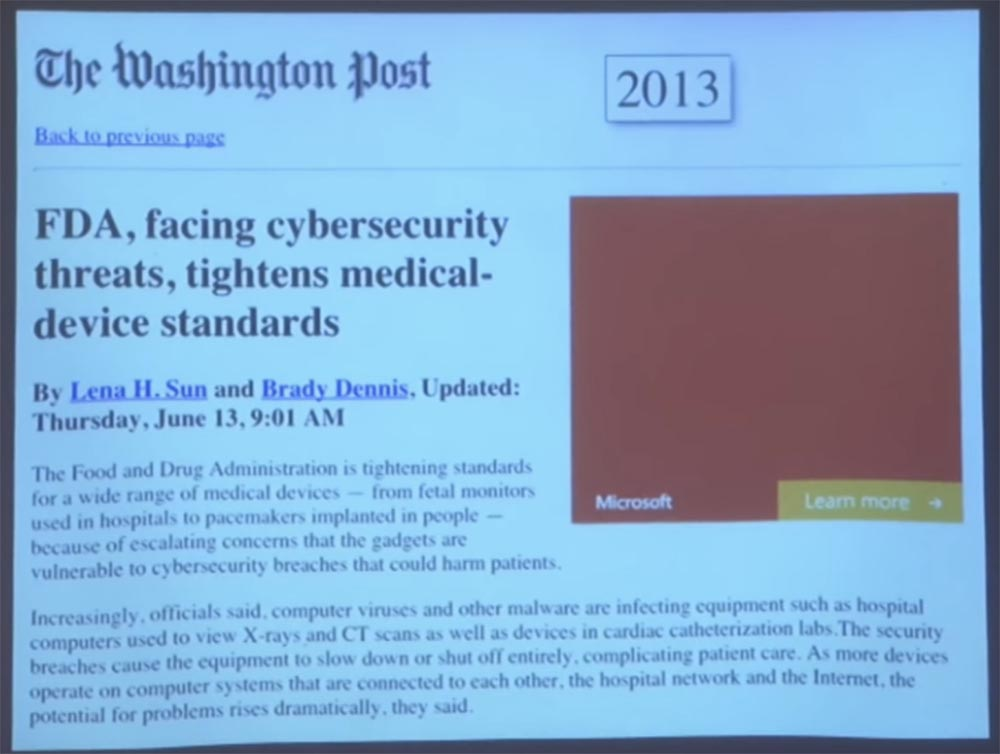

Поэтому мы поговорим о том, как это повлияло на мышление сообщества производителей медицинских устройств. Последнее руководство по разработке дизайна медицинского программного обеспечения появилось всего пару недель назад, и мы недавно участвовали в видеоконференции, организованной FDA по этому поводу. Всего к этому совещанию присоединились более 650 человек. Там было много интересного для производителей медицинского оборудования относительно того, как применить некоторые концепции, которые вы изучаете здесь в своем классе.

Однако это действительно трудно. Я заметил, что один из вопросов на сайте был о том, как изменить культуру медицинского сообщества так, чтобы оно понимало, насколько важна безопасность. Данный слайд иллюстрирует это.

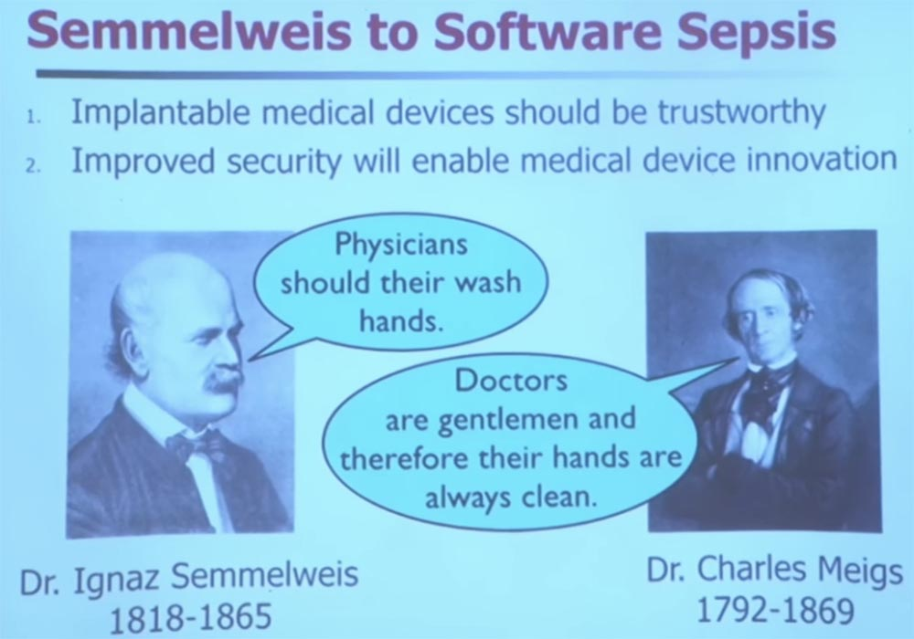

На слайде изображён один из основоположников асептики, доктор Игнац Земмельвайс, говорящий, что доктор обязан мыть руки. Ему возражает американский акушер Чарльз Мейгс, произносящий слова: «Поскольку доктора – джентльмены, у них всегда чистые руки!»

Кто сегодня утром мыл руки? Отлично, я не узнаю Массачусетский институт! Итак, 165 лет назад жил известный врач-акушер Игнац Земмельвайс, который исследовал болезнь под названием «послеродовой сепсис». И он обнаружил, что если его студенты-медики, работавшие утром в морге, затем шли к пациентам, то эти пациенты, как правило, умирали чаще. Он пришёл к выводу, что если врачи будут мыть руки после того, как работали с трупами, то смертность после родов, во время которых они ассистировали, будет намного меньше. Так что он рекомендовал врачам мыть руки. Однако реакция сообщества врачей на это предложение в основном выражалась мнением акушера Чарльза Мейгса, утверждавшего, что все врачи – джентльмены, поэтому у них всегда чистые руки.

В какой-то мере мы видим подобное отношение к безопасности и сегодня, так что это не слишком удивительно. На протяжении нашего разговора я попробую провести с этим некоторые параллели.  
У меня имеется слишком много материала по теме, так что я буду перескакивать через некоторые вещи. Но первым делом я хочу поинтересоваться — кто-нибудь из вас собирается стать врачом? Нет? Хорошо, хорошо, в таком случае вам будет о чём поговорить за коктейлем с друзьями-врачами.

Мы немного поговорим об имплантируемых медицинских устройствах. Я дам вам подержать в руках эту штуку, она безопасна, только не надо её облизывать. Это имплантируемый дефибриллятор бывшего пациента. На самом деле, этим устройствам уже около 50 лет, именно тогда начали появляться первые кардиовентеры-дефибрилляторы. В то время они были внешними, и пациентам приходилось толкать перед собой тележку с этим устройством и иметь рядом с собой сильную медсестру.

Прошли десятилетия, и дефибрилляторы стали достаточно маленькими, чтобы быть полностью имплантированными в организм. На слайде вы видите изображение того, что называется «жезлом», который использует индуктивную связь. Технически он беспроводной, здесь нет никаких проводов. Прибор программируется так, чтобы обеспечивать сердечный ритм 60 ударов в минуту.

Меня как исследователя безопасности заинтересовало появление примерно в 2003 году дефибрилляторов, таких как тот, что я передал вам, использующих беспроводные технологии и сети. Мы привыкли, что сети больше служат для глобальных вычислений, поэтому я задумался, что здесь может пойти не так?

К счастью, есть много инженеров, которые также озабочены этим вопросом в медицинских компаниях, однако здесь безопасность требует совсем другого мышления. И я собираюсь рассказать вам о том, как менялось это мышление.

Если вы разберёте одно из таких устройств, то найдете в нем огромное количество вещей, ограничивающих эксплуатацию. Так что если вам нужна сложная инженерная проблема, просто разберите одно из таких устройств. Больше половины объёма дефибриллятора занимает аккумулятор очень большой ёмкости, который стоит 40000 долларов. Здесь также используется серебристый металл — оксид ванадия.

В верхней части стимулятора расположены микроконтроллеры, и обычно в нём есть антенны для связи с устройством контроля дефибриллятора. Все это герметично запечатано и имплантировано в ваше тело.

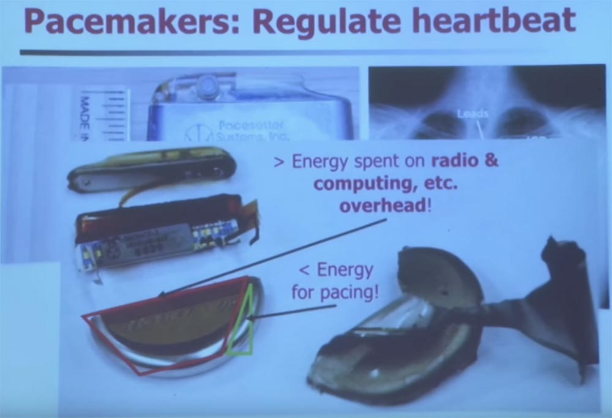

Мы говорим об одном из самых суровых условий эксплуатации электронного устройства. Если вы захотите перезарядить батарею в своем теле, вам можно только пожелать удачи. Знаете ли вы, что при зарядке аккумуляторы выделяют тепло и газ? Поэтому при конструировании таких устройств существуют серьёзные ограничения, и добавить туда безопасность достаточно сложно.

Однако существует очень веская причина для беспроводного управления медицинским устройством. Есть веские причины, но есть и серьезные риски. Чтобы проиллюстрировать это, я хочу, чтобы вы посмотрели, как выглядели первые имплантируемые дефибрилляторы.

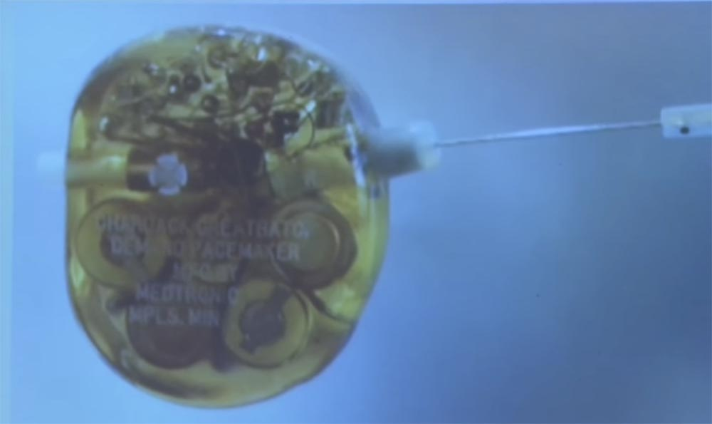

Это дефибриллятор из музея Medtronic в Миннеаполисе. Может ли кто-нибудь догадаться, что это за маленький металлический цилиндр с правой стороны? Какова его функция? Антенна? Контроль? Управление — очень близкая догадка! Есть еще предположения?

Этот «выступ» использовался ещё до появления беспроводной связи для управления дефибриллятором. Раньше для изменения настроек устройства врач говорил: «пациент, пожалуйста, поднимите руку. Я собираюсь вставить вам иглу через подмышку и покрутить диск изменения сердечного ритма».

Таким образом, одно из главных преимуществ беспроводной связи заключается в том, что она фактически снижает количество инородных предметов, попадающих в организм, потому что чем больше инородных предметов попадает в организм, тем больше вероятность заражения. Это серьезный риск. На самом деле, 1% имплантатов дают серьезные осложнения, и из них около 1% являются фатальными. Так что контроль инфекции — одна из самых важных вещей, которую вы должны обеспечить при имплантации и замене устройства.

Конечно, если вы впадёте в другую крайность и просто скажете, что хотите повсюду установить беспроводную связь, вы получите другие виды рисков. Я назвал это теорией «бекона для беспроводной связи». Моя мама со среднего Запада говорила, что бекон делает всё вокруг лучше.  
Я заметил, что есть некоторые производители устройств, которые, похоже, используют беспроводную связь везде, при этом не продумывая опасность такого решения. Оно имеет свои преимущества, но нужно поразмыслить стратегически, прежде чем добавлять такую возможность в достаточно небезопасное устройство. Например, подумать, о том, какие риски могут возникнуть со временем.

Я не собираюсь говорить много об интернет-сетях, но думаю, эта цитата заслуживает упоминания. Кто-нибудь помнит корабль «Коста Конкордия» у берегов Италии? Его капитан говорил: «В наши дни все намного безопаснее благодаря современным инструментам и интернету». Это кадр из космоса, на котором видно его перевернувшийся корабль.

Так что когда вы добавляете интернет и беспроводную связь в ваше медицинское устройство, то идете на новый риск. Но вам не стоит этого бояться, нужно просто предусмотреть контроль возможных негативных последствий.

Я хочу показать вам в картинках, как проходит типичная эксплуатации медицинского устройства, как оно используется в клинической помощи, как это может изменить ваше мышление, если исходить с точки зрения безопасности, и что вы должны думать о риске. Сначала поговорим о мире, в котором нет реальных угроз, а присутствуют только небезопасные методы, опасные случайности и некоторая небрежность без всякого сознательного саботажа.

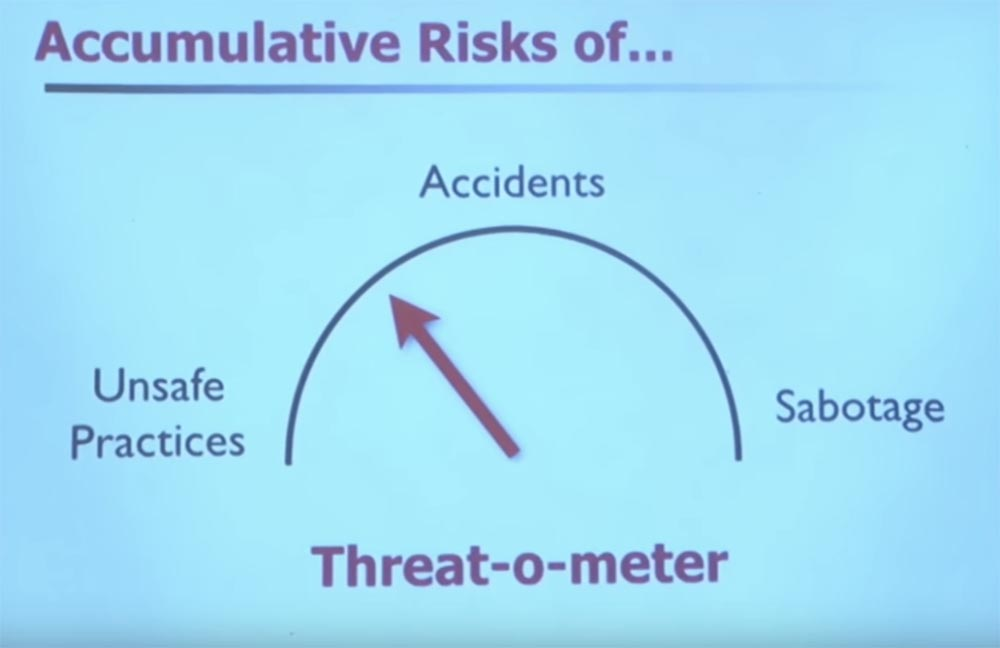

FDA поддерживает базу данных промахов, неисправностей, повреждений и смертельных случаев. Это открытая информация, вы можете сами посмотреть. Эта выборка называется MAUDE – «Опыт использования устройств производителями и потребителями».

На этом слайде описывается случай применения устройства под названием «объемный инфузионный насос», это прибор, который механически вводит лекарственные препараты в ваше тело через вену. В данном случае пациент умер, и если вы посмотрите на этот текст внимательно, то увидите, что одной из причин трагедии было переполнение буфера. Я думаю, вы знаете всё о переполнении буфера из вашей первой лекции. Так что подобное случается в реальной жизни в каждой области, использующей компьютерную технику.

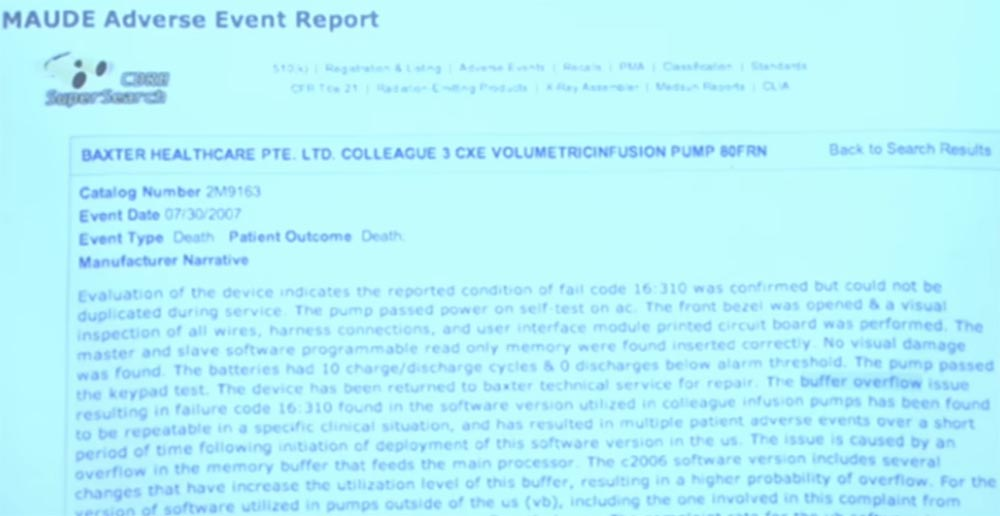

В этом конкретном случае переполнение буфера было обнаружено во время проверки ошибок программного обеспечения, но реакцией на такую ошибку было выключение насоса, то есть перевод его в безопасный режим. Но создатели ПО не учли того, что для некоторых пациентов отключение насоса — это смертный приговор. Так что этот пациент умер после увеличения внутричерепного давления, сопровождаемого смертью мозга, и всё это случилось из-за переполнения буфера.

Так что здесь нет ничего сложного, верно? Вы все знаете, что не хотите получить переполнение буфера в программном обеспечении, и в данном случае нет никакого внешнего воздействия. Это просто иллюстрирует состояние программного обеспечения, по крайней мере, для этого конкретного устройства. Это очень сложная задача.

Другая сложность обеспечения безопасности состоит в необходимости учитывать человеческий фактор. Есть несколько университетов, которые фокусируются на этой стороне вопроса, но, по моему мнению, недостаточно. Поэтому я опираюсь на собственный жизненный опыт.

Моя жена просила сохранить анонимность, так что я не раскрою ее имя. На слайде вы видите меня, мою жену, сзади расположен инфузионный насос, а наш ребёнок находится пока что внутри жены. К нашему счастью, насос работал просто отлично. Вообще насосы отлично подходят для оказания медицинской помощи, но они всё же вызвали более 500 смертей и из-за различных видов неисправностей.

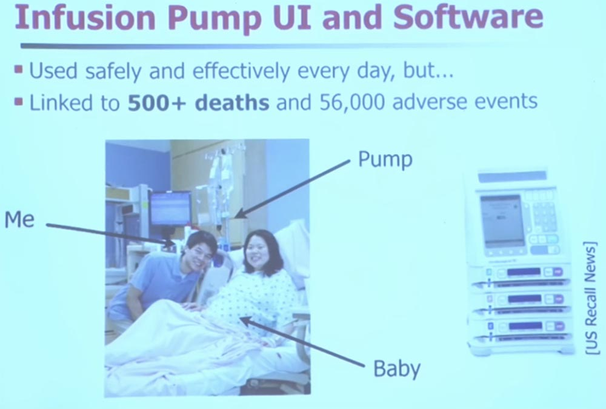

Поэтому я расскажу вам еще об одной неисправности. На следующем слайде показан имплантируемый вид насоса. У него есть полупроницаемая мембрана, через которую вы можете пополнить запасы лекарств, и пользовательский интерфейс, который медсестра или врач использует для изменения дозировки.

Кто-нибудь видит, где вы набираете количество медицинского препарата? Вы должны прищуриться, верно? Вам нужно очень хорошо приглядеться к этой цифре.  
.  
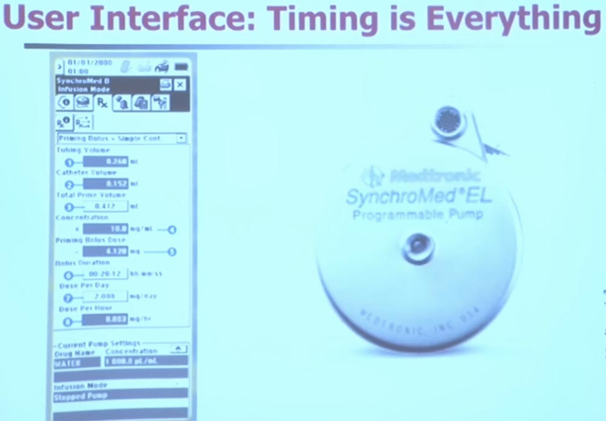

Здесь под номером шесть написано, что мы собираемся дозировать болюс. Болюс — это время постепенного введения ежедневной дозы лекарства, более 20 минут и 12 секунд, и всё это имплантировано, так что пациент не чувствует процесса введения лекарства.

Этот пользовательский интерфейс вступил в силу после того, как FDA отозвало предыдущую версию интерфейса и потребовало доработки. До отзыва в пункте 6 интерфейса управления этим насосом отсутствовало восемь ключевых элементов: HH: MM: SS, это часы, минуты и секунды.

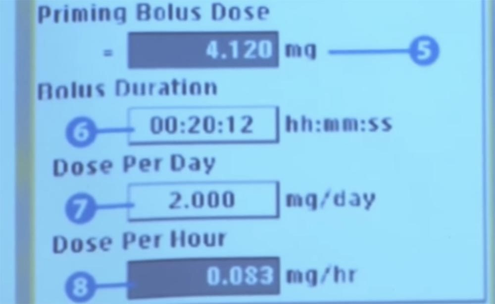

Как вы думаете, что могло бы произойти, когда это обозначение отсутствовало? В таком случае очень легко ошибиться в единицах измерения и сделать ошибку в порядке величины.

К несчастью для данного пациента, его насос был неправильно запрограммирован, так что лекарство вводилось за 24 минуты вместо 24 часов. Ошибка была вызвана отсутствием обозначения вводимых цифр: часы, минуты, секунды. Это было обнаружено только после смерти пациента – покинув лечебное учреждение, он попал в тяжёлую автомобильную аварию и позже умер из-за того, что его семья согласилась отключить медицинскую систему жизнеобеспечения.

Если вы посмотрите на это с технической точки зрения, проблема довольно проста, не так ли? Просто в интерфейсе не было «этикетки». Но здесь человеческий фактор очень легко проследить, хотя он не всегда на виду, в центре внимания инженерных процессов. Но это очень важный элемент повышения надежности устройств, которые полагаются на программное обеспечение. Поэтому я призываю вас обязательно учитывать человеческий фактор при разработке своего программного обеспечения, даже если он не оказывает критического влияния.

Еще я хочу поговорить о захватывающем мире программного менеджмента. Я собрал на этом слайде все эти маленькие диалоговые окна, появляющиеся всякий раз, как мой компьютер получает обновление программного обеспечения, но все это происходит в фоновом режиме. Как и мой iPhone, который постоянно получает обновления и становится «всё сильнее». Медицинские устройства также получают обновления программного обеспечения, принципиально они не отличаются от традиционных вычислительных устройств. Они просто контролируют жизненно важные функции вашего организма.

Имеется один интересный случай, который произошёл около 4-х лет назад. Есть компании, выпускающие антивирусное ПО, которое используется больницами, в частности, McAfee. Так вот, этот антивирус при очередном критическом обновлении Windows посчитал его вредоносным, поместил на карантин, а потом решил изолировать систему. Это вызвало аварийную перезагрузку компьютеров и появление BSOD на экранах.

В результате данная больница прекратила приём пациентов, за исключением тяжелых случаев, таких как огнестрельные ранения, потому что их системы регистратуры не работали должным образом.

Итак, клиническая помощь сильно зависит от функций программного обеспечения, и мы иногда забываем о роли безопасности.

Microsoft имеет огромное влияние на множество пользователей как крупнейший разработчик операционных систем. Верите вы или нет, но до сих пор существует множество медицинских устройств под управлением Windows XP, поддержка которой прекратилась полгода назад. Таким образом, вы не должны использовать эту ОС, потому что больше для неё не выпускается обновлений безопасности и обновления функций. Это устаревшее программное обеспечение. Но до сих в медицинские учреждения продолжает поставляться новое компьютерное оборудование с предустановленной ОС Windows XP.

В данной ситуации жизненные циклы программного обеспечения немного смещены. Хорошо, если вы привыкли ежедневно загружать обновления для общедоступного программного обеспечения, но подумайте о медицинских устройствах. Вы не сможете отказаться от него через год, оно может использоваться в течение 20 лет. Поэтому очень трудно найти программное обеспечение, подходящее для 20-тилетней эксплуатации, это практически как полет в космос.

Месяц назад FDA выпустило руководство о том, что они ожидают увидеть от производителей. Думайте о нем, как о проекте для разработчиков ПО.

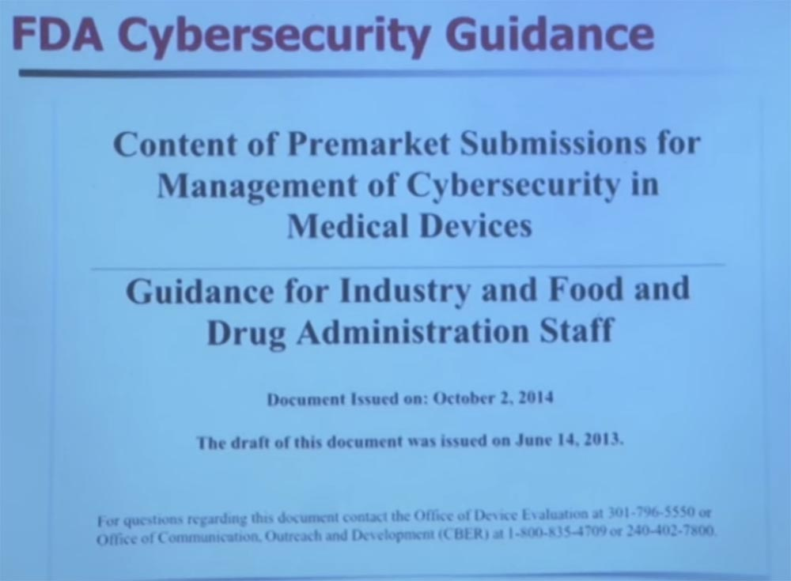

Когда вы излагаете все требования для своего медицинского устройства, они спрашивают производителей, как они продумали проблемы безопасности, все риски и как они собираются их смягчить. Каковы остаточные риски, то есть каковы проблемы, которые они не могут решить? В идеале они ожидают, что производитель или разработчик предусмотрит все возможные риски и способы их уменьшения.

С точки зрения управления программным обеспечением, никто из медицинского персонала не является ответственным, авторизированным пользователем, поэтому может случиться всякое. Но теперь появились рекомендации, которые призваны помочь производителям лучше интегрировать безопасность в свои продукты. Так что я думаю, что мы проводим время с пользой, обсуждая подобные вопросы.

Теперь мы сможем перейти к обсуждению проблем безопасности, оставив вне контекста лекции вещи, к ней не относящиеся. Так что давайте наденем свои серые и чёрные шляпы (намёк на этику хакеров: хакер в серой шляпе тестирует уязвимость компьютеров, но может применить свои знания в корыстных целях, хакеры в чёрных шляпах больше взломщики, чем исследователи).

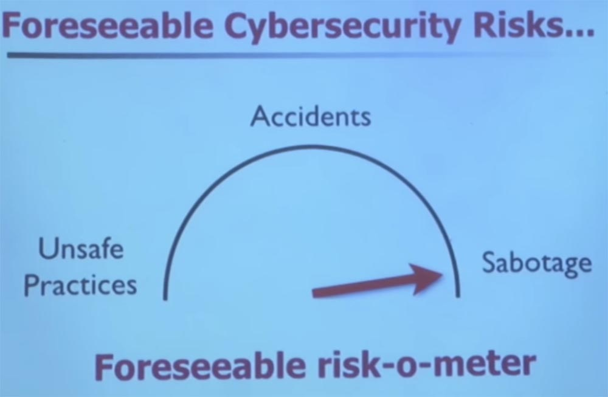

Прежде чем я начну, хочу сказать, что это очень сложная область исследования, потому что в ней присутствуют пациенты. И если бы сегодня мне дали медицинское устройство, у которого имеются проблемы безопасности, я бы всё равно взял его, потому что пациенту будет намного лучше с этим прибором, чем без него. Но, конечно, я бы предпочел иметь более безопасные медицинские устройства. Сейчас появляется все больше и больше безопасных устройств, но если вы должны выбрать между прибором и его отсутствием, я бы настойчиво рекомендовал вам всё равно использовать прибор, чтобы быть в гораздо лучшем положении.

Но, тем не менее, давайте рассмотрим случай саботажа, в котором у нас имеется противник, желающий создать проблемы при использовании медицинского устройства. У кого сейчас дефибриллятор? Отлично, он здесь. Я хотел бы рассказать вам немного о том, как эти дефибрилляторы имплантируются. Это очень специфичное устройство, потому что, во-первых, оно имплантировано внутрь живого организма, поэтому риск очень высок. Оно поддерживает вашу жизнь. Если оно бьется в вашем сердце и вдруг отказывает, результаты могут быть катастрофическими. Так что это очень интересно с инженерной точки зрения, потому что дефибриллятор должен работать круглосуточно, семь дней в неделю в течение многих лет.

Итак, это программер, не человек, а устройство. В основном это износоустойчивый компьютер, к которому прикреплен небольшой девайс под названием Wand, или жезл. Это не компьютерная мышь, а передатчик и приемник, использующий собственную беспроводную связь в специально выделенном частотном диапазоне, это не обычная связь стандарта 802.11.

Операция длится примерно 90 минут. Пациент бодрствует, он сохраняет спокойствие, но операция выполняется под местной анестезией. Спереди под ключицей делается небольшой разрез, а затем бригада из шести человек будет проводить электрод через кровеносный сосуд, заканчивающийся внутри сердца. У меня здесь есть такой зонд — электрод, который ранее не использовался.

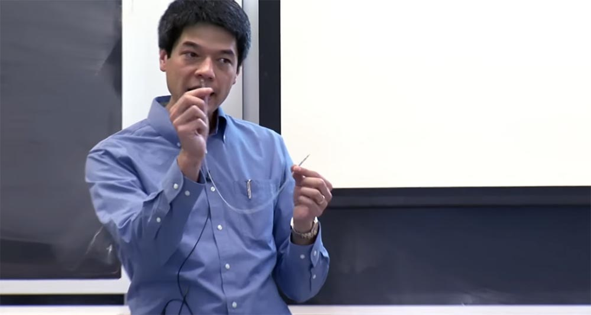

Вы видите маленькие насечки на его конце, в некоторых таких устройствах есть два датчика, так что он может чувствовать ваш сердечный ритм и оказывать на него влияние. Вы можете создавать маленькие или большие сердечные сокращения, в такт сердечному ритму или чтобы перезагрузить сердце, если ритм хаотичный. Это очень продвинутое устройство. Скошенный кончик на конце зонда-электрода – это металл стероидного типа, он не цепляется к тканям, поэтому электрод свободно проходит через сосуд. В принципе, это обычный USB-кабель, верно?

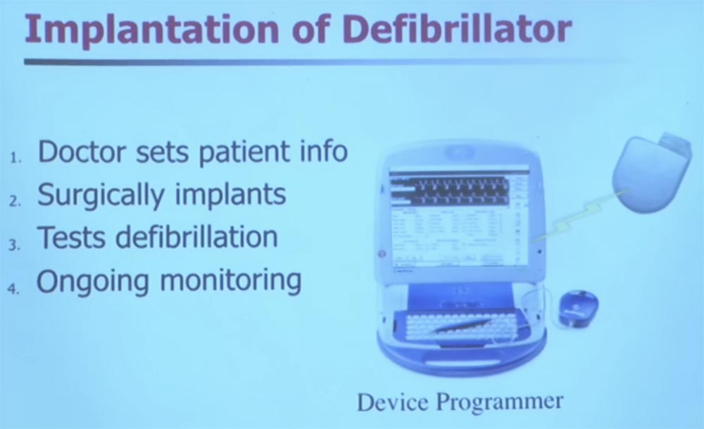

После того, как эта штука имплантирована в сердце, пациента зашивают и проводят испытания работоспособности стимулятора. Обычно после этого пациент получает то, что выглядит как маленькая базовая станция, как маленькая точка доступа и называется «домашний монитор». Это очень ограничивает свободу.

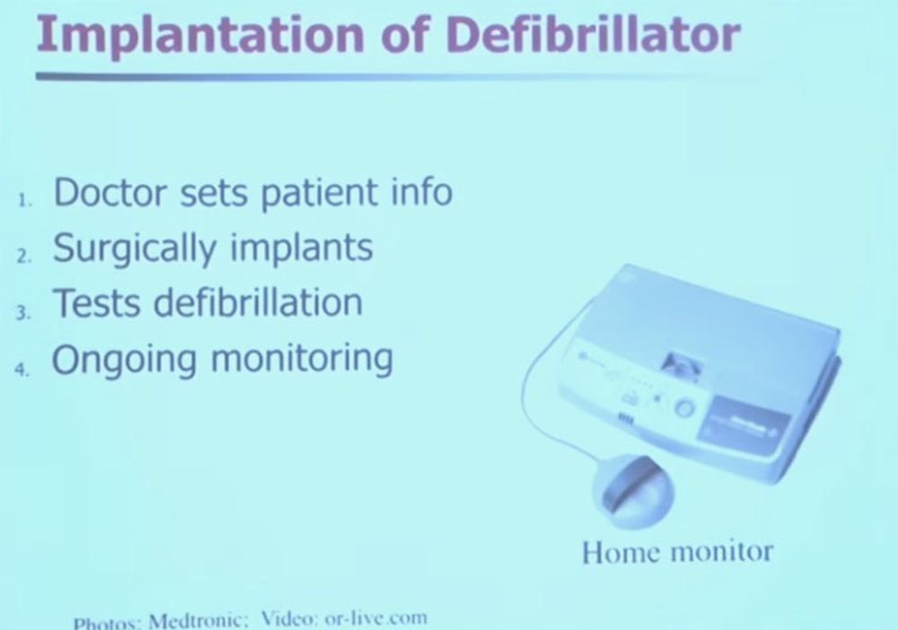

По радиоканалу, работающему на выделенной частоте, можно собрать всю телеметрию и отправить её в «облако», обычно это конфиденциальное облачное хранилище для приватного использования, чтобы медицинские работники могли следить за своим пациентом. Например, если вы заметили, что устройство пациента Мэри передаёт необычные показания, вы можете позвонить ей и сказать: «вам нужно записаться на прием и прийти ко мне, потому что я хотел бы разобраться, что происходит с вашим дефибриллятором».

Таким образом, одно из полезных свойств беспроводной связи – это возможность осуществлять непрерывное наблюдение за работой дефибриллятора пациента, а не проделывать это всего лишь раз в год.

У нас была команда студентов, которую мы собрали из нескольких университетов, я дал им дефибриллятор и осциллограф, и они «удалились в пещеру» примерно на девять месяцев. Вернувшись оттуда, они сказали: «посмотрите, что мы нашли»!

На следующем слайде показан скриншот сеанса связи между устройством и программером. Всё, что вы видите, совершенно понятно, никакой криптографии, по крайней мере, никакого шифрования, которое можно было бы заметить.

Здесь вы найдете имя врача, поставившего имплантат, диагноз, название больницы, состояние устройства, имя пациента, дата рождения, модель и производителя дефибриллятора, серийный номер устройства. В целом это полная электронная медицинская карта. Это довольно старое устройство, использовавшееся около 10 лет назад, но в то время оно воспринималось как произведение искусства. Оно не использовало шифрование, по крайней мере, для обеспечения конфиденциальности медицинской информации.

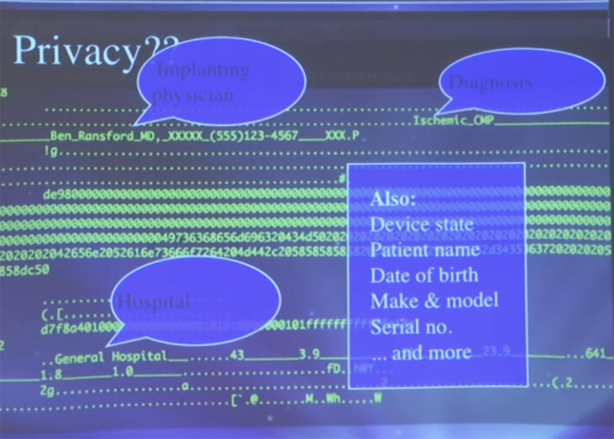

Поэтому, когда мы увидели это, то подумали, что нам определенно нужно обратить внимание на безопасность управления данным устройством. Как оно обеспечивают подлинность контроля? Неприкосновенность информации? Мы решили провести следующий эксперимент и начали учиться использовать то, что называется «программным радио». Возможно, некоторые из вас играли с этим, сейчас их целая куча. Около 10 лет назад популярным было программное обеспечение для радио USRP и GNU. Нашей целью было заставить дефибриллятор думать, что сердце пациента продуцирует фатальный сердечный ритм.

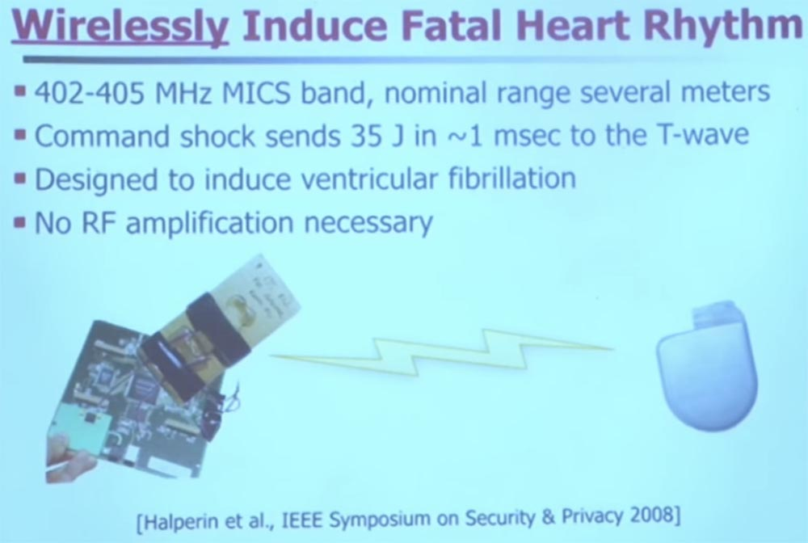

Мы взяли ненужную антенну от кардиостимулятора, создали маленькую антенну и записали радиочастотный сигнал, вызывающий фатальный сердечный ритм. А затем мы направили его обратно дефибриллятору по беспроводной связи. После этого устройство излучило сигнал, соответствующий шоку от удара током 500В. То есть провело электрическую дефибрилляцию останавливающую сердце несуществующего пациента. Это порядка 32 джоулей в миллисекунду, нечто подобное можно испытать при ударе в грудь лошадиным копытом.

Интересно было то, как мы это обнаружили. Итак, я был в операционной, и если помните, я говорил, что после имплантации хирургическая бригада проверяет, правильно ли работает дефибриллятор. Как можно узнать, нормально ли работает дефибриллятор, если сердце пациента бьется нормально? Поэтому в дефибриллятор встроена команда, вызывающая смертельный сердечный ритм, для восстановления которого и предназначается дефибриллятор. Это называется «командный шок». Поэтому, когда я спросил врачей об этом, выяснилось, что они не понимают, в чём заключается концепция аутентификации для подобных устройств. После этого мы решили, что нам действительно нужно более глубоко изучить, как можно решить эти проблемы.

В данном конкретном случае мы смогли отправить команду на устройство, но не смогли проверить подлинность этой команды, так что мы искусственно можем вызвать шок. Хорошая новость состоит в том, что эти устройства могли решить данную проблему путем обновления программного обеспечения.

Вот что касается самого имплантата. К ним применяется огромное количество инновационных решений, это больше не научная фантастика, за этим стоят реальные люди и пациенты.

Большинство людей глубоко озабочены предоставлением качественной медицинской помощи. Но иногда они просто не понимают, как вписать безопасность в процесс проектирования, так что в культурном плане это некий вызов.

Еще одной заинтересованной стороной являются те люди, которые оказывают медицинскую помощь в первую очередь – это персонал больниц или небольших клиник. Если вы хотите найти вредоносное ПО, обратитесь в больницу, там вы найдёте много интересных вирусных программ, и вот почему.

На следующем слайде представлен скриншот от моего коллеги, который работал в бостонском медицинском центре Beth Israel Deaconess. Он сделал скриншот своей сетевой архитектуры. В ней нет ничего потрясающего. Интересно, что он перечислил операционные системы, установленные на том, что считалось медицинскими устройствами.

Мне нравится складывать цифры и всё проверять, поэтому я пересчитал его данные и сказал:

«Хорошо, у вас есть пакет обновления Windows XP SP1, SP2 и SP3, но 0+15+1 не равняется 600, оно равно 16, у тебя неправильно сложение»! Он посмотрел на меня и сказал: „Нет, Кевин, всё правильно, у нас в больнице есть ещё 600 компьютеров с нулевым пакетом обновления Windows XP“.

Таким образом, это те медицинские устройства, для которых они не смогли обновить программное обеспечение производителя и установить патчи безопасности. Это означает, что у них в больнице используется старое программное обеспечение, уязвимое для всех старых вредоносных программ, которые поражают Windows XP на протяжении 15 лет.

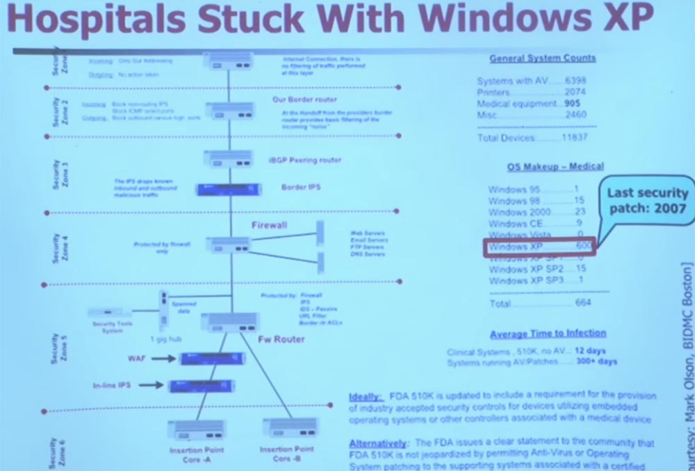

В условиях клиники очень трудно обеспечивать защиту оборудования, потому что сроки службы оборудования и программного обеспечения не синхронизированы. В здравоохранении мыслят, оперируя понятиями десятилетий, но в быстром мире хоккейной клюшки из Силиконовой долины, мы думаем о днях, неделях или месяцах по отношению к новинкам программного обеспечения.  
Внизу слайда вы видите информацию о том, что среднее время заражения медицинского оборудования вирусами составляет 12 дней, в течение которых у них нет никакой защиты от вредоносных программ. При наличии антивирусных программ время безопасной работы устройств без угрозы заражения вирусами увеличивается почти до 1 года, но и этого недостаточно.

25:00 мин

[Курс MIT «Безопасность компьютерных систем». Лекция 15: «Медицинское программное обеспечение», часть 2](https://habr.com/company/ua-hosting/blog/428654/)

Полная версия курса доступна [здесь](https://ocw.mit.edu/courses/electrical-engineering-and-computer-science/6-858-computer-systems-security-fall-2014/).

Спасибо, что остаётесь с нами. Вам нравятся наши статьи? Хотите видеть больше интересных материалов? Поддержите нас оформив заказ или порекомендовав знакомым, **30% скидка для пользователей Хабра на уникальный аналог entry-level серверов, который был придуман нами для Вас:** [Вся правда о VPS (KVM) E5-2650 v4 (6 Cores) 10GB DDR4 240GB SSD 1Gbps от $20 или как правильно делить сервер?](https://habr.com/company/ua-hosting/blog/347386/) (доступны варианты с RAID1 и RAID10, до 24 ядер и до 40GB DDR4).

**VPS (KVM) E5-2650 v4 (6 Cores) 10GB DDR4 240GB SSD 1Gbps до декабря бесплатно** при оплате на срок от полугода, заказать можно [тут](https://ua-hosting.company/vpsnl).

**Dell R730xd в 2 раза дешевле?** Только у нас **[2 х Intel Dodeca-Core Xeon E5-2650v4 128GB DDR4 6x480GB SSD 1Gbps 100 ТВ от $249](https://ua-hosting.company/serversnl) в Нидерландах и США!** Читайте о том [Как построить инфраструктуру корп. класса c применением серверов Dell R730xd Е5-2650 v4 стоимостью 9000 евро за копейки?](https://habr.com/company/ua-hosting/blog/329618/)