Курс MIT «Безопасность компьютерных систем». Лекция 15: «Медицинское программное обеспечение», часть 2 / Блог компании ua-hosting.company

### Массачусетский Технологический институт. Курс лекций #6.858. «Безопасность компьютерных систем». Николай Зельдович, Джеймс Микенс. 2014 год

Computer Systems Security — это курс о разработке и внедрении защищенных компьютерных систем. Лекции охватывают модели угроз, атаки, которые ставят под угрозу безопасность, и методы обеспечения безопасности на основе последних научных работ. Темы включают в себя безопасность операционной системы (ОС), возможности, управление потоками информации, языковую безопасность, сетевые протоколы, аппаратную защиту и безопасность в веб-приложениях.

Лекция 1: «Вступление: модели угроз» [Часть 1](https://habr.com/company/ua-hosting/blog/354874/) / [Часть 2](https://habr.com/company/ua-hosting/blog/354894/) / [Часть 3](https://habr.com/company/ua-hosting/blog/354896/)  
Лекция 2: «Контроль хакерских атак» [Часть 1](https://habr.com/company/ua-hosting/blog/414505/) / [Часть 2](https://habr.com/company/ua-hosting/blog/416047/) / [Часть 3](https://habr.com/company/ua-hosting/blog/416727/)  
Лекция 3: «Переполнение буфера: эксплойты и защита» [Часть 1](https://habr.com/company/ua-hosting/blog/416839/) / [Часть 2](https://habr.com/company/ua-hosting/blog/418093/) / [Часть 3](https://habr.com/company/ua-hosting/blog/418099/)  
Лекция 4: «Разделение привилегий» [Часть 1](https://habr.com/company/ua-hosting/blog/418195/) / [Часть 2](https://habr.com/company/ua-hosting/blog/418197/) / [Часть 3](https://habr.com/company/ua-hosting/blog/418211/)  
Лекция 5: «Откуда берутся ошибки систем безопасности» [Часть 1](https://habr.com/company/ua-hosting/blog/418213/) / [Часть 2](https://habr.com/company/ua-hosting/blog/418215/)  
Лекция 6: «Возможности» [Часть 1](https://habr.com/company/ua-hosting/blog/418217/) / [Часть 2](https://habr.com/company/ua-hosting/blog/418219/) / [Часть 3](https://habr.com/company/ua-hosting/blog/418221/)  
Лекция 7: «Песочница Native Client» [Часть 1](https://habr.com/company/ua-hosting/blog/418223/) / [Часть 2](https://habr.com/company/ua-hosting/blog/418225/) / [Часть 3](https://habr.com/company/ua-hosting/blog/418227/)  
Лекция 8: «Модель сетевой безопасности» [Часть 1](https://habr.com/company/ua-hosting/blog/418229/) / [Часть 2](https://habr.com/company/ua-hosting/blog/423155/) / [Часть 3](https://habr.com/company/ua-hosting/blog/423423/)  
Лекция 9: «Безопасность Web-приложений» [Часть 1](https://habr.com/company/ua-hosting/blog/424289/) / [Часть 2](https://habr.com/company/ua-hosting/blog/424295/) / [Часть 3](https://habr.com/company/ua-hosting/blog/424297/)  
Лекция 10: «Символьное выполнение» [Часть 1](https://habr.com/company/ua-hosting/blog/425557/) / [Часть 2](https://habr.com/company/ua-hosting/blog/425561/) / [Часть 3](https://habr.com/company/ua-hosting/blog/425559/)  
Лекция 11: «Язык программирования Ur/Web» [Часть 1](https://habr.com/company/ua-hosting/blog/425997/) / [Часть 2](https://habr.com/company/ua-hosting/blog/425999/) / [Часть 3](https://habr.com/company/ua-hosting/blog/426001/)  
Лекция 12: «Сетевая безопасность» [Часть 1](https://habr.com/company/ua-hosting/blog/426325/) / [Часть 2](https://habr.com/company/ua-hosting/blog/427087/) / [Часть 3](https://habr.com/company/ua-hosting/blog/427093/)  
Лекция 13: «Сетевые протоколы» [Часть 1](https://habr.com/company/ua-hosting/blog/427763/) / [Часть 2](https://habr.com/company/ua-hosting/blog/427771/) / [Часть 3](https://habr.com/company/ua-hosting/blog/427779/)  
Лекция 14: «SSL и HTTPS» [Часть 1](https://habr.com/company/ua-hosting/blog/427783/) / [Часть 2](https://habr.com/company/ua-hosting/blog/427785/) / [Часть 3](https://habr.com/company/ua-hosting/blog/427787/)  
Лекция 15: «Медицинское программное обеспечение» [Часть 1](https://habr.com/company/ua-hosting/blog/428652/) / [Часть 2](https://habr.com/company/ua-hosting/blog/428654/) / [Часть 3](https://habr.com/company/ua-hosting/blog/428656/)

Кстати, не стесняйтесь задавать вопросы, если хотите узнать больше, погружайтесь вглубь причин любого из этих инцидентов. Еще одна интересная вещь, которую я обнаружил – это то, что относительно распространенным источником заражения являются сами поставщики, причём иногда они даже не осознают этого. При этом имеет место «фабричная установка вирусов». Поэтому я собираюсь перейти к случаям, когда сам поставщик оказывался распространителем вредоносного ПО.

Я разговаривал с главным офицером службы безопасности Администрации ветеранов, VA. Они имеют около 153 клиник в США. Однажды у них появился поставщик, который намеревался обновить программное обеспечение части медицинского оборудования.

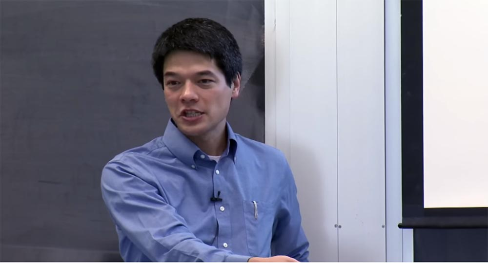

При этом антивирусные программы буквально кричали повсюду, куда совался этот Боб, потому что в процессе обновления ПО он использовал собственный USB-накопитель, зараженный вирусом. Он заражал машины случайно, потому что каким-то образом вредоносное ПО попало на его флешку.  
Есть мнение, что если ты не в сети, то ты в безопасности. Но если вы задумаетесь об этом, то поймёте, что несмотря на то, что мало кто пользовался интернетом 20 лет назад, люди всё равно страдали от компьютерных вирусов. Самым распространенным переносчиком вирусной инфекции в клинике является USB-накопитель. Я знал двух производителей, не могу сообщить вам их имена, которые почти что отправили в клиники зараженные вредоносными программами медицинские устройства. К счастью, они спохватились раньше, чем включили это оборудование в линейку своих продуктов.

Кто из вас выполнял какую-либо работу по программированию или имел дело с дистрибутивом программного обеспечения с использованием «облака»? Несколько человек, отлично.

Медицинское сообщество также использует облачные технологии. Это дает им больше контроля над дистрибутивом, но связано с рисками, которые качественно отличаются от рисков вашего типичного программного обеспечения. Если вы хотите получить обновление для текстового редактора, это одно, а если вы хотите получить обновление для дыхательного аппарата – совершенно другое дело.

Я заметил, что FDA опубликовало отзыв по поводу обновления прошивки для данного аппарата, сообщив, что производитель разместил на сайте ссылку, по которой можно скачать это обновление. Я хотел проверить их цифровые подписи PGP, но не смог их нигде найти, зато внизу страницы поддержки продукта была ссылка с надписью «Нажмите здесь для обновления программного обеспечения". Я подумал: «вот здорово, дай-ка я попробую!», щелкнул по ссылке, и на экране тут же выскочило диалоговое окно с таким текстом: «Предупреждение: посещение этого сайта может нанести вред вашему компьютеру. Веб-сайт, который вы собираетесь посетить, вероятно, содержит вредоносные программы».

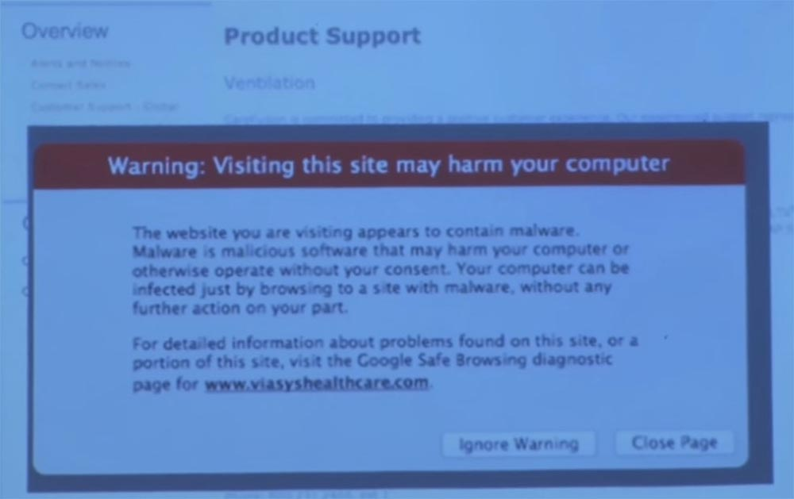

Кто-нибудь видел такое окно раньше? Знаете, что это такое? Что здесь происходит?

**Аудитория:** вероятно, это сработало ваше антивирусное программное обеспечение?

**Профессор:** почти угадали, но это не мой антивирус, а нечто подобное.

**Аудитория:** наверняка это предупреждение браузера Chrome!

**Профессор:** да, похоже, что в этом случае я использовал Chrome. У Google есть то, что называется службой безопасного просмотра веб-страниц, Safe Web Browsing service.

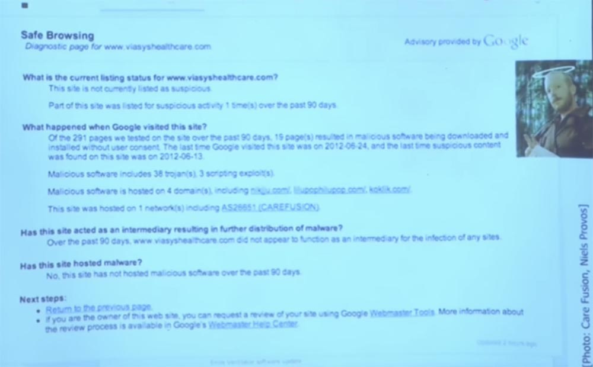

Парня, который разработал этот сервис, зовут Нильс Провос. Я считаю его одним из ведущих программистов OpenSSH, он тоже из Мичигана. Он создал этот сервис в Google, который просто «бродит» по интернету, загружая случайные исполняемые файлы, а затем запускает их. Что интересно, они создали кучу виртуальных машин. Это мое понимание технологии Нильса, я могу исказить суть, но я понимаю так, что они создают множество виртуальных машин, загружают на них эти исполняемые файлы, запускают и смотрят, заразится ли виртуальная машина вирусом.  
Если такое происходит, данный сайт помечается как распространитель вредоносных программ. Возможно, распространение вирусов не входит в намерения владельцев данного сайта, но если сайт позволяет загружать зараженное ПО, то он обязательно будет включен в список распространителей вредоносных программ.

Это то, что можно назвать «загрузки drive-by», это очень распространенный способ получения вредоносных программ в интернете, который используют спамеры и организованная киберпреступность.

Но в данном случае, похоже, их сайт был просто взломан, и вместо того, чтобы отправить мне обновление прошивки аппарата искусственного дыхания, они собирались предоставить мне вредоносное ПО. Во всяком случае, выборка Google показала, что все запросы по поводу обновления прошивки этого дыхательного аппарата в течение последних 90 дней отсылали пользователя именно на этот сайт. Предположим, что FDA опубликовало этот отзыв, вы инженер — биомедик, работаете в клинике и ваша работа заключается в том, чтобы обеспечивать безопасность и эффективность медицинских устройств. Вы просто пойдёте и скачаете эту программу.

Как вы думаете, на какую кнопку нажмёт такой инженер? Покинуть страницу или игнорировать предупреждение? Я уверен, 99% инженеров нажали бы кнопку «игнорировать»! А таких инженеров тысячи, и они разгуливают по больнице с вредоносным ПО в своих ноутбуках. Надеюсь, что вирусы попадают не в программу аппарата для вентиляции лёгких, а лишь в локальные компьютеры.

Вы можете проделать такую интересную вещь – произвести в базе данных MAUDE поиск по ключевой фразе «компьютерный вирус» и посмотреть на результат – там будут все рассказы, представленные клиниками и производителями медицинского оборудования. Наиболее интересно прочесть об устройстве под названием Compounder, у меня в лаборатории есть один такой прибор. Его довольно трудно достать, он производит жидкие лекарства. В верхней части компаундера расположены 16 воронок, куда можно поместить сыворотки, а на выходе получить нужную смесь в капельнице, из которой лекарственное средство поступает пациенту в вену. Во многих клиниках имеются такие устройства для производства лекарственных коктейлей. Так вот, MAUDE опубликовали отчёт, что один из таких компаундеров был заражен вирусом.

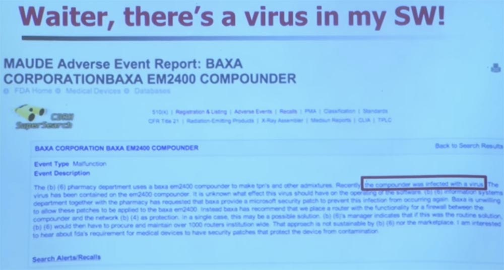

Мы купили такой компаундер и обнаружили, что он работает под управлением Windows XP Embedded. Поэтому он был уязвим для вредоносных программ, как и любое другое издание Windows XP. Но меня немного удивила реакция производителя, последовавшая на это сообщение. Я думал, они сменили пластинку, но их ответом было обычное: «Ну да, мы не регулярно устанавливаем обновления операционной системы и патчи». Именно это и удивило меня, и моей первой реакцией было: «Что-что? Что вы имеете ввиду? Неужели вы не знали, что Windows XP не поддерживается уже несколько лет? О каких обновлениях вы говорите»?

Таким образом, на лицо совершенное непонимание того, чего следует ожидать от обновления ОС. Позвольте мне прояснить ситуацию. FDA ожидает, что производители будут поддерживать программное обеспечение в актуальном состоянии. Но многие производители утверждают, что они не в состоянии производить обновления из-за некоторых несуществующих правил FDA. Так что если вы когда-либо столкнётесь с производителем медицинского устройства, утверждающим, что правила FDA запрещают им обновлять программное обеспечение, просто скажите ему, что он лжёт.  
По такому случаю профессор Фримен создал этот постер. Итак, поехали: «Домашнее задание мешает мне посещать школу», «eHarmony мешает мне назначать свидания» и «Правила FDA мешают обновлять ПО». И под этими высказываниями стоит штамп: «Чушь собачья»!

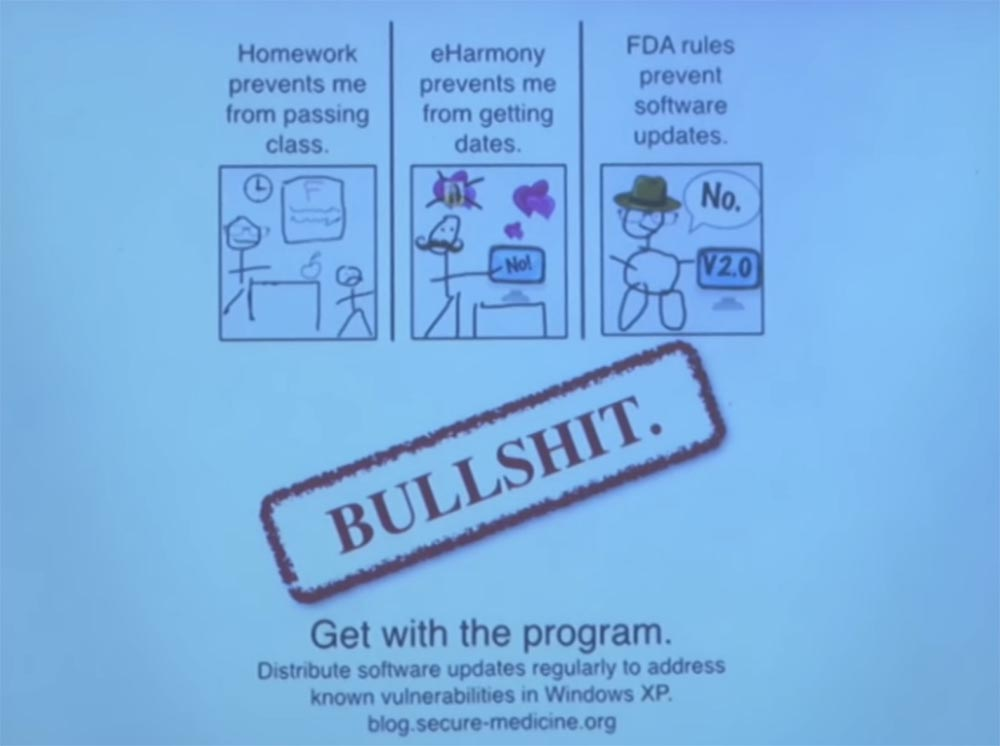

Да, это правда, что выпуск обновления программного обеспечения требует усилий. Это занимает инженерное время. Это непростой процесс. Существует огромное количество согласований и утверждений проделанной работы. Но это то, что вы обязаны делать, если участвуете в производстве медицинских устройств. От вас ожидают именно такого поведения, если вы заняты в этой отрасли.

Поэтому часто возникает вопрос: нужно ли нам беспокоиться об этом? Существуют ли неполадки, вызванные преднамеренно? Насколько они значительны?

Хорошая новость состоит в том, что мне неизвестно ни одного конкретного случая, когда на медицинское оборудование была бы осуществлена целенаправленная хакерская атака, и я надеюсь, что этого никогда не произойдёт. Но я думаю, было бы глупо предполагать, что плохих людей вообще не существует.

Итак, если оглянуться назад, то можно вспомнить инцидент 1982 года в Чикаго, где кто-то преднамеренно сфальсифицировал на полках аптек подлинный «Тайленол», введя в него цианид. Несколько человек проглотили такие таблетки и умерли. Немного позже, на похоронах, некоторые из родственников умерших приняли лекарство из такого же пузырька и тоже скончались.

В течение нескольких дней США изъяли «Тайленол» со всех полок с лекарственными препаратами. Вы бы не смогли найти ни одной бутылочки этого лекарства по всей Америке. Спустя год Конгресс принял новое законодательство в сфере фармацевтики, требующее защиты медицинских препаратов от несанкционированного вскрытия упаковки и физической безопасности безрецептурных препаратов.

Этот случай послужил причиной того, что когда вы открываете пузырёк с лекарством, то видите защитную металлическую фольгу.

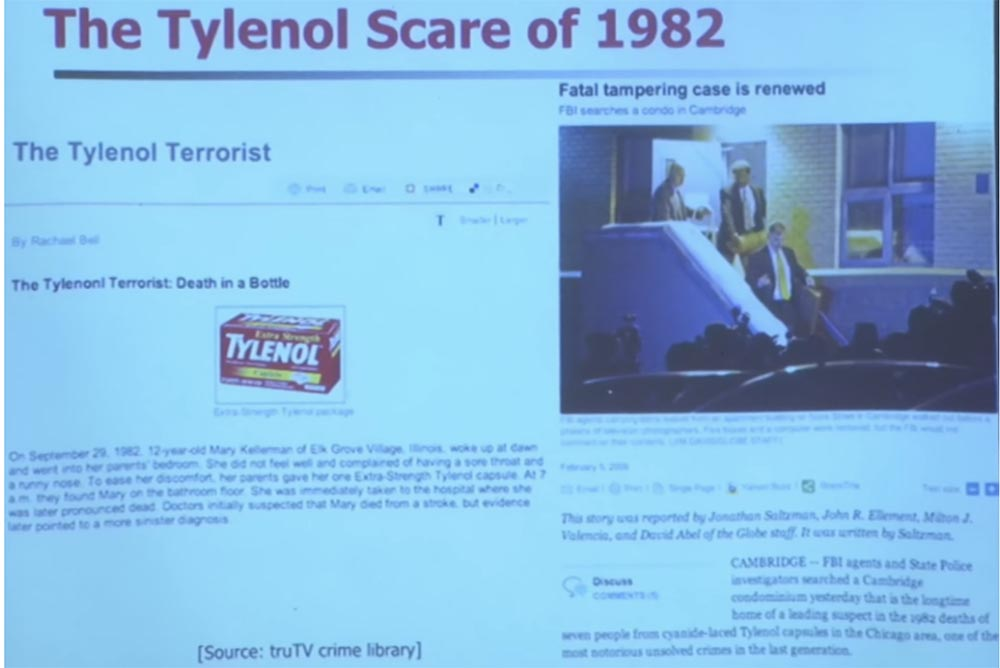

Так что мы знаем, что плохие люди реально существуют. Случаи, о которых мы знаем, больше касаются обычной глупости, но опасность всё ещё существует. На следующем слайде вы видите женщину, которая говорит, что у неё был один из самых тяжелых приступов, который она когда-либо испытала, после того, как кто-то разместил мигающую анимацию на сайте группы поддержки больных эпилепсией. Так что в данном случае налицо злой умысел. Вероятно, это был кто-то, кто не осознавал последствия своих действий, потому что вы можете серьезно навредить пациенту, чувствительному к подобным вещам. Но, опять же, плохие люди существуют.

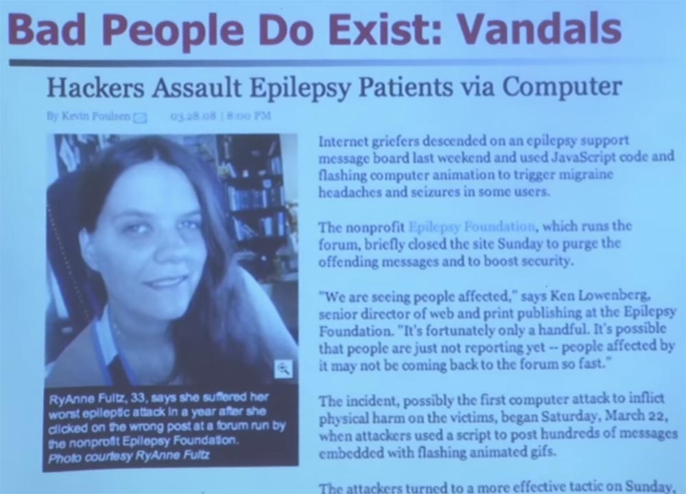

Таким образом, одна из проблем недостатка культуры мышления заключается в том, что большая часть производителей медицинских устройств мыслят статистически, предсказывая будущую производительность устройства на основе прошлых данных. Но как мы знаем, на самом деле, в мире безопасности, то, что вы не видите никаких проблем в данный момент, может означать, что вскоре их появится целая куча.

Например, посмотрите на Mac – ещё два года назад практически не существовало вирусов, способных заразить эти компьютеры. Но однажды ночью более полумиллиона компьютеров Mac были заражены вирусом Flashback.

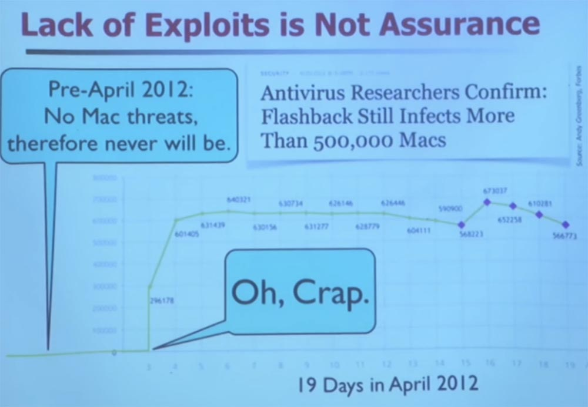

Поэтому одна из проблем — это преодоление культурного разрыва. Чтобы двигаться дальше и внедрять параметры безопасности в управление рисками при использовании медицинских устройств, не нужно опираться на то, что до сих пор с ними не было никаких особых проблем. Надеюсь, что мы сможем предотвратить сообщения о подобном крахе в еженедельных мировых новостях, но это всё равно может произойти.

Сейчас я пытаюсь провести некую аналогию. Прежде чем мы перейдем к способам решения проблем, я хочу напомнить вам историю с врачами, которые отрицали необходимость мыть руки. Однако для этого была причина. В 1800-х годах в больницах не было проточной воды, перчатки из латекса ещё не придумали, поэтому процедура мытья рук на самом деле была довольно сложной.

То же самое можно сказать и о безопасности, практически в любом контексте. Нет никакой магической пыли, которую вы могли бы распылить и нет волшебных латексных перчаток, которые вы можете надеть, чтобы добавить безопасность в работу ваших устройств. Поэтому, когда вы попросите производителя или врача, скажем, сохранять безопасность вашего устройства, это бывает довольно трудной задачей. Я думаю, что это займет некоторое время.

Если бы противники мытья рук были живы, то они бы сказали, что все врачи джентльмены, поэтому их компьютеры безопасны. Но я всё же настроен оптимистично, потому что большинство производителей, с которыми я разговариваю, теперь понимают, что это реальная проблема.  
Они просто не знают, что делать дальше. Так что, возможно, в будущем они наймут вас, чтобы помочь им решить эти проблемы безопасности.

Но все сводится к тому, что очень трудно добавлять безопасность по факту, вносить изменения в готовое ПО в некоторых случаях очень сложно и зачастую очень дорого. Вы действительно должны проектировать безопасность с самого начала, чтобы всё получилось правильно. Поэтому FDA ожидает от производителей, что они начнут делать всё правильно, когда они еще работают с ручкой и бумагой, на конструкторских досках, до того, как они изготовили медицинское устройство.

Так, что у нас со временем? 40 минут, замечательно. Я рассказываю быстрее, чем рассчитывал. Извините, если вы записываете, то я постараюсь говорить медленнее.

Я хочу поговорить немного о технологии, которые делают медицинские устройства более надежными, так что я попытаюсь взорвать ваш мозг, хорошо? Итак, почему вы доверяете датчику, скажем так, в вашем смартфоне? Я вижу, у вас есть смартфон, знаете ли вы, какие датчики в нём имеются?

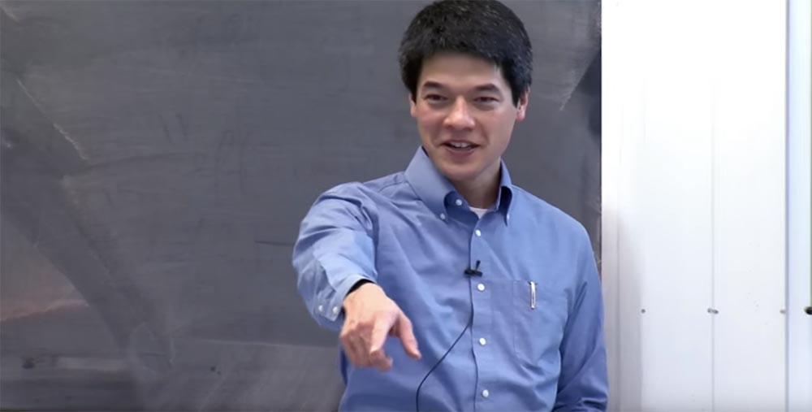

**Аудитория:** GPS.

**Профессор:** GPS, акселерометр, я слышал. Есть еще мысли? Что еще мы могли бы найти в телефоне?

**Аудитория:** Компас.

**Профессор:** Компас, свет, электромагнитное поле, температурные сенсоры? Технически камера имеет CCD-матрицу, так что сенсоры повсюду. У медицинских приборов тоже есть датчики.  
Почему вы доверяете тому, что сенсор говорит вашему процессору? Если вы пишете программное обеспечение и сенсор говорит, что сегодня 77 градусов, или 25 градусов по Цельсию, почему вы этому верите?

Моя лаборатория много работает над сенсорами. Сейчас я передам вам посмотреть один из таких датчиков, это датчик без батареек, снабжённый микроконтроллером MSP430. Но там нет батарей, потому что в нём имеется конденсатор ёмкостью 10 мкФ, который собирает энергию радиопередачи для питания микропроцессора.

У него есть все эти забавные мелочи, такие как 3D-акселерометр, датчики температуры, света. Но их довольно трудно включить. Опять же, почему вы доверяете показаниям всех компонентов, входящих в этот датчик? Ведь что-то превращает физические явления в эти маленькие электрические импульсы. Есть одно важное обстоятельство, почему вы не можете полностью доверять тому, что показывает этот датчик.

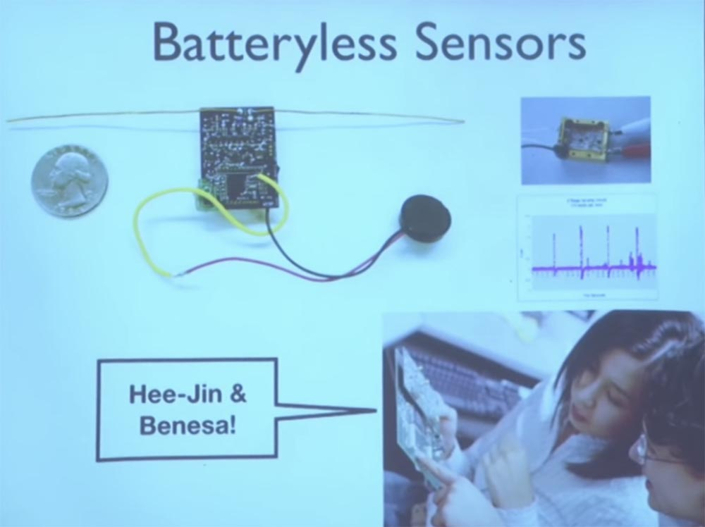

Это работа одного из моих лаборантов, Дениса Фу Куна, который катается на доске по озеру Мичиган. Но в остальное время он любит вмешиваться в работу сенсоров. Забудем на мгновение о безопасности — в 2009 году один джентльмен сообщал, что каждый раз, когда его сотовый звонил на кухне, в плите включалась духовка. Вы можете найти это сообщение в The New York Times. Так получилось, что резонансная частота звонка просто идеально подходила для срабатывания датчика включения кухонной духовки.

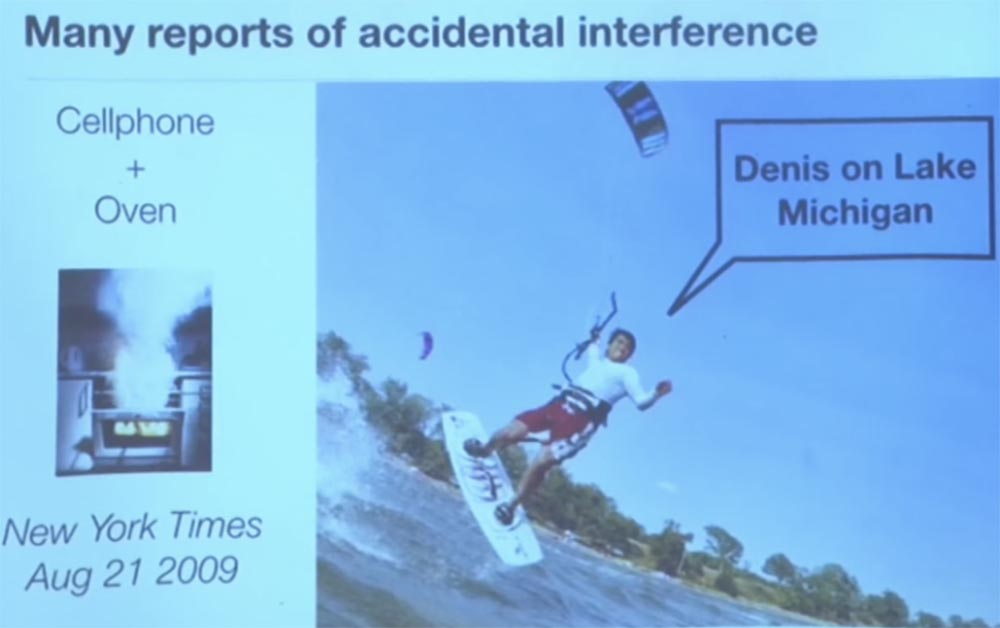

Так что помехи есть повсюду. Это постоянная битва устройств, говорящих в одном диапазоне частот. Но есть технологии, способные уменьшить это вмешательство. Проблема состоит в том, что происходит во время частотной интерференции сигнала. Я хочу поговорить немного об аналоговых устройствах.

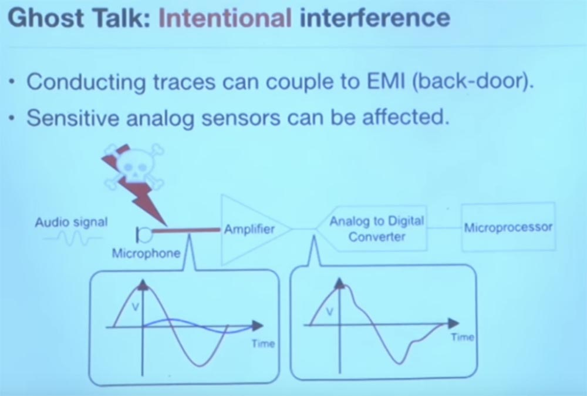

Скажите, курс лекций 6.003 все еще существует? Неужели? Отлично. Я бы посоветовал всем вам его пройти, если вы ещё этого не сделали. Это один из самых удивительных курсов для человека, занимающегося компьютерными науками, потому что вам не нужно слишком глубоко погружаться в электрические схемы.

Итак, мне было интересно, я пытался понять, почему я должен верить в то, что мне рассказывает сенсор. Я начал изучать структурную схему. Например, если у вас есть гарнитура Bluetooth, внутри неё вы найдёте микрофон, кусок провода, усилитель, ещё один провод, который идёт к конвертеру, преобразующему аналоговый сигнал в цифровой, там может быть какой-то фильтр, а затем всё поступает в микропроцессор. Но есть ещё и все эти вещи, которые мешают данным, прежде чем они попадают в ваше программное обеспечение. Однако программное обеспечение просто верит всему, что говорит этот провод. Знаете, что именно меня заинтересовало?

Например, этот отрезок провода от микрофона до усилителя имеет длину и резонансную частоту. Что произойдет, если кто-то создаст искусственные электромагнитные помехи, которые оптимизированы для захвата резонансной частоты этого куска провода? Они поступят в усилитель, где ещё усилятся, затем в этот аналого-цифровой преобразователь и оттуда в микропроцессор.

Одним из вопросов было, возможно ли подобное в принципе? Если да, то насколько сложно это осуществить? Какого вида энергия нужна, чтобы это сделать? И каково было бы качество сигнала, который достигнет микропроцессора?

Основная причина, почему это возможно, заключается в том, что мы говорим об умышленном, а не случайном вмешательстве в частотный диапазон.

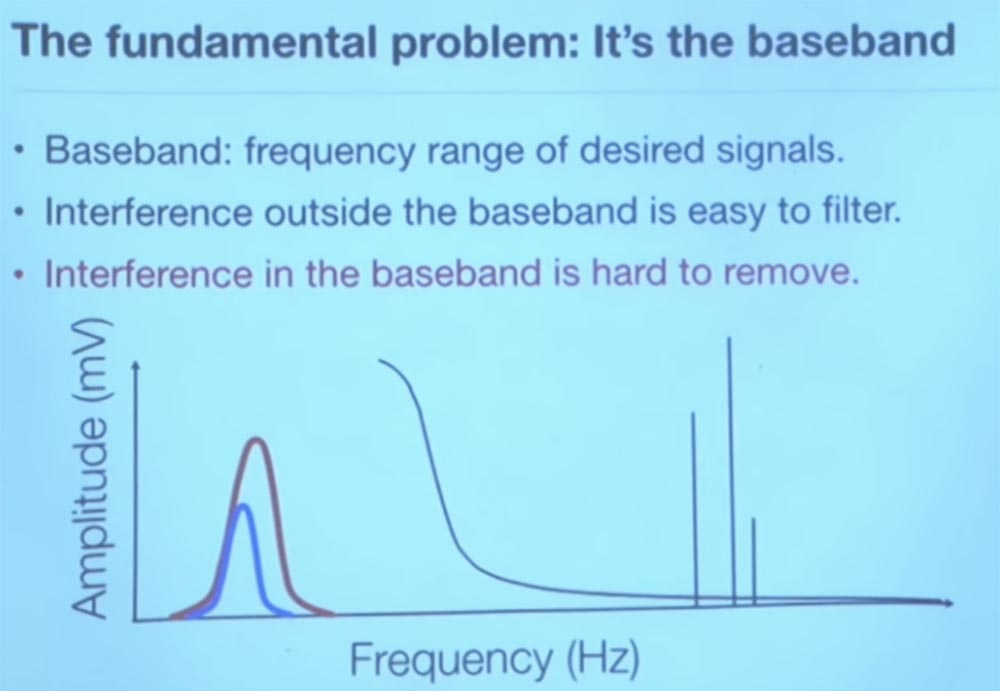

Представьте, что ваше медицинское устройство предназначено для приема физиологических сигналов организма в низкочастотном диапазоне, так как сердце не бьётся слишком быстро. Мы говорим о частоте в несколько герц. Поэтому если бы ваши электроды собирали высокочастотные сигналы, вы бы просто вставили аналоговый фильтр, вы бы сказали, что это нереально, чтобы сердце билось как электрический миксер, которым вы готовите свой ланч. Так что импульсы высокой частоты можно отфильтровать. Но если вы посылаете помехи, которые находятся в основной полосе пропускания, эти фильтры будут бессмысленными. Аналоговые фильтры не могут избавить от частот, находящихся в той же ожидаемой области диапазона, поэтому аналоговый сигнал трудно отфильтровывать.

Рассмотрим несколько примеров. Начнем с Bluetooth-гарнитуры, а потом доберемся до медицинского устройства. Итак, Денис построил множество биполярных антенн, передатчиков и усилителей. Здесь вы видите, что у него есть веб-камера.

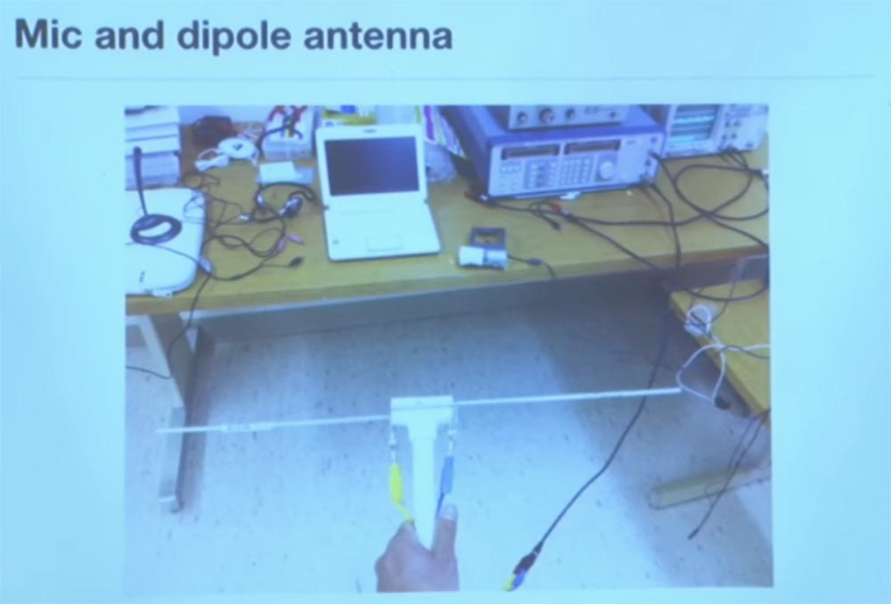

Я думаю, не многие из вас их теперь не покупают, потому что веб-камеры встроены в ноутбуки. У этой автономной веб-камеры есть микрофон и небольшой USB-кабель для трансляции звука на компьютер. Денис настроил компьютер на запись видео и аудио с последующим воспроизведением. Интересно, что вы сейчас это увидите.

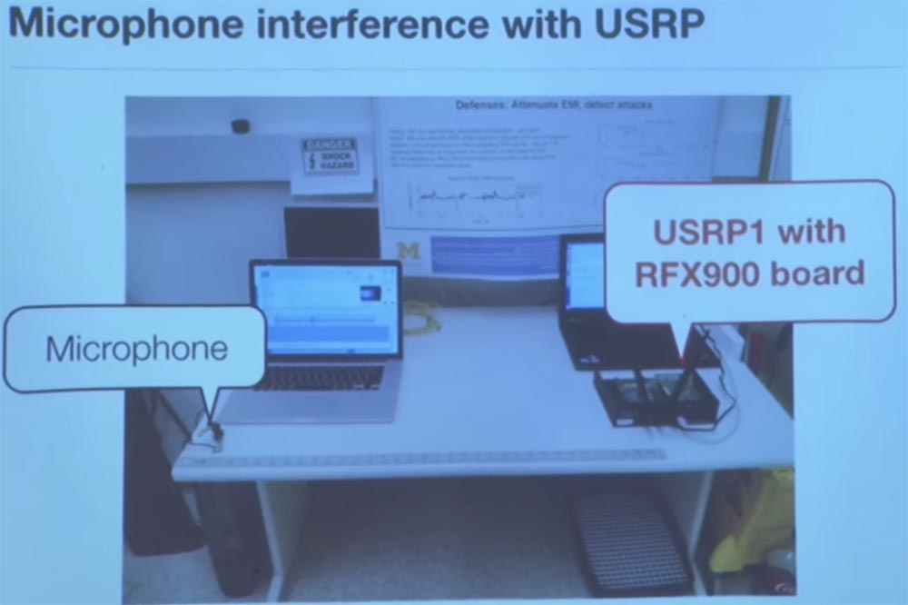

Всё происходило в абсолютно тихой комнате, и всё что вы могли услышать – это слабый шум компьютерной вентиляции. Он снял корпус с видеокамеры, потому что так было легче измерять интерференцию. Примерно в метре от ноутбука располагалось программно определяемая радиосистема, software radio, генерирующая электромагнитные помехи. Он написал для неё программу на Python и это радио посылало свои сигналы. Вот что услышал левый ноутбук в этой абсолютно тихой комнате.

Воспроизводится аудио, песня группы Weezer — «Island in the Sun».

Вот так! В последний раз, когда я это демонстрировал, кто-то в задних рядах начал танцевать. Собственно, это и есть высокое качество, Hi-Fi. Вот почему эти видеокамеры такие дешёвые – они используют действительно дешёвые микрофоны с низкой частотной чувствительностью.

Фактически через интерференцию мы получили более высококачественное аудио, нежели то, что способен передать микрофон.

Так что если вам перестанет нравиться ваша bluetooth-гарнитура, и вы захотите прослушать классическую музыку, просто передайте её с помощью интерференции. Только не говорите FCC, что я вас этому научил, потому что создавать искусственные помехи устройствам связи запрещено. Итак, если вы создаёте преднамеренные магнитные помехи, это оказывается за пределами модели защиты, и поэтому ваш процессор просто им доверяет.

Вы можете сделать несколько интересных вещей. Предположим, ваш коллега по офису решает с помощью гарнитуры Bluetooth позвонить в свой банк и сделать несколько вкладов. Вы можете вставить в передачу DTMF-сигналы, используемые для набора телефонного номера. Это интересно, и играть с этим довольно весело.

Например, вы можете изменить язык, когда коллега пытается перевести средства со счёта на счёт, и всё это благодаря помехам, интерференции.

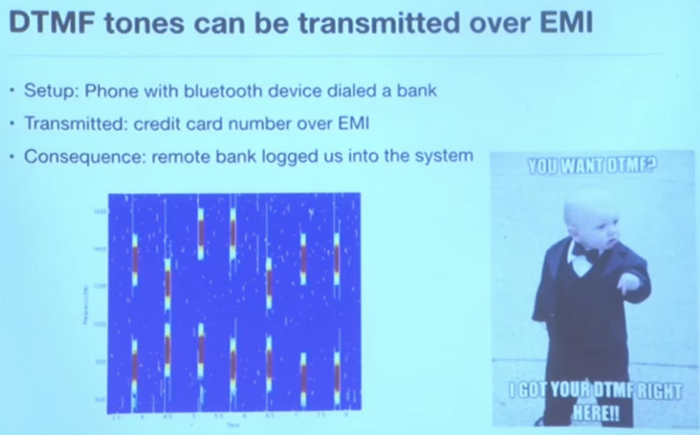

При этом человек с гарнитурой Bluetooth ничего не услышит, никаких посторонних сигналов, потому что, как вы помните, эти сигналы исходят от самого человека, но обратно не возвращаются. Однако банк их услышит и совершит все сделки.

Так что есть способы проделать это, и для них не требуется особо разбираться в аналоговых технологиях, ведь мы в основном компьютерщики. Но вам нужно как-то преобразовать сигнал для микропроцессора во что-то другое, что легче передать.

В первую очередь вы можете подумать о том, чтобы просто подавить передачу очень мощным сигналом, заглушить её. Это метод грубой силы. Он не слишком хорошо работает, но всё же может помочь. Так что если вы сможете отправить что-то, что соответствует резонансной частоте этого маленького кусочка провода, да, это в какой-то степени поможет выполнить работу.

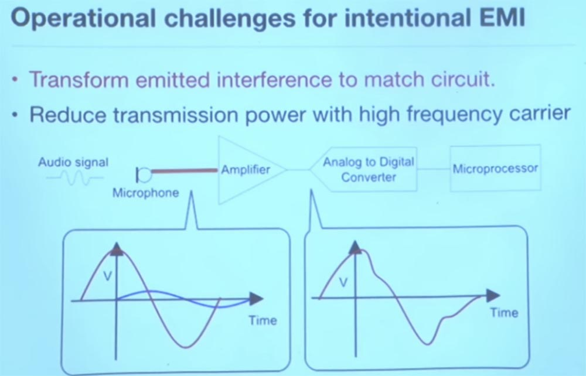

Проблема в том, что многие из этих сигналов низкочастотные, и их сложнее передавать. Они потребляют меньше энергии, так что послать сигнал будет сложнее. Поэтому вы заинтересованы в том, чтобы отправить сигнал более высокой частоты, ведь его легче обеспечить энергией. Но если вы пошлете действительно высокочастотный сигнал, он окажется за пределами полосы пропускания частот, так что против него сработают все фильтры.

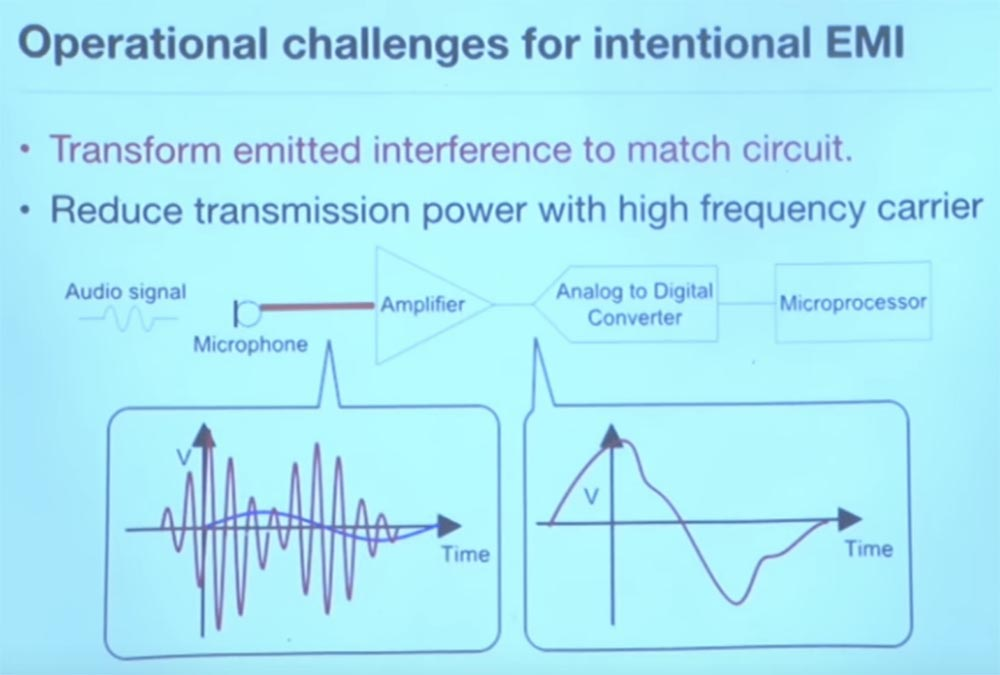

Вот что вы делаете вместо этого. Вы рассматриваете эту схему как непреднамеренный демодулятор. У нас имеется крутая синусоида красного цвета, которую мы хотим передать. Вместо этого мы накладываем её на пологую синусоиду более высокой частоты и посылаем в усилитель, и, в конце концов, благодаря теории выборки это сработает.

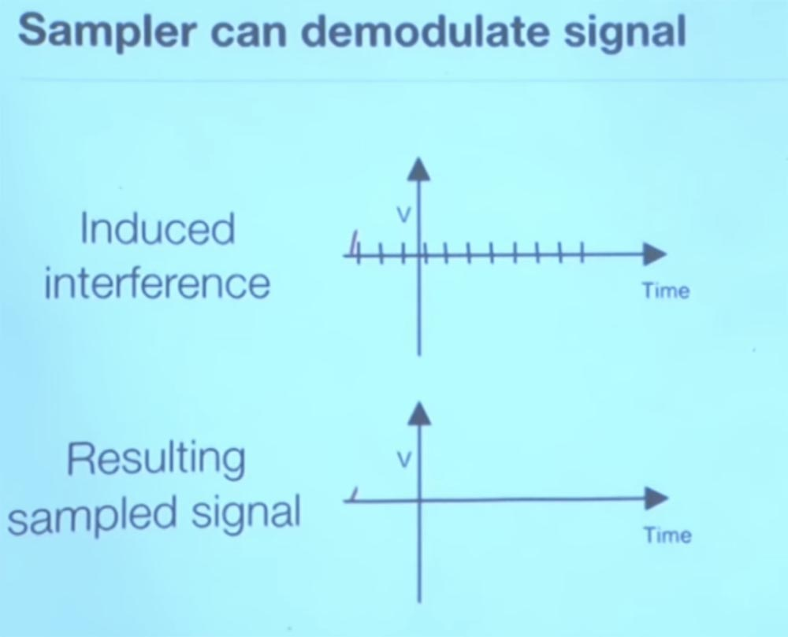

Вверху изображён сигнал помехи, который мы посылаем, а внизу показан сигнал, который видит микропроцессор. Аналогово\-цифровой преобразователь не делает постоянную выборку образцов, процессор работает с прерыванием типа: «проснись\- прочти показания\- проснись\- прочти показания». Таким образом, волны собираются в образец, а затем формируется выходной сигнал для процессора. Так как мы посылаем действительно быстрый сигнал, он берет образец, берет образец, берет образец, и так далее, и так далее.

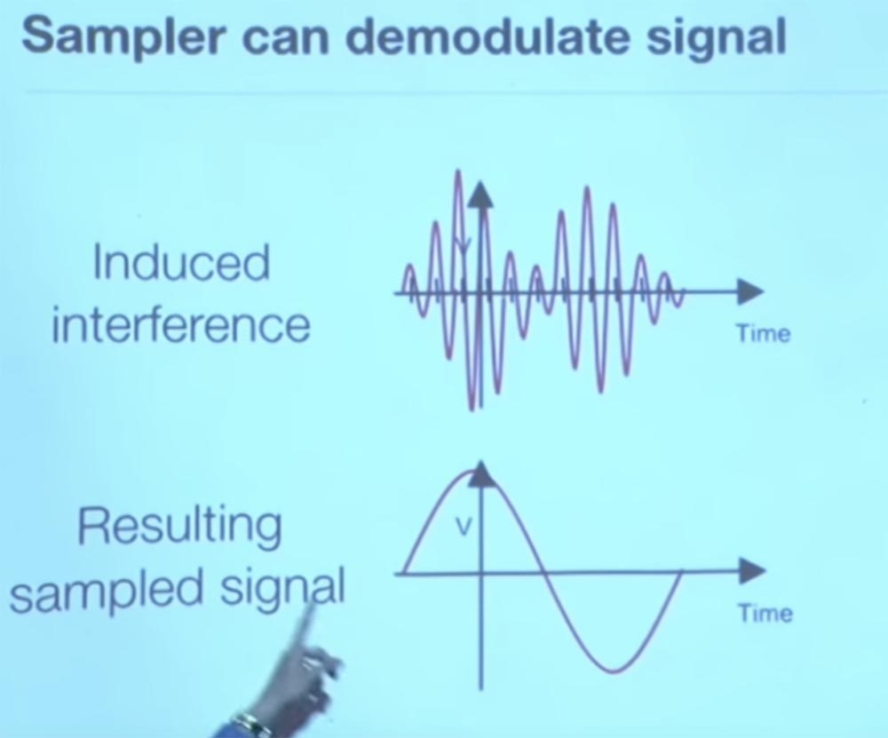

Ваш микропроцессор думает, что он получил синусоидальную волну низкой частоты, но фактически мы использовали высокочастотную волну, потому что это позволило нам осуществить передачу намного легче.

Поэтому я не собираюсь останавливаться на подробностях, но хорошая возможность проделать подобное – это повозиться с нелинейными компонентами схемы.

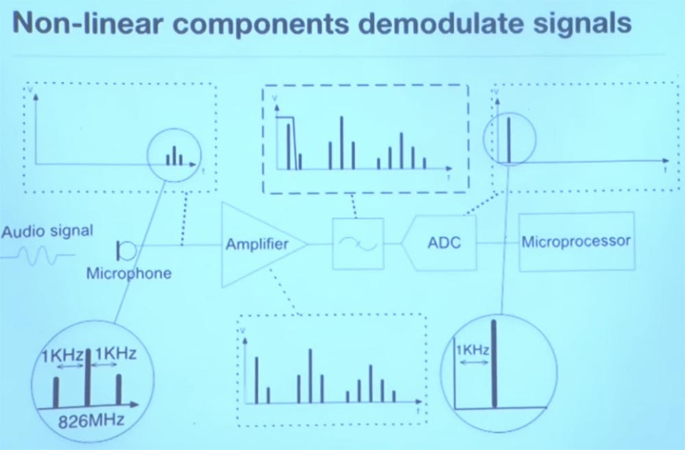

Но ведь здесь речь идёт о нарушении модели безопасности, верно? Мы полностью нарушаем то, что задумал проектировщик данной схемы. Предположим, вы посылаете сигнал частотой 826 МГц, это резонансная частота нашего провода. Но я не могу говорить так быстро.

Всё, что мы делаем – это модулируем наш голос на 826 мегагерцовом носителе. Проблема состоит в том, чтобы получить, например, всю эту репликацию сигнала. Вы видите частоту, так, как её выдаёт модулятор. В прямоугольнике показана частотная область, вы видите, что сигналы повторяются. Но оказывается, что фильтры, встроенные в большинство этих устройств, обрезают повторяющиеся копии. Поэтому в итоге микропроцессор видит наш оригинал частотой 1КГц, который мы и пытались послать. Таким образом, здесь имела место непреднамеренная демодуляция.

Это самый простой пример, который я смог придумать, чтобы объяснить идею преднамеренных помех. Теперь попробуем применить её к дефибрилляторам и другим медицинским устройствам.

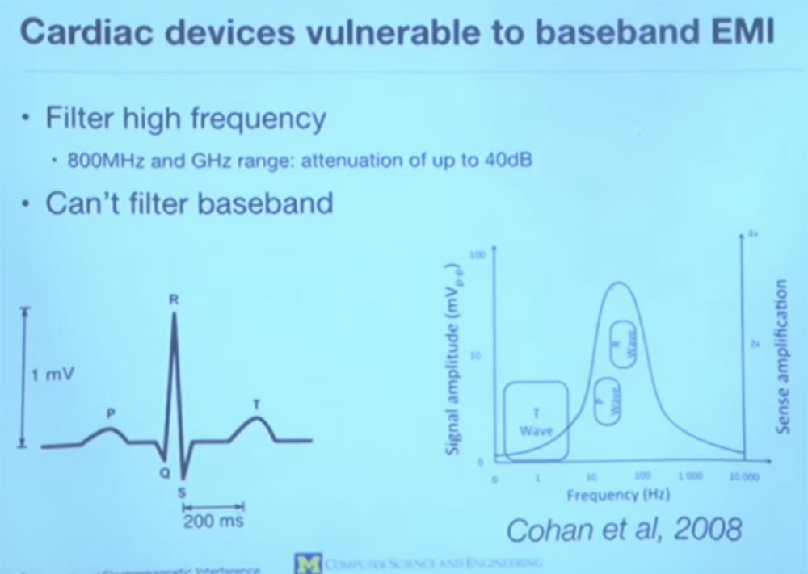

Опять же, дефибриллятор имплантирован под ключицу. У него есть эти электроды, которые идут в камеры сердца, и они используются для контроля ритма и возбуждения сердечной деятельности. Слева вы видите частоту удара, распределённую по времени, а справа – трансформацию Фурье.  
Так что справа просто сигнал, одиночный удар сердца, а сердцебиение довольно сложная вещь. Врачи отмечают различные компоненты сердечного ритма, помеченные литерами P, Q, R, S, T. Комплекс QRS – это то, что считается сердцебиением. Фактический ритм — это гигантское R, это то, что вы чувствуете. Но есть и другие волны, поменьше, так как ткань вашего сердца заряжается энергией в области P и расслабляется в области T.

Если обработать сердечный ритм с помощью преобразования Фурье, то видно, что большинство сигналов типичного сердечного ритма расположены в диапазоне десятков герц и лишь некоторые находятся за пределами 100 Гц. Поэтому большинство этих устройств предназначены для фильтрации сигналов, которые соответствуют слишком низким или слишком высоким частотам.  
Но если вы собираетесь произвести преднамеренное электромагнитное взаимодействие в основной полосе частот, то оно проходит через все аналоговые фильтры. Единственный способ обойти это состоял в применении компьютерных наук. Здесь моим ученикам стало немного веселей, потому что мы хотели проверить это в реальной ситуации, но не смогли найти добровольцев. Вместо этого мы обнаружили, что существует национальный стандарт для симуляции человеческого организма.

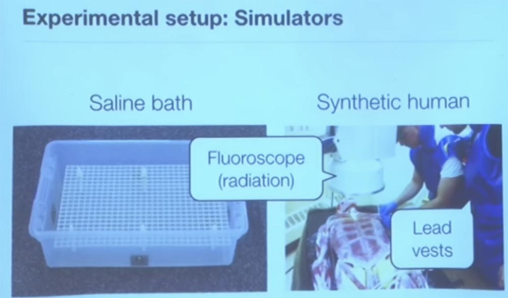

То что вы видите на слайде справа — это тело. Оказывается, мы все просто мешки с физраствором. И так если вы имеете тщательно откалиброванный физиологический раствор, это лучший способ имитировать человеческие ткани. Кроме этой ванночки с раствором, мы использовали синтетический труп, у которого правильная анатомия. Он имеет все те же жизненно важные органы, что внутри у всех нас, и работающую кровеносную систему. Так что он имеет все поверхностные свойства радиочастот. В правой части слайда показано, как мы делаем радиационную рентгеноскопию, чтобы получить 3D изображение, вернее, 4D. Мы видим световое изображение того, как мы имплантируем электроды в наш синтетический труп.

Сейчас мы создадим электромагнитные помехи, а затем посмотрим, что именно наше устройство воспринимает как достоверный сигнал.

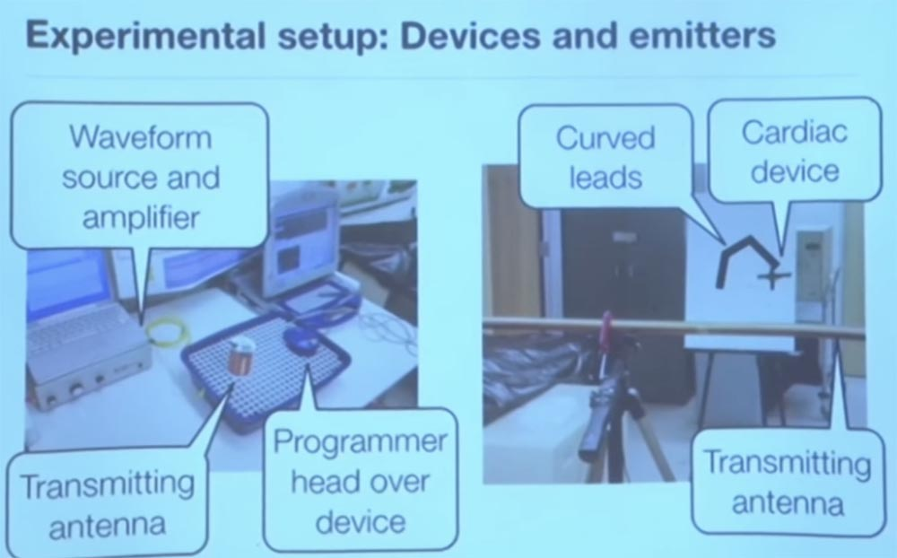

Мы сделали это несколькими способами. В физрастворе мы использовали только катушку магнитной проволоки. Здесь у нас есть жезл, который считывает телеметрию, чтобы узнать, что программер думает по поводу того, что он видит, а также источник волновых форм и преобразователь. Справа на заднем плане на доске мы создали 2D-версию пациента. Вы можете видеть загиб электрода, сам электрод и кардиостимулятор – это лента, находящаяся прямо под ними.

49:50 мин

[Курс MIT «Безопасность компьютерных систем». Лекция 15: «Медицинское программное обеспечение», часть 3](https://habr.com/company/ua-hosting/blog/428656/)

Полная версия курса доступна [здесь](https://ocw.mit.edu/courses/electrical-engineering-and-computer-science/6-858-computer-systems-security-fall-2014/).

Спасибо, что остаётесь с нами. Вам нравятся наши статьи? Хотите видеть больше интересных материалов? Поддержите нас оформив заказ или порекомендовав знакомым, **30% скидка для пользователей Хабра на уникальный аналог entry-level серверов, который был придуман нами для Вас:** [Вся правда о VPS (KVM) E5-2650 v4 (6 Cores) 10GB DDR4 240GB SSD 1Gbps от $20 или как правильно делить сервер?](https://habr.com/company/ua-hosting/blog/347386/) (доступны варианты с RAID1 и RAID10, до 24 ядер и до 40GB DDR4).

**VPS (KVM) E5-2650 v4 (6 Cores) 10GB DDR4 240GB SSD 1Gbps до декабря бесплатно** при оплате на срок от полугода, заказать можно [тут](https://ua-hosting.company/vpsnl).

**Dell R730xd в 2 раза дешевле?** Только у нас **[2 х Intel Dodeca-Core Xeon E5-2650v4 128GB DDR4 6x480GB SSD 1Gbps 100 ТВ от $249](https://ua-hosting.company/serversnl) в Нидерландах и США!** Читайте о том [Как построить инфраструктуру корп. класса c применением серверов Dell R730xd Е5-2650 v4 стоимостью 9000 евро за копейки?](https://habr.com/company/ua-hosting/blog/329618/)