Курс MIT «Безопасность компьютерных систем». Лекция 18: «Частный просмотр интернета», часть 1 / Блог компании ua-hosting.company

### Массачусетский Технологический институт. Курс лекций #6.858. «Безопасность компьютерных систем». Николай Зельдович, Джеймс Микенс. 2014 год

Computer Systems Security — это курс о разработке и внедрении защищенных компьютерных систем. Лекции охватывают модели угроз, атаки, которые ставят под угрозу безопасность, и методы обеспечения безопасности на основе последних научных работ. Темы включают в себя безопасность операционной системы (ОС), возможности, управление потоками информации, языковую безопасность, сетевые протоколы, аппаратную защиту и безопасность в веб-приложениях.

Лекция 1: «Вступление: модели угроз» [Часть 1](https://habr.com/company/ua-hosting/blog/354874/) / [Часть 2](https://habr.com/company/ua-hosting/blog/354894/) / [Часть 3](https://habr.com/company/ua-hosting/blog/354896/)  
Лекция 2: «Контроль хакерских атак» [Часть 1](https://habr.com/company/ua-hosting/blog/414505/) / [Часть 2](https://habr.com/company/ua-hosting/blog/416047/) / [Часть 3](https://habr.com/company/ua-hosting/blog/416727/)  
Лекция 3: «Переполнение буфера: эксплойты и защита» [Часть 1](https://habr.com/company/ua-hosting/blog/416839/) / [Часть 2](https://habr.com/company/ua-hosting/blog/418093/) / [Часть 3](https://habr.com/company/ua-hosting/blog/418099/)  
Лекция 4: «Разделение привилегий» [Часть 1](https://habr.com/company/ua-hosting/blog/418195/) / [Часть 2](https://habr.com/company/ua-hosting/blog/418197/) / [Часть 3](https://habr.com/company/ua-hosting/blog/418211/)  
Лекция 5: «Откуда берутся ошибки систем безопасности» [Часть 1](https://habr.com/company/ua-hosting/blog/418213/) / [Часть 2](https://habr.com/company/ua-hosting/blog/418215/)  
Лекция 6: «Возможности» [Часть 1](https://habr.com/company/ua-hosting/blog/418217/) / [Часть 2](https://habr.com/company/ua-hosting/blog/418219/) / [Часть 3](https://habr.com/company/ua-hosting/blog/418221/)  
Лекция 7: «Песочница Native Client» [Часть 1](https://habr.com/company/ua-hosting/blog/418223/) / [Часть 2](https://habr.com/company/ua-hosting/blog/418225/) / [Часть 3](https://habr.com/company/ua-hosting/blog/418227/)  
Лекция 8: «Модель сетевой безопасности» [Часть 1](https://habr.com/company/ua-hosting/blog/418229/) / [Часть 2](https://habr.com/company/ua-hosting/blog/423155/) / [Часть 3](https://habr.com/company/ua-hosting/blog/423423/)  
Лекция 9: «Безопасность Web-приложений» [Часть 1](https://habr.com/company/ua-hosting/blog/424289/) / [Часть 2](https://habr.com/company/ua-hosting/blog/424295/) / [Часть 3](https://habr.com/company/ua-hosting/blog/424297/)  
Лекция 10: «Символьное выполнение» [Часть 1](https://habr.com/company/ua-hosting/blog/425557/) / [Часть 2](https://habr.com/company/ua-hosting/blog/425561/) / [Часть 3](https://habr.com/company/ua-hosting/blog/425559/)  
Лекция 11: «Язык программирования Ur/Web» [Часть 1](https://habr.com/company/ua-hosting/blog/425997/) / [Часть 2](https://habr.com/company/ua-hosting/blog/425999/) / [Часть 3](https://habr.com/company/ua-hosting/blog/426001/)  
Лекция 12: «Сетевая безопасность» [Часть 1](https://habr.com/company/ua-hosting/blog/426325/) / [Часть 2](https://habr.com/company/ua-hosting/blog/427087/) / [Часть 3](https://habr.com/company/ua-hosting/blog/427093/)  
Лекция 13: «Сетевые протоколы» [Часть 1](https://habr.com/company/ua-hosting/blog/427763/) / [Часть 2](https://habr.com/company/ua-hosting/blog/427771/) / [Часть 3](https://habr.com/company/ua-hosting/blog/427779/)  
Лекция 14: «SSL и HTTPS» [Часть 1](https://habr.com/company/ua-hosting/blog/427783/) / [Часть 2](https://habr.com/company/ua-hosting/blog/427785/) / [Часть 3](https://habr.com/company/ua-hosting/blog/427787/)  
Лекция 15: «Медицинское программное обеспечение» [Часть 1](https://habr.com/company/ua-hosting/blog/428652/) / [Часть 2](https://habr.com/company/ua-hosting/blog/428654/) / [Часть 3](https://habr.com/company/ua-hosting/blog/428656/)  
Лекция 16: «Атаки через побочный канал» [Часть 1](https://habr.com/company/ua-hosting/blog/429390/) / [Часть 2](https://habr.com/company/ua-hosting/blog/429392/) / [Часть 3](https://habr.com/company/ua-hosting/blog/429394/)  
Лекция 17: «Аутентификация пользователя» [Часть 1](https://habr.com/company/ua-hosting/blog/429680/) / [Часть 2](https://habr.com/company/ua-hosting/blog/429682/) / [Часть 3](https://habr.com/company/ua-hosting/blog/429686/)  
Лекция 18: «Частный просмотр интернета» [Часть 1](https://habr.com/company/ua-hosting/blog/430204/) / [Часть 2](https://habr.com/company/ua-hosting/blog/430206/) / [Часть 3](https://habr.com/company/ua-hosting/blog/430208/)

Итак, давайте начнём. Добро пожаловать на еще одну увлекательную лекцию о безопасности и о том, почему мир настолько ужасен. Итак, сегодня мы поговорим о режимах приватного просмотра интернета, о том, в чем многие из вас, вероятно, имеют большой личный опыт. Какова цель частного просмотра? Что говорят о приватности исследователи безопасности?

В общем смысле они говорят о следующей цели: любой конкретный пользователь не должен ничем отличаться от кучи других пользователей. В частности, активность данного пользователя при просмотре интернета не должна выглядеть компрометирующей с точки зрения активности других пользователей. Итак, как я уже упоминал, сегодня мы поговорим о конфиденциальности в конкретном контексте приватного интернет-просмотра.

На самом деле нет формального определения того, что означает приватный просмотр веб-страниц. На это есть несколько причин. Одна из них состоит в том, что веб-приложения очень и очень сложные вещи. В них постоянно добавляют новые функции, такие, как аудио, видео контент и прочие подобные вещи. В результате то, что должны представлять собой браузеры, является «движущейся целью». Поэтому понятие того, что могут делать браузеры, достаточно расплывчато, в результате чего не всегда ясно, какая именно информация о конкретном пользователе способна просочиться в открытый доступ.

В конечном итоге происходит то, что на практике, как и для многих других вещей, само существование и задачи браузеров определяются стандартами жизни. Таким образом, различные производители браузеров будут реализовывать различные функции, особенно в отношении частного просмотра. Другие разработчики видят результаты работы конкурентов и обновляют свой собственный браузер, так что цели и задачи браузера постоянно меняются.

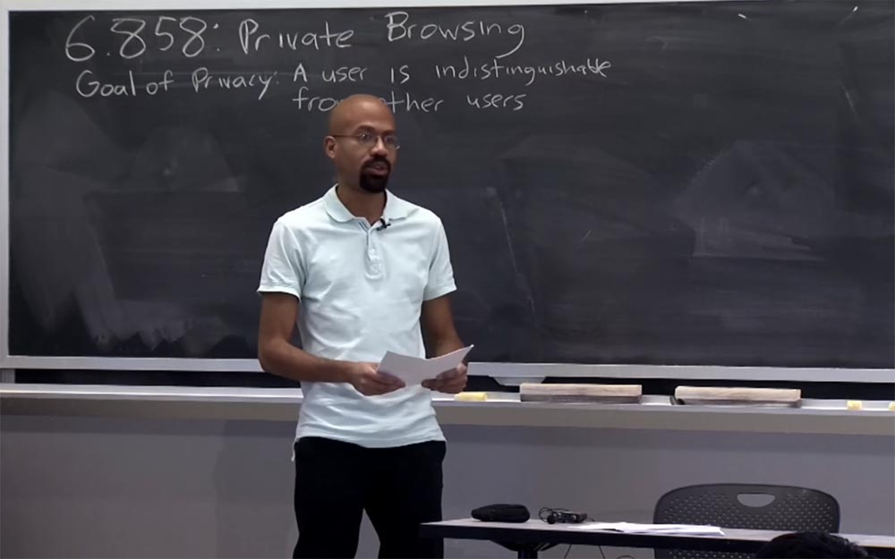

Так как пользователи всё больше и больше полагаются на приватный просмотр интернета, они в конечном итоге находят множество ошибок конфиденциальности, о которых я расскажу через минуту. В глобальном смысле приватный просмотр можно рассматривать как амбициозную цель. Но по мере того, как общество совершенствуется, некоторые аспекты частного просмотра становятся лучше, а некоторые – хуже.

Так что же мы подразумеваем под приватным просмотром интернета? Это достаточно сложно определить, но лекционная статья пытается формализовать этот вопрос двумя конкретными способами. В первую очередь в ней говорится о локальном хакере в частной сети – человеке, который завладеет вашим компьютером после того, как вы закончите приватный просмотр. И этот человек хочет выяснить, какие сайты вы посещали в режиме приватного просмотра.

Также в статье говорится о об интернет-злоумышленниках, которые контролируют посещаемые вами сайты. Этот злоумышленник может попытаться выяснить, что вы конкретный человек, Джон или Джейн, а не какой-то обезличенный пользователь, о котором веб-сайт не может предоставить никакой информации. Поэтому мы детально рассмотрим каждую из этих атак. Достаточно сказать, что если злоумышленник может одновременно организовать обе эти атаки, как локальную, так и интернет-атаку, это значительно усилит его возможность раскрыть вашу личность.

Например, локальный злоумышленник, который может знать ваш IP-адрес, способен узнать, имеется ли этот конкретный IP-адрес в логах сайта. Так что с точки зрения безопасности очень полезно рассмотреть эти локальные и веб-атаки, сначала по отдельности, а затем в объединенном виде.

Давайте рассмотрим первый тип злоумышленника – локальный атакующий. Предположим, что этот хакер будет управлять компьютером пользователя после завершения сеанса сетевой связи. Я имею в виду, что приватный просмотр интернет-страниц завершён, пользователь прекратил пользоваться браузером и его нет за компьютером. После этого хакер берёт компьютер под свой контроль и пытается выяснить, что происходило перед этим. Поэтому цель безопасности заключается в том, чтобы не дать злоумышленнику возможности понять, какие веб-сайты посещал пользователь во время приватного просмотра.

Важная причина, по которой мы рассматриваем атаку после завершения сеанса интернет-активности, заключается в следующем. Если мы предполагаем, что злоумышленник может контролировать компьютер перед частным просмотром, то «игра закончена», потому что в таком случае хакер может установить клавиатурный перехватчик, нарушить целостность браузера или самой операционной системы. Так что мы не будем уделять внимания такому атакующему. Обратите внимание, что по той же причине мы не пытаемся обеспечить конфиденциальность пользователя после того, как злоумышленник контролировал его компьютер, потому что захватив контроль над компьютером, хакер сможет проделать с ним всё, что захочет, хотя бы установить тот же клавиатурный перехватчик. Таким образом, в принципе, как только пользователь покидает компьютер, мы не рассматриваем напрямую понятие конфиденциальности.

Здесь можно представить ещё одну цель, которую вы хотите достичь — попытаться скрыть от злоумышленника, что пользователь вообще использует режим частного просмотра.

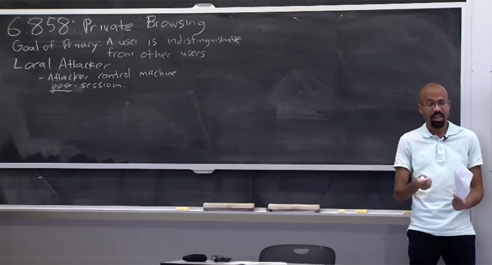

В лекционной статье сказано, что это очень сложно. Это свойство часто называют «правдоподобное отрицание». Например, ваш босс подходит к вам после сеанса частного просмотра и говорит: «вы просматривали сайт mylittlepony.com?», а вы отвечаете, нет, что вы, я точно туда не заходил! И я, конечно же, не использовал частный режим просмотра, чтобы скрыть тот факт, что я просматривал mylittlepony.com. Итак, как я уже сказал, свойство правдоподобного отрицания трудно обеспечить, позже я назову конкретные причины. Так что мы в основном будем рассматривать только локального злоумышленника.

Мы могли бы подумать над вопросом, какое постоянное состояние клиентской стороны способствует утечкам во время сеанса приватного просмотра? Под постоянностью я подразумеваю, что какие-то данные будут сохраняться на локальном жестком диске, локальном SSD или чем-то подобном.

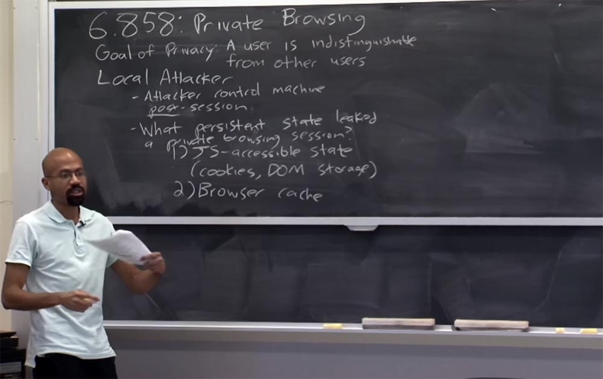

Итак, какие рабочие состояния системы чреваты утечками данных, если мы не были достаточно осторожны при приватном просмотре? В первую очередь, это состояние доступности таких составляющих JavaScript, как кукиз и хранилище DOM. Еще одна вещь, о которой люди беспокоятся при частном просмотре – это кеш браузера. Ведь вы не хотите, чтобы кто-то нашел во внутреннем кэше какие-то изображения или HTML-файлы с веб-сайтов, посещение которых вы хотите скрыть от других людей.

Еще одна важная вещь – это история посещенных вами сайтов. Можно испортить отношения с другим человеком, когда он заходит в браузер, начинает вводить что-то в адресной строке и смущенно прерывает начатое, так как история ваших просмотров автоматически подсказывает ему что-то в высшей степени неприличное. Это одна из причин, почему вы не захотите утечки этой информации за пределы сеанса приватного просмотра.

Можно также подумать о состояниях конфигурации просмотра и о таких вещах, как сертификаты клиентов и закладки страниц. Возможно, вы зашли на определенный сайт, и браузер предлагает сохранить ваши пароли в файле конфигурации для просмотра данного сайта, и вы не желаете их утечки.

Пятое – это загруженные файлы. Это интересно, потому что для загрузки файла требуется явное действие пользователя. Возможно, вы воспользуетесь загруженным файлом во время приватного просмотра при открытии браузера, но также возможно, что вы используете загруженный файл после окончания работы с браузером вне режима приватного просмотра. Мы поговорим об этом немного позже.

И, наконец, в режиме приватного просмотра вы можете установить новые плагины или расширения для браузера. Это еще один тип состояния, утечка которого за пределы частного просмотра нежелательна.

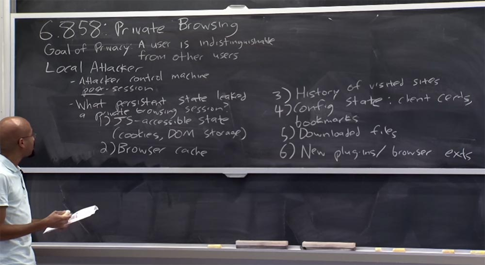

Таким образом, текущие режимы просмотра обычно пытаются предотвратить утечку данных во время первого, второго и третьего состояния сеанса приватного просмотра. То есть здесь не должно быть возможности утечки кукиз или данных DOM. Все, что вы помещаете в кэш во время сеанса приватного просмотра, должно быть удалено. У вас не должна храниться история посещаемых URL-адресов.

Как правило, данные четвёртого, пятого и шестого состояния режима частного просмотра могут просачиваться за пределы сеанса. Существуют полезные и вредные причины, по которым это может иметь место. Позже мы увидим, что если позволить утечку чего-то одного, то это радикальным образом увеличивает поверхность угрозы утечек всей приватной информации. Поэтому рассуждать о том, какие именно свойства безопасности предназначены для частного режима просмотра, достаточно сложно.

Следующая вещь, о которой мы поговорим очень кратко, — это сетевая активность во время режима частного просмотра. Интересно в этом то, что даже если мы предусмотрим защиту всех этих 6 состояний, не позволяя происходить утечкам информации, сам факт того, что вы выдаете сетевые пакеты при соединении, является доказательством того, что вы делали. Представьте, что когда вы хотите зайти на сайт foo.com, ваш компьютер должен выдать DNS запрос для foo.com. Так что даже если вы не оставите никаких следов активности шести вышеупомянутых состояний, всё равно в локальном кеше DNS останутся записи, что вы пытались связаться с хостом foo.com. Это очень интересно. Вы можете подумать, что браузеры каким-то образом могут попытаться очистить кэш DNS после завершения сеанса приватного просмотра, но на практике это сложно сделать, потому что во многих системах для подобного действия требуются права администратора. Здесь возникает противоречие, потому что, скорее всего, вы не захотите, чтобы браузер имел root права, так как мы убедились, что браузеры недостаточно ненадёжны. Кроме того, команды очистки DNS кеша рассчитаны на активность конкретного пользователя, они не очищают весь кеш, чего бы вы хотели для режима приватного просмотра. Вам потребуется «хирургическая» точность, чтобы избавиться только от упоминания посещения foo.com и других сайтов в режиме частного просмотра, не затронув при этом других вещей. На практике с этим справиться достаточно сложно.  
И еще одна хитрая вещь, о которой упоминает статья — это артефакты оперативной памяти, или RAM. Здесь основная идея заключается в том, что в режиме частного просмотра приватный браузер должен что-то хранить в памяти. Даже если режим приватного просмотра не требует непосредственной записи данных на диск или чтения данных с диска, работу браузера обеспечивает оперативная память. Например, просматриваемая вкладка может оставаться в файле подкачки, и эта информация может быть отражена в файле гибернации ноутбука. Таким образом, если это состояние отражается в постоянном хранилище, то после завершения сеанса частного просмотра злоумышленник может найти в файле подкачки код JavaScrip или HTML, которые отразились на диске.

У нас будет небольшая демонстрация того, как это может работать. На экране вы видите вкладку приватного просмотра, с которой я собираюсь зайти на сайт группы программирования PDOS лаборатории компьютерных наук нашего института CSAIL.

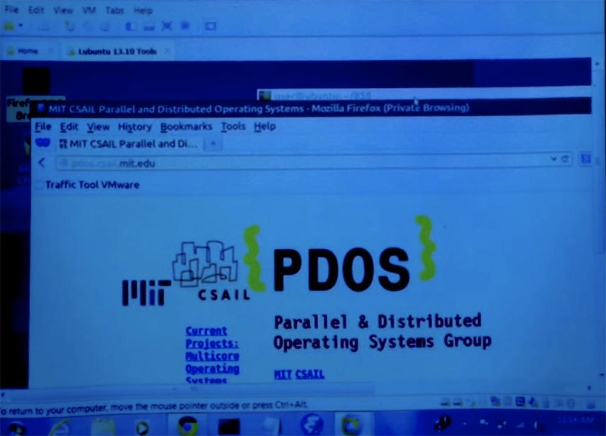\

Далее я собираюсь использовать эту забавную команду под названием gcore, чтобы сохранить в памяти снимок этой открытой страницы PDOS.

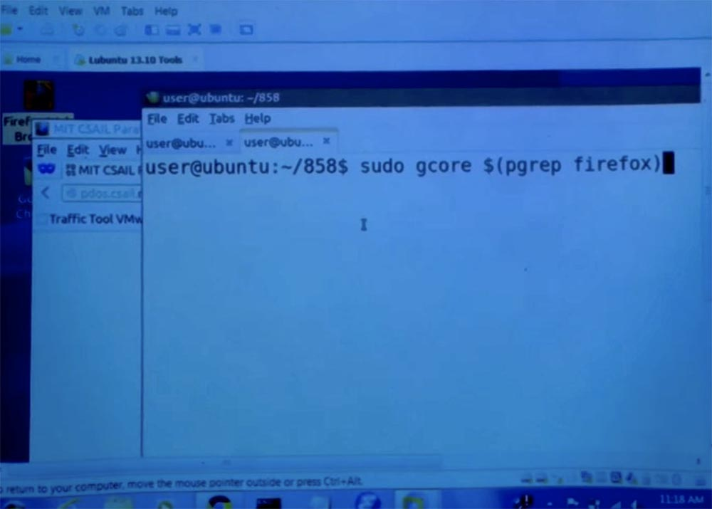

Далее я использую немного волшебства для того, чтобы мой терминал сделал снимок памяти, иногда это занимает немного времени.

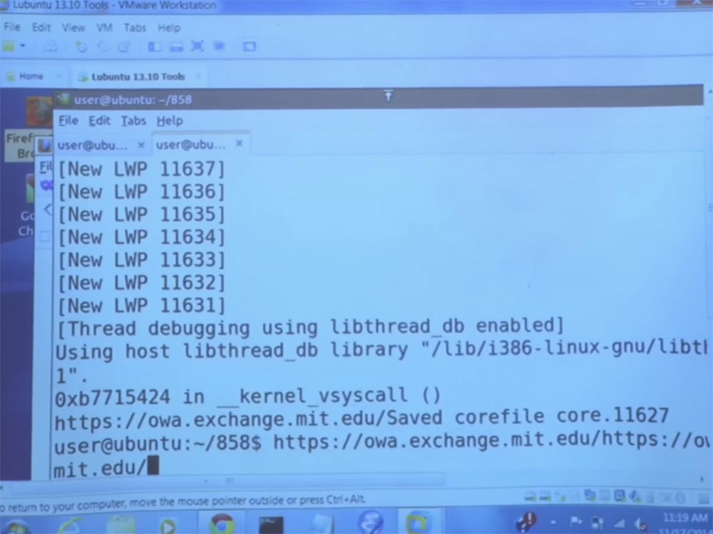

Вот что при этом происходит – здесь генерируется основной файл изображения этого частного просмотра. Теперь мы собираемся заглянуть внутрь этого изображения и посмотреть, cможем ли мы найти какие-либо упоминания о pdos.

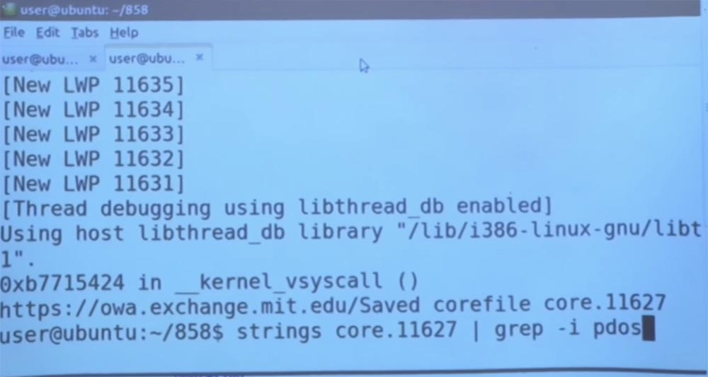

Интересно, что мы видим кучу экземпляров строк pdos с различными префиксами в этом изображении памяти для режима приватного просмотра.

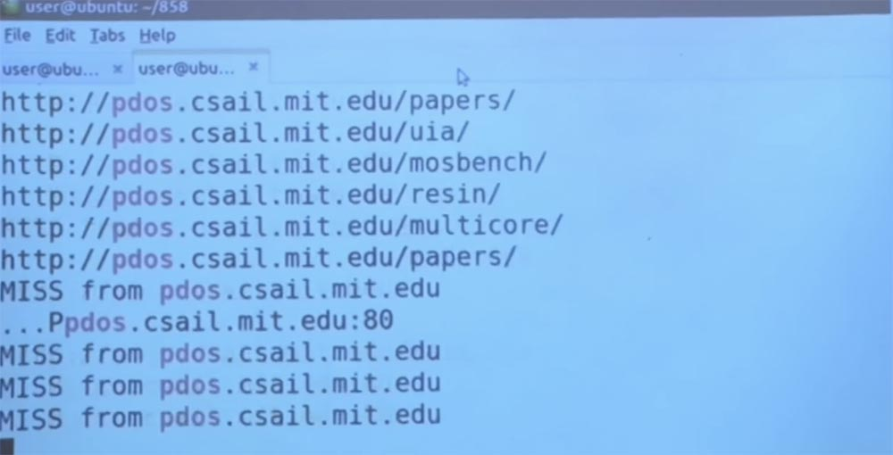

Если мы посмотрим дальше, то увидим такие вещи, как полные URL-адреса и HTML-коды.

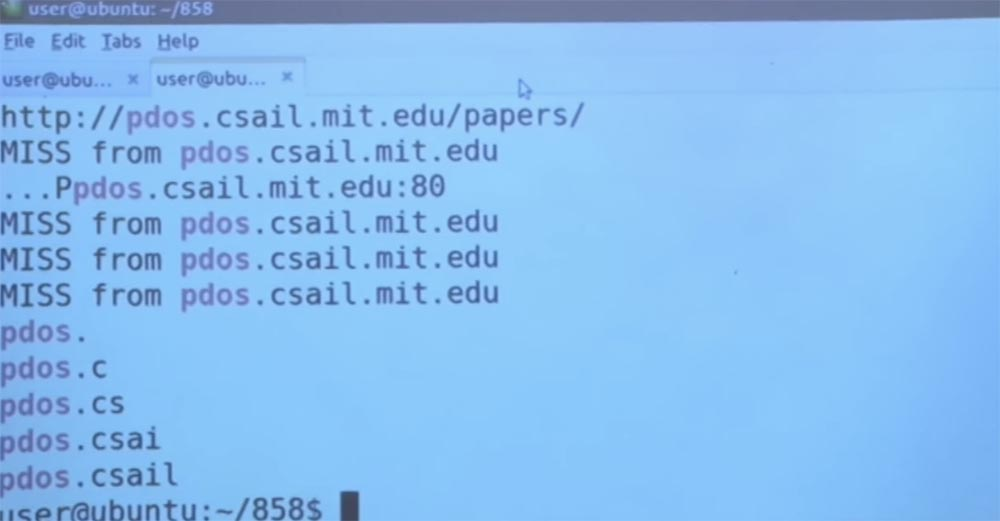

Смысл в том, что если мы смогли найти все это в памяти страницы, то есть какие-то данные этой страницы были помещены в файле подкачки на диск, то и злоумышленник сможет запросто запускать эти строки. Он может проделать то, что я только что сделал с файлом этой страницы, и попытаться узнать, какие сайты вы посетили в режиме приватного просмотра. Это понятно?  
В принципе, проблема здесь состоит в том, что режим частного просмотра не пытается «запутать» RAM или каким-то образом её зашифровать. Это кажется довольно фундаментальной вещью, потому что в определенный момент процессор должен выполнять задачу на основе открытых текстовых данных. Поэтому данное обстоятельство может стать большой проблемой. У кого-нибудь есть вопросы?

**Студент:** это именно то, чего я не ожидаю от своего браузера, потому что браузеры должны гарантировать конфиденциальность частного просмотра. Например, если вы делаете какие-то покупки, то знакомый, севший за ваш компьютер, не сможет их просмотреть. Не могли бы вы немного рассказать о том, какие гарантии дают авторы статьи и описывают ли они в статье, что можно изменить в работе браузеров для обеспечения такой конфиденциальности?

**Профессор:** да, это очень интересно. Существует одна вещь, на которую вы можете обратить внимание — когда вы открываете вкладку частного просмотра, как правило, перед вами появляется текстовое сообщение: «добро пожаловать в режим инкогнито». Этот режим поможет вам не оставлять следов, если на компьютере работает несколько пользователей, и ваш друг, севший после вас за компьютер, не сможет ознакомиться с историей ваших просмотров, файлами кукиз и данными заполнения форм. Однако режим «инкогнито» не поможет, если за вашей спиной стоит кто-то с резиновой дубинкой и собирается «вырубить» вас, как только вы зайдёте на сайт.

Поэтому сами производители избегают того, чтобы конкретизировать гарантии относительно сохранения конфиденциальности данных при использовании их браузеров.

В действительности после инцидента со Сноуденом многие браузеры изменили это всплывающее сообщение, потому что хотели на самом деле дать понять пользователю, что не могут защитить его от вмешательства таких сил, как АНБ или чего-то в этом роде.

Короче говоря, какие гарантии они обеспечивают? На практике, они обеспечивают лишь ту уязвимость, о которой вы только что сказали. То есть тот, кто не может увидеть сейчас, что вы делаете, сможет потом посмотреть, чем вы занимались. Мы предполагаем, что непрофессионал не может запустить строки в файле подкачки или проделать нечто подобное. Однако существуют две проблемы. Одна из проблем заключается в том, что браузеры настолько сложны, что они часто даже не защищают от действий непрофессионалов.

Могу привести личный пример. Несколько раз, когда я видел на странице смешные рекламные баннеры «Хаффингтон Пост», типа, «посмотрите, как трогательно эти щенки помогают другим щенкам спуститься по лестнице!», я по своей слабости иногда ловился на такое и кликал по ним. Но поскольку я не хотел, чтобы люди узнали о моей слабости, я иногда делал это в режиме приватного просмотра. Однако случалось, что иногда URL-адреса этих рекламных штук просачивались в историю URL-адресов в обычном, публичном режиме браузера, для которого этот материал не предназначался. Таким образом, одна из проблем заключается в том, что иногда эти браузеры не обеспечивают защиту от атак непрофессионалов.

Во-вторых, я думаю, что есть много людей, которые особенно после истории со Сноуденом, хотели бы от режима частного просмотра более сильной защиты конфиденциальности. Они хотели бы защиты от атаки артефактов ОЗУ, даже если они не могут технически грамотно сформулировать своё желание.

Поэтому одной из вещей, которую я сделал, обучаясь в этом институте, было исследование в области усиления защиты в режиме приватного просмотра, так что мы можем поговорить об этом. Вы узнаете, что все профессора могут бесконечно рассказывать о своих исследованиях, так если вы хотите поговорить об этом в течение трех часов, просто пришлите мне запрос, и мы это организуем. Итак, показанное мной всего лишь демонстрирует … у вас есть вопрос?

**Студент:** да, насчет оперативной памяти, потому что я не знаком с тем, как это работает. Почему браузер не может в конце сеанса просто попросить ОС очистить те части памяти, которые он использовал?

**Профессор:** мы перейдем к этой теме через пару минут. Но вы совершенно правы. в глобальном смысле можно представить, чтобы ОС после завершения процесса просматривала все задействованные страницы и записывала в них нули. Также можно представить, что браузер закреплял бы все страницы в памяти, чтобы они вообще не очищались. Существуют некоторые решения, которые могут это сделать, и через секунду я вам отвечу.

Итак, это был пример того, как данные из ОЗУ могут попадать на диск через файл подкачки. Но обратите внимание на то, что время жизни данных является более серьезной проблемой, чем она кажется в контексте частного просмотра. Вы можете себе представить, что любые программы, которые имеют дело, скажем, с криптографическими ключами или паролями пользователей, будут иметь эту проблему. Каждый раз, когда вы вводите пароль к программе, страница памяти, которая содержит этот пароль, всегда может быть отражена на диске.

Позвольте мне показать вам еще один пример. Рассмотрим довольно простую программу, которая называется memclear. Вы видите на экране, что мы просто прочитаем секретный текстовый файл, а затем навсегда «впадём в спячку».

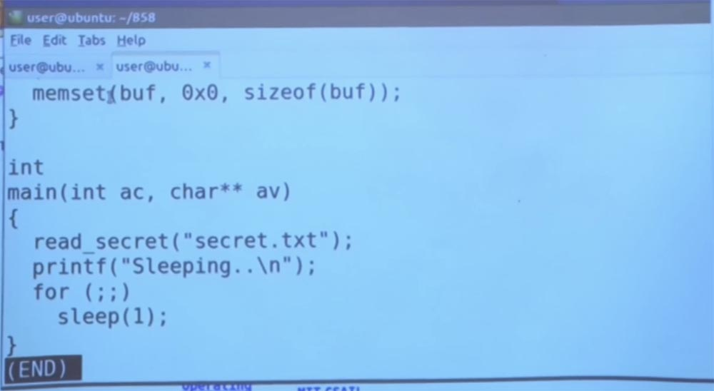

Так что же делает команда read_secret? Она прочитает некий файл, распечатает содержимое этого файла, а затем очистит буфер, который использовался для хранения этой секретной информации.

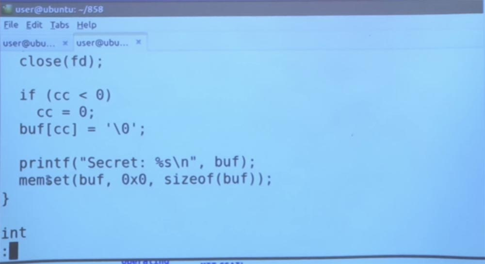

Итак, вернемся к вашей проблеме. Можно представить, что браузер, например, будет пытаться просто использовать команду memset для того, чтобы обнулить все секреты, которые встречаются только в режиме приватного просмотра. Если мы посмотрим на наш секретный файл, то увидем, что в нём нет ничего интересного, здесь просто написано: «мои секреты в файле».

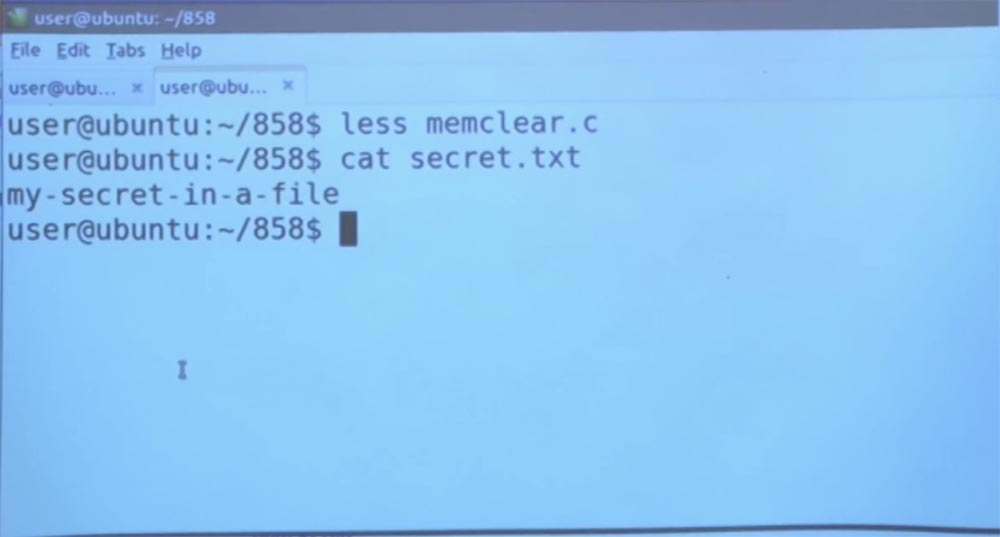

Затем, если запустить программу в фоновом режиме, что она сделает? Как я уже сказал, она просто распечатает содержимое этого файла.

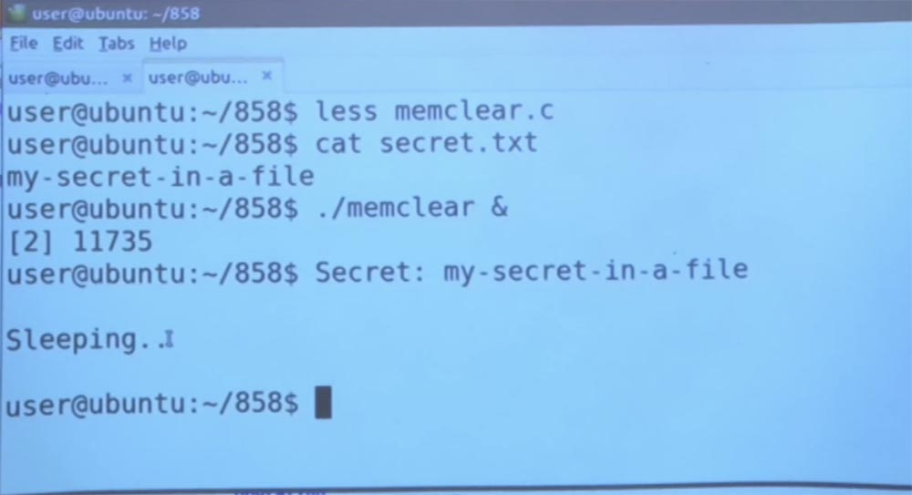

Как я уже сказал, она просто распечатала его. Она прочла этот файл, распечатала содержимое этого «секрета», очистила буфер памяти, который использовался для печати, и перешла в спящий режим. Если мы снова используем эту забавную команду gcore, то сможем получить дамп памяти программы memclear, которая работает в памяти прямо сейчас.

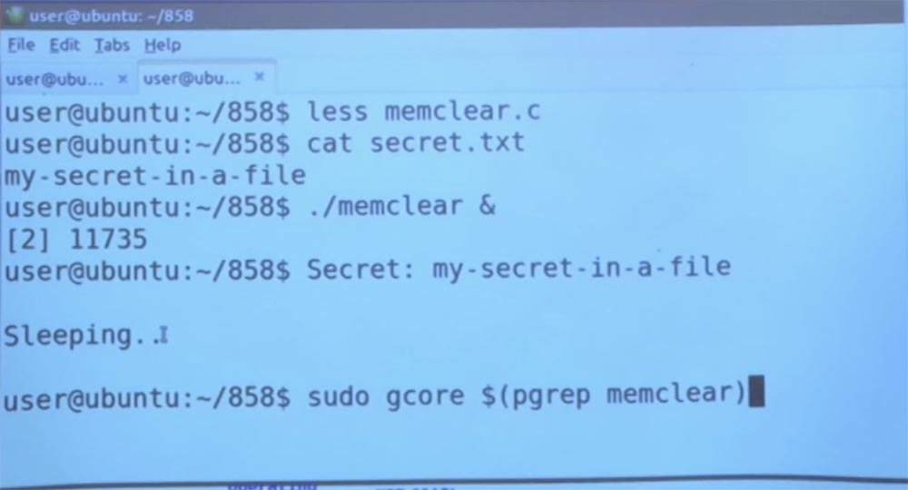

Далее найдём строку, которая нам нужна, и выполним команду grep для нашего секрета.

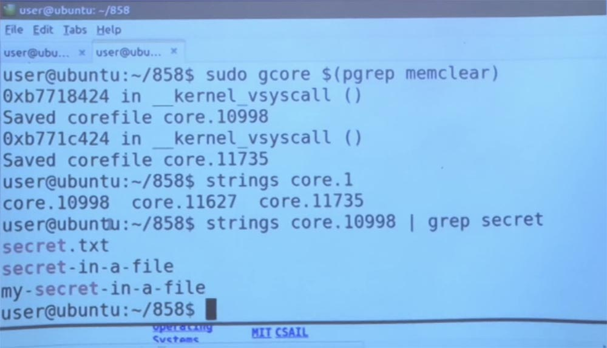

Итак, если посмотреть на образ оперативной памяти этой запущенной программы, то мы найдём экземпляры имени файла, который был считан, а также некоторые префиксы содержимого строки этого файла, несмотря на то, что мы стерли буфер в самой программе. Вы можете сказать, почему так получилось? Это кажется очень, очень странным.

Если вы подумаете о том, как работает ввод/вывод данных, то это похоже на типовые слои. К тому времени, когда содержимое этого файла попадает в программу, оно уже прошло, скажем так, память ядра, прошло стандартную библиотеку C для ввода/вывода, потому что эта библиотека выполняет буферизацию, и тому подобное. В конечном итоге происходит то, что даже если вы применили memset к видимому буферу приложения, остаются еще экземпляры секретных данных, расположенные в самых разных местах по всей системе, а эта программа рассматривает только режим пользователя данного приложения. Так что, вероятно, данные все еще находятся вокруг, может быть, в буферах ввода/вывода данных ядра или чего-то в этом роде.

Итак, возвратимся к вашему вопросу. Если вы хотите сделать то, что они называют распределением безопасности, вы не можете просто полагаться на механизмы на уровне приложений, потому что могут быть и другие места в системе, где обитают эти данные. Что это за места? Например, данные могут находиться в памяти процесса, где имеются такие вещи, как куча и стек. Поэтому, когда мы выполнили memset внутри программы memclear, мы в основном пытались решить именно эту проблему. И мы выяснили, что это необходимо, но недостаточно, чтобы очистить все экземпляры этого секрета из памяти. Так где же ещё обитают артефакты оперативной памяти? Они могут находиться во всех типах файлов, в резервных копиях, базах данных SQL.

Если в какой-то момент приложение берет что-то в RAM и записывает его в одну из этих вещей, то повторю еще раз, злоумышленник может быть в состоянии это восстановить после того, как захватит контроль над диском.

Как я упоминал, память ядра может служить ещё одним распространённым местом для хранения артефактов RAM, потому что, опять же, приложения обычно выполняют многоуровневый ввод-вывод, в котором каждый фрагмент данных проходит несколько частей стека. Подумайте, например, о передаче данных по сети. Во-первых, данные должны поступать в какой-то сетевой буфер, вероятно, внутри ядра. Затем они, вероятно, проходят через буферы стандартной библиотеки языка С и только после этого поступают в пользовательскую часть, то есть в приложение, написанное разработчиком. Так что это может стать большой проблемой.

Вы также можете думать об освобожденных страницах памяти как об источнике утечки данных. Представьте, что ваше приложение выделяет кучу памяти, используя, скажем, функцию malloc или еще много чего. Затем этот процесс умирает, и ядро запускает другой процесс, не обнулив перед физические страницы RAM. Может случиться так, что когда этот новый процесс запустится, он может просто пройти все эти физические страницы оперативной памяти, использовать кучу памяти и просто сделать ту же странную вещь – посмотреть, нет ли там чего-то интересного. И тогда злоумышленник, инициировавший данный процесс, сможет получить ваши секреты.

Существует множество способов утечки информации из ядра. Вы также можете подумать о буферах ввода/вывода таких устройств, как клавиатура и мышь. Там просто куча разных факторов, которые могут привести к утечке данных через ядро.

Как злоумышленник может попытаться получить эти сведения? В некоторых случаях так же просто, как прочитать файл подкачки. Можно прочитать файл гибернации и просто посмотреть, что там имеется. Некоторые форматы файлов встраивают в себя различные версии. Например, Microsoft Word использует для работы принцип, когда один файл Word на самом деле содержит в себе версии старых фрагментов данных. Поэтому, если бы вы могли получить доступ к этому файлу Word, вы могли бы просто с помощь разных форматов просмотреть все предыдущие версии документа.

Как я заметил пару минут назад, распределение безопасности также является проблемой, потому что оно не может поддерживать полный стек. Например, в более старых версиях ядра Linux, когда вы создаете каталог, конечную директорию, вы можете просочиться на глубину до 4-х килобайтов памяти ядра. Только Зевс знает, что имеется в этих воспоминаниях. И это потому, что Linux на самом деле не обнуляет память ядра, которая была выделена, освобождена, а затем снова выделена для чего-то другого.

Так что, как я уже упоминал ранее — если ядро не обнуляет страницы, которые предоставляются процессу в режиме пользователя, у вас может происходить утечка секретов пользователя с этих же типов страниц памяти.

По-другому обстоит дело с SSD. Большинство из них обеспечивает ведение журнала. Другими словами, когда вы отправляете запись на SSD, вы не перезаписываете данные напрямую, а на самом деле записываете их в журнал. И когда часть данных становится недействительной, затребовать их становится невозможно.

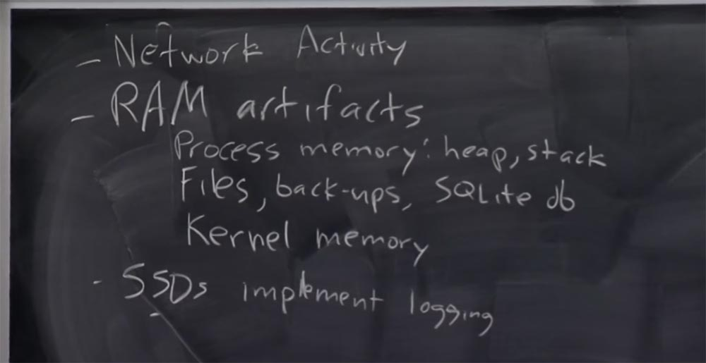

Так что в этом случае вам как пользователю не повезет, потому что если вы написали кучу данных, которые не были востребованы с SSD, то злоумышленник может посмотреть на это оборудование и сказать: «отлично, я понимаю формат этого журнала, и хотя технически эти данные могут быть недействительными, я все еще могу их восстановить».

Поэтому в глобальном смысле у вас может возникнуть проблема с украденным или выброшенными жёсткими дисками. Потому что если вы не используете шифрование, в больше случаев можно просто взять найденный в мусоре диск, разобраться с физическими слоями памяти и восстановить данные.

Так или иначе, с этими артефактами ОЗУ существует много проблем, связанных с тем, что данные каким-то образом «застревают» на постоянном хранении и позже могут стать доступными для злоумышленника.

Итак, как же мы можем исправить эти проблемы со временем жизни данных? Мы уже обсудили одно решение, которое заключается в том, чтобы обнулить память после того, как вы завершили процесс. Поэтому всякий раз, когда вы что-то освобождаете, вы просто записываете кучу нулей или какие-то случайные вещи, чтобы по существу скрыть старые данные от кого-то, кто может прийти после вас.

27:05 мин

[Курс MIT «Безопасность компьютерных систем». Лекция 18: «Частный просмотр интернета», часть 2](https://habr.com/company/ua-hosting/blog/430206/)

Полная версия курса доступна [здесь](https://ocw.mit.edu/courses/electrical-engineering-and-computer-science/6-858-computer-systems-security-fall-2014/).

Спасибо, что остаётесь с нами. Вам нравятся наши статьи? Хотите видеть больше интересных материалов? Поддержите нас оформив заказ или порекомендовав знакомым, **30% скидка для пользователей Хабра на уникальный аналог entry-level серверов, который был придуман нами для Вас:** [Вся правда о VPS (KVM) E5-2650 v4 (6 Cores) 10GB DDR4 240GB SSD 1Gbps от $20 или как правильно делить сервер?](https://habr.com/company/ua-hosting/blog/347386/) (доступны варианты с RAID1 и RAID10, до 24 ядер и до 40GB DDR4).

**VPS (KVM) E5-2650 v4 (6 Cores) 10GB DDR4 240GB SSD 1Gbps до декабря бесплатно** при оплате на срок от полугода, заказать можно [тут](https://ua-hosting.company/vpsnl).

**Dell R730xd в 2 раза дешевле?** Только у нас **[2 х Intel Dodeca-Core Xeon E5-2650v4 128GB DDR4 6x480GB SSD 1Gbps 100 ТВ от $249](https://ua-hosting.company/serversnl) в Нидерландах и США!** Читайте о том [Как построить инфраструктуру корп. класса c применением серверов Dell R730xd Е5-2650 v4 стоимостью 9000 евро за копейки?](https://habr.com/company/ua-hosting/blog/329618/)