Курс MIT «Безопасность компьютерных систем». Лекция 5: «Откуда берутся ошибки систем безопасности», часть 2 / Блог компании ua-hosting.company

### Массачусетский Технологический институт. Курс лекций #6.858. «Безопасность компьютерных систем». Николай Зельдович, Джеймс Микенс. 2014 год

Computer Systems Security — это курс о разработке и внедрении защищенных компьютерных систем. Лекции охватывают модели угроз, атаки, которые ставят под угрозу безопасность, и методы обеспечения безопасности на основе последних научных работ. Темы включают в себя безопасность операционной системы (ОС), возможности, управление потоками информации, языковую безопасность, сетевые протоколы, аппаратную защиту и безопасность в веб-приложениях.

Лекция 1: «Вступление: модели угроз» [Часть 1](https://habr.com/company/ua-hosting/blog/354874/) / [Часть 2](https://habr.com/company/ua-hosting/blog/354894/) / [Часть 3](https://habr.com/company/ua-hosting/blog/354896/)  
Лекция 2: «Контроль хакерских атак» [Часть 1](https://habr.com/company/ua-hosting/blog/414505/) / [Часть 2](https://habr.com/company/ua-hosting/blog/416047/) / [Часть 3](https://habr.com/company/ua-hosting/blog/416727/)  
Лекция 3: «Переполнение буфера: эксплойты и защита» [Часть 1](https://habr.com/company/ua-hosting/blog/416839/) / [Часть 2](https://habr.com/company/ua-hosting/blog/418093/) / [Часть 3](https://habr.com/company/ua-hosting/blog/418099/)  
Лекция 4: «Разделение привилегий» [Часть 1](https://habr.com/company/ua-hosting/blog/418195/) / [Часть 2](https://habr.com/company/ua-hosting/blog/418197/) / [Часть 3](https://habr.com/company/ua-hosting/blog/418211/)  
Лекция 5: «Откуда берутся ошибки систем безопасности» [Часть 1](https://habr.com/company/ua-hosting/blog/418213/) / [Часть 2](https://habr.com/company/ua-hosting/blog/418215/)

Заполнение учётных данных в **iframes** значительно увеличивает масштабы атаки, а посещение вредоносной страницы может очень быстро скомпрометировать большие наборы учетных данных.

Исследователи проблем безопасности обнаружили уязвимость непроверенных менеджеров паролей, например расширений **Chrome** для **Windows**, а позже исследования научных сотрудников, в том числе и из **MIT**, показали уязвимость расширения **LastPass** для браузера **Safari**.

Рассмотрим кросс-доменные запросы. Как вы думаете, возможно, чтобы заполненная менеджером паролей форма авторизации на сайте **https:// example.com** была бы представлена для входа на сайт **https:// [www.isecpartners.com](http://www.isecpartners.com/)**, может ли менеджер паролей передавать данные третьей стороне? Да, может, и это даёт возможность найти уязвимость или функцию, которая позволяет злоумышленнику создать форму входа в домен, после чего вредоносная форма входа отправляется на подлинный сайт **https:// [www.isecpartners.com](http://www.isecpartners.com/)**.

Следует учитывать, что все проверенные менеджеры паролей безопасно отправляют пароли по различным доменам.

То, что справедливо для доменов, так же справедливо и для поддоменов. Особенностью субдоменов является то, что их «чувствительность» к безопасности может сильно отличаться от проверок безопасности, осуществляемых доменами. Такие поддомены, как **blog.***, **forum.*** или **mail.*** могут иметь совершенно другие требования, предъявляемые к безопасности. Обработка поддоменов как эквивалента домена увеличивает поверхность атаки. Следует учитывать, что все проверенные менеджеры паролей рассматривали поддомены как эквивалентные домену страницы.

Нужно тщательно подходить к идентификации страниц входа. Интернет-приложения меняются, и это приводит к тому, что страницы входа перемещаются. Поэтому их подлинность следует проверять ещё тщательней, чем подлинность поддоменов.

Нужно учитывать, что большинство веб-приложений имеют небольшой набор страниц входа. Их можно связать друг с другом для того, чтобы появление страницы входа инициировало автозаполнение или автоотправку формы одному основному домену. При этом менеджер паролей будет заполнять любую форму авторизации для любого встречающегося субдомена.

Вектором атаки в данном случае может стать электронная почта **HTML**. Например, **Google**, **Yahoo** и **Outlook** используют такую вещь, как заполнение формы онлайн. На слайде приведён пример со следующим текстом: «если вы испытываете трудности при заполнении или отправке данной формы, вы можете заполнить её онлайн по этой ссылке» и приводится ссылка на форму, направляющая пользователя на домен **docs.google.com**. Причём дальше на странице написано: «Никогда не пересылайте пароли с помощью Google Forms!»

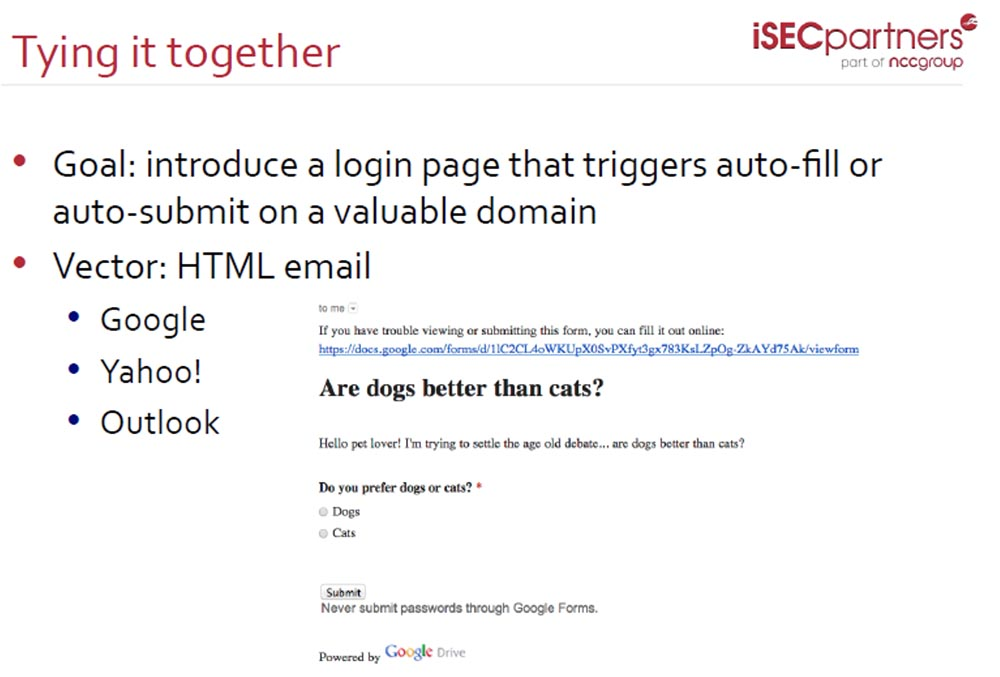

Поскольку люди часто используют почту для пересылки форм, атакующие сосредоточились на пользователях этих трёх сервисов. Вы заполняете форму, например, отвечая на вопросы различных опросов, и используете свой почтовый ящик для её отправки. Как эти сервисы противостоят атакам?

Лучше всего противостоит хакерам **Outlook** (**live.com**). Он предотвращает возможность атаки тем, что запрещает предоставлять третьей стороне любые оригинальные материалы, включая формы и персональную информацию пользователей.

На втором месте находится **Google**, который просто предостерегает пользователей от совершения таких действий, что не исключает возможности кражи паролей.

**Yahoo** позволяет красть пароли без всяких предупреждений.

Опасность встроенного механизма автозаполнения и создания форм аутентификации заключается в том, что сервисы не всегда предупреждают об опасности их пересылки третьей стороне или опасности использования этих функций на страницах других интернет-ресурсов. Например, при прохождении приведенного выше опроса имеется подозрительная функция **Submit**. Отвечая на вопрос, кто лучше, собаки или кошки, и нажимая на кнопку **Submit**, вы не только подтверждаете выбранный вами ответ, но и одновременно подтверждаете пересылку злоумышленнику своего логина и пароля.

**Yahoo** является наихудшим в смысле безопасности сервисом, особенно если вы используете менеджер паролей **LastPass**.

Мобильные версии браузеров защищены ещё хуже. Здесь нет расширений, но исследователи безопасности обнаружили плагин для мобильной версии браузера **Chrome** под названием **Javascript Bookmarklets**. Он запускает фальшивый код безопасности на враждебных сайтах, которые вы посещаете. Фактически он маскирует их опасность, создавая ощущение ложной безопасности, что может нанести вам большой ущерб.

Ознакомиться с другими расширениями для браузеров и узнать результат исследований атак и защиты паролей можно по ссылкам организаций в области исследования проблем безопасности [Berkeley](http://devd.me/papers/pwdmgr--%E2%80%90usenix14.pdf) и [Joint Stanford](http://crypto.stanford.edu/~dabo/pubs/papers/pwdmgrBrowser.pdf).

Я хочу, чтобы вы поняли: ознакомившись с основами работы менеджеров паролей, вы сами сможете найти почти что все ошибки безопасности этих приложений.

Нужно понять, какую функциональность заложил в приложение разработчик и как это работает на практике. Если вы это сделаете, вам намного проще будет находить уязвимости.

Рассмотрим атаку на **TLS** под названием **CRIME**, что является сокращением от **Compression Ratio Info-leak Made Easy**. Это эксплойт безопасности, который позволяет декодировать сессии **HTTPS**, в том числе пользовательские куки, перехватывая зашифрованный трафик между сервером и браузером. Уязвимости подвержены все версии **TLS**, включая **TLS 1.2**.

Во время этой атаки хакер перехватывает пользовательский трафик, добавляет в него свои данные и отправляет запросы на сервер. Алгоритм сжатия при повторении части текста сжимает его. После отправки данных на сервер, хакер смотрит за длиной сообщения и если оно уменьшилось, значит подобрана правильная последовательность. Тем самым можно подбирать отдельные строки и параметры в запросе, например, значения куки.

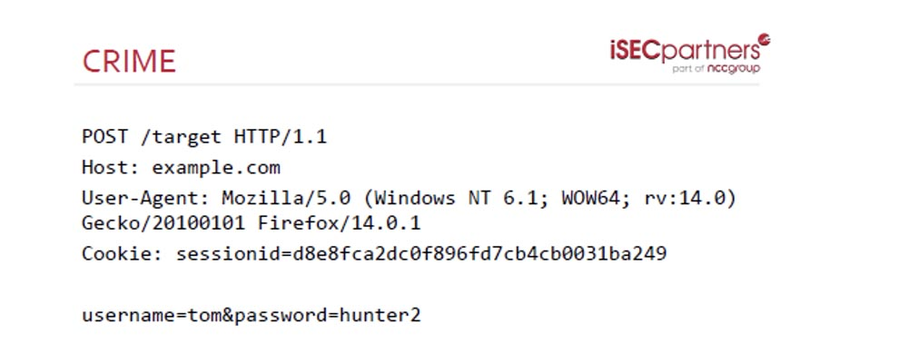

Эта атака основана на том, что ваш браузер взаимодействует с сайтом, используя внутренний интерфейс — HTTP-протокол. При этом, если я захожу на сайт **example.com**, браузер передаёт ему мои кукиз со всей информацией, имеющейся в заполненной ранее форме авторизации, в том числе имя пользователя и пароль. В форме **HTTP** это выглядит так:

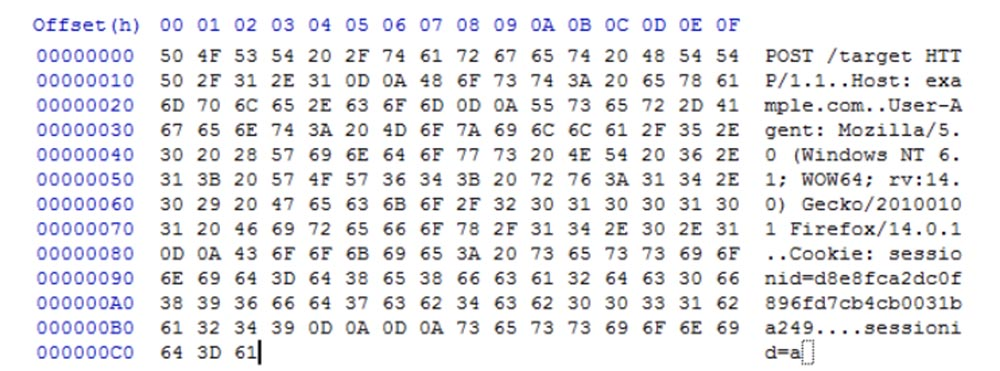

Даже если данные защищены соединением **SSL/TLS**, я всё равно могу получить часть информации, если я владею сетью. Вот как выглядит информация **SSL**:

Здесь я вижу такую информацию: время передачи, от кого посылается сообщение, то есть IP пользователя, кому посылается сообщение, то есть IP получателя, и длину сообщения.

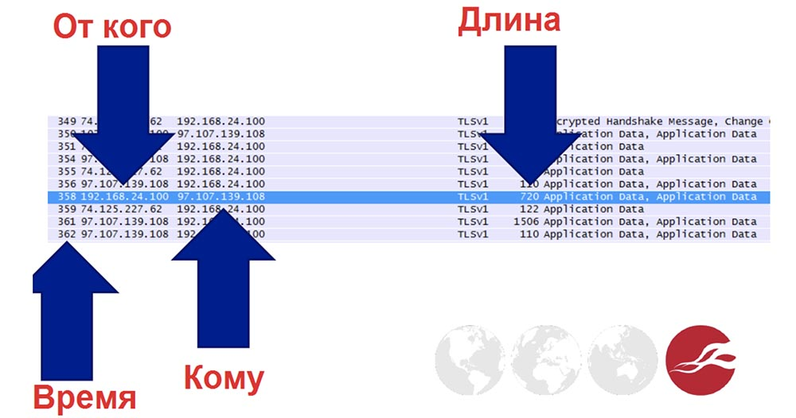

Таков дизайн криптографического протокола уровня защищённых сокетов **SSL**. Если у вас есть возможность анализировать трафик, эти данные предоставляют огромное поле для вредоносной деятельности.

Рассмотрим сообщение, которое отсылает браузер.

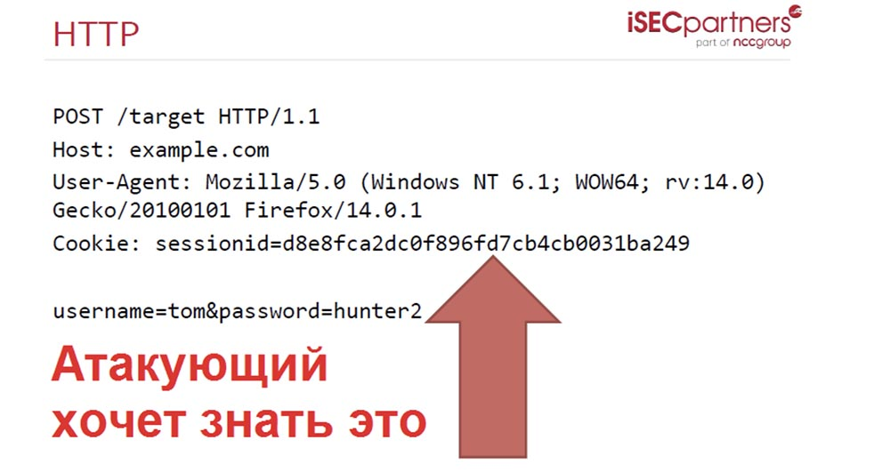

Если браузер позволяет совершать кросс-доменные запросы, то он пошлёт запрос с куки, содержащим данные формы, любому сайту, на который будет перенаправлен злоумышленником, например, сайту **example.com.** Если злоумышленник захватит эти куки, то сможет контролировать следующие параметры:

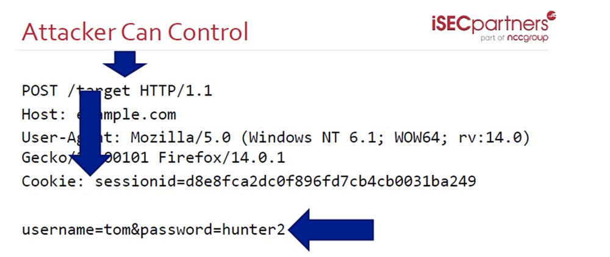

Для того, чтобы угадать пароль пользователя, я начинаю подбирать параметр для строки **username=tom&password** и вместо **hunter2** ввожу букву **а**.

Затем я смотрю расшифровку HTTP и вижу, что этот параметр занимает 195 байт.

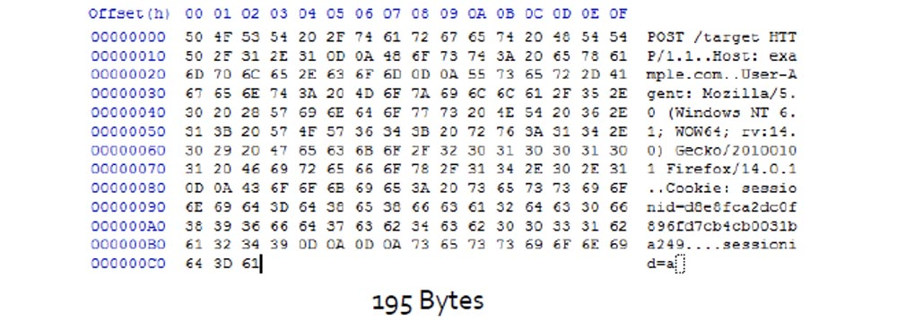

Чтобы облегчить себе работу, хакер использует сжатие **TLS**. Алгоритм сжатия при повторении части текста сжимает его, причем сжатие создаёт для этих частей маркеры и помещает их в форме сообщения **HTTP**.

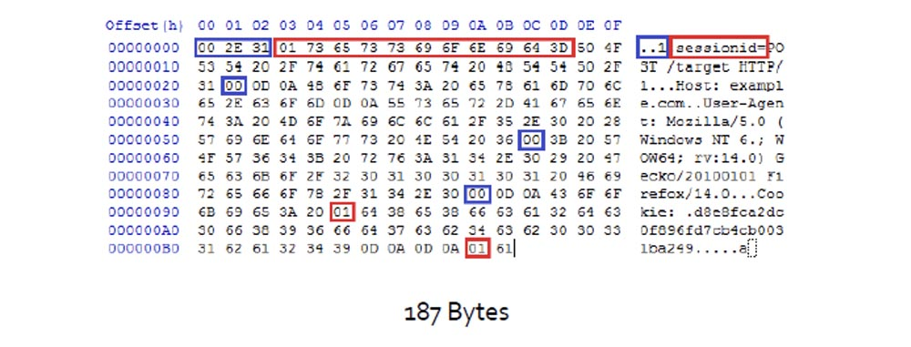

В этом случае **session ID** эквивалентно частям кода, помеченным соответствующим маркером, а размер сжатого сообщения составляет 187 байт.

Что произойдёт, если я приравняю **session ID = d**?

Размер сообщения сокращается, потому что ему нужно сжать большее количество байт. Это видно, если сравнить количество аргументов, обведённых красной рамкой, во 2-й строке сверху.

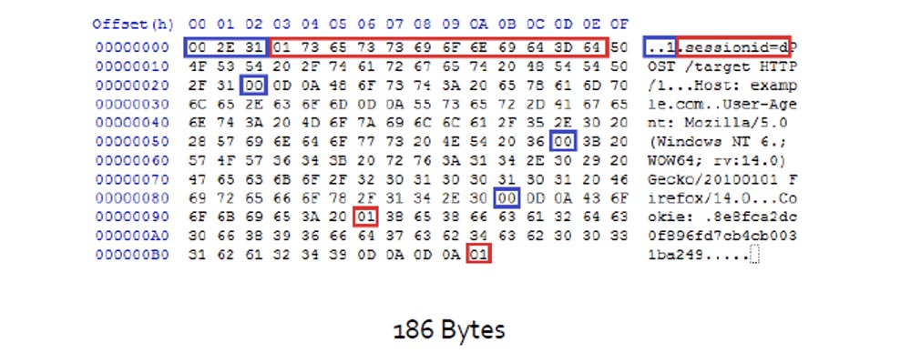

Это то, что видит атакующий. Он видит, что сообщение сжимается, и благодаря этому узнаёт, что угадал первую букву в **session ID**. Тогда он заменяет **session ID = da** и получает размер сообщения 188 байт.

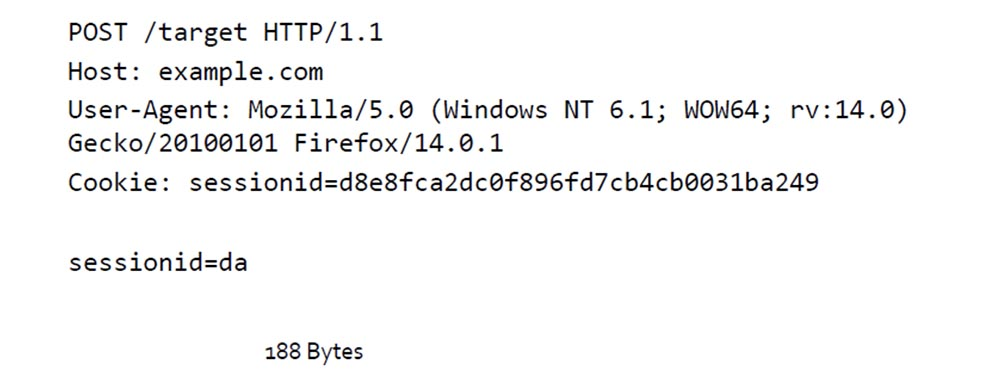

Так, последовательно подставляя буквы и цифры и анализируя изменения размера сообщения, он угадывает весь **session ID**. То есть он подбирает не ключ шифрования, а само содержание зашифрованного сообщения.

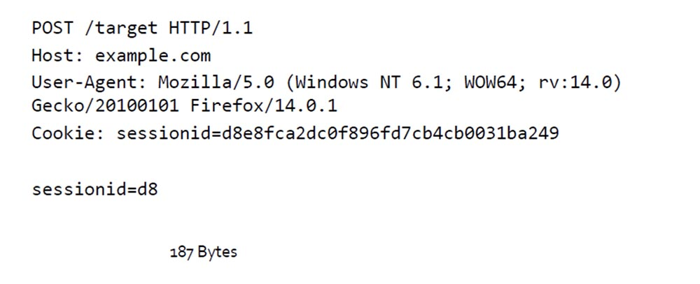

Для того, чтобы бороться с **CRIME**, необходимо запретить браузеру выполнять сжатие **TLS**. Нужно также изменить протокол **SPDY** таким образом, чтобы при запросе секретных данных они сжимались в раздельном контексте.

Рассмотрим случаи нарушения **HTTP**. В ответах **HTTP**, которые приходят пользователю после обращения на сервер, может содержаться такие секретные данные, как токены **CSRF** или другая конфиденциальная информация. Атаки, похожие на **CRIME**, требуют знания хотя бы одного секретного префикса сессии и возможности ввести свои данные в ответное сообщение.

Предотвратить атаку можно, запретив сжатие ответов или заглушив атаку **CRIME**, так как эта атака использует принцип **MiTM** (человек посередине) и может «обрушить» актуальные запросы. Это довольная «шумная» атака, которую можно засечь, так как злоумышленник обычно не общается напрямую с сервером, а использует доступ к роутеру, при этом сервер может даже «не знать» об атаке.

Защититься можно также размещая различную секретную информацию в различных файлах, таких как **javascript**, однако это трудно осуществить на практике и к тому же трудно модифицировать под это существующие приложения.

Можно попробовать рандомизировать секретную информацию в запросах, в основном это касается токенов **CSRF**, однако данный способ приведёт к сильному падению производительности.  
Зная принципы работы приложений и уязвимости, вы способны «обрушить» весь Интернет: **SSL/TLS**, **DNS**, **DNSSEC/DNSEC**, **IPv6**, это вполне осуществимо.

А сейчас я хочу поговорить об очень большом игроке в области безопасности – **NSA**, Агентстве Национальной Безопасности, или АНБ. Это люди, которые часто создают проблемы безопасности и сами же их решают.

За некоторые вещи я готов их возненавидеть. Однако сотрудники АНБ не в состоянии изменить действующую политику. Они способствуют интеллектуальному развитию всего, что связано с безопасностью, и я надеюсь, они верят в то, что результат их работы будет использован в благих целях.

В их работе есть две стороны медали, однако это исключительно моё мнение и оно может не совпадать с мнением моих работодателей. И я думаю, что не все данные исследований, о которых я вам расскажу, официально рассекречены.

Сноуден говорил, что некоторые утверждения можно доказать как истинные, а некоторые как фальшивые. Примером фальшивого утверждения является высказывание **NSA** о том, что «существует прямой доступ к сетям **Google**”, потому что истинное положение вещей с доступом к этим сетям продемонстрировано на следующем рисунке, который сделало само АНБ.

В настоящее время **Google** шифрует весь свой трафик потому что беспокоиться о том, что кто-то сможет взломать их сеть. Кроме того, все новости фильтруются через средства массовой информации, и мы видим только отрывки из документов.

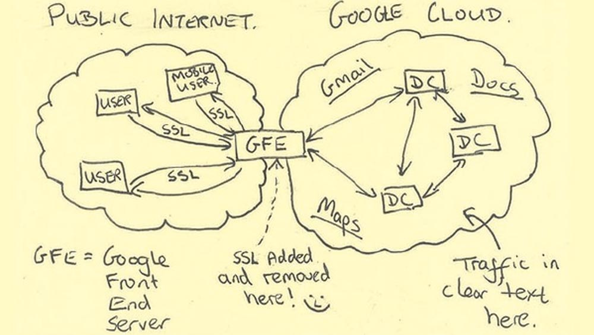

Вы видите смайлик рядом с фразой «**SSL** добавляются и удаляются здесь, на головном сервере **Google**», потому что именно отсюда **NSA** может извлечь данные. **Google**, который имеет дата-центры по всему миру, широко использует выделенные оптоволоконные линии для своих сетей. Благодаря этому трафик передаётся с большой скоростью и к нему очень трудно подобраться.

Правительство обладает не только большими техническими возможностями, но и рычагами давления. Некоторым компаниям очень трудно сопротивляться принуждению к сотрудничеству с правительством. Примером противостояния государству может служить бесплатная служба электронной почты **Lavabit**, созданная как альтернатива **Gmail**, потому что последняя нарушала тайну переписки пользователей по требованию правительственных служб.

Государство также может принуждать компании не признавать публично то, что они сотрудничают с государственными службами.

Рассмотрим, какими инструментами для осуществления политик безопасности обладает государство.

В первую очередь это **SIGINT** – Всемирная защитная криптологическая платформа. Её основу составляют оптоволоконные сети. На следующем сайте показана схема из особо секретного документа, опубликованного Сноуденом. Вы видите на ней множество жёлтых точек, обозначенных как CNE. Сноуден предполагает, что в этих местах расположено оборудование для взлома сетей. Их количество составляет свыше 50 000 по всему миру.

Сети можно взламывать самым различным способом. Правительство использует для этого **supply chain attack** – кибер-атаки, которые нацелены на наименее защищённые элементы в сетях различных организаций. Для того, чтобы обезопасить самих себя от подобного рода атак, правительство избегает сотрудничества любого вида, обеспечивая к своим собственным сетям только прямой доступ, без всяких посредников и третьих особ.

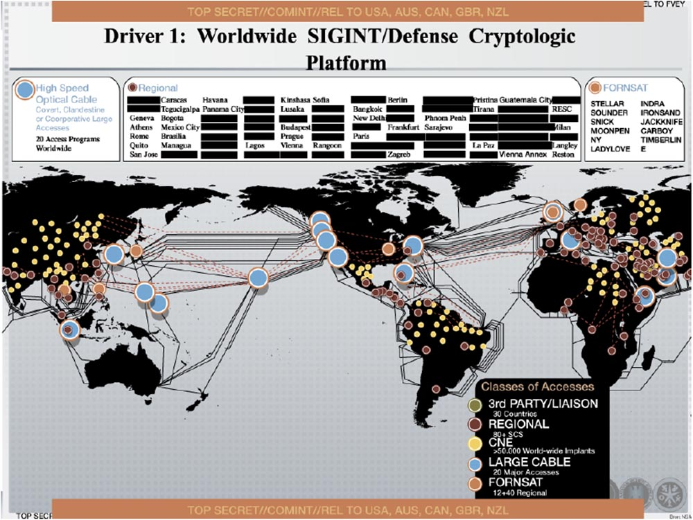

Согласно данным неправительственной организации **EFF** (Фонд Электронных Рубежей) и инициированных ею судебных процессов, АНБ любит использовать так называемые «оптические переключатели», позволяющие перехватывать телефонные разговоры, в том числе из **MPLS** и препятствующие утечке целевой информации посредникам. В этом замешаны большинство посредников, осуществляющих передачу информации между пользователями не только в США, но и по всему миру.

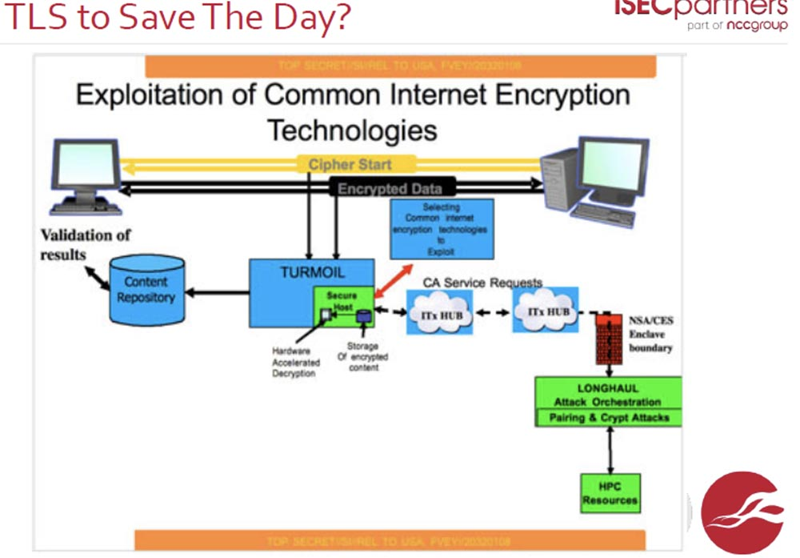

Надеюсь, что **TLS** может противостоять подобному вмешательству.

Правительство способно компрометировать даже внутреннюю инфраструктуру сети, используя частные ключи шифрования **Pokemon** от конечных серверов. Это позволяет организовать атаки типа **Heartbleed** и стандартные сетевые атаки. Правительство часто использует модель сетевого взаимодействия **DOD**, разработанную Министерством обороны США. Такая система применяется в сетях **google.com**.

Существует возможность использовать крипто-атаки против **TLS**. Предполагается, что компьютерный червь **Stuxnet**, поражающий компьютеры под управлением **Windows**, был разработан по инициативе правительства США. Он использует конфликт внутри алгоритма шифрования **MD5**, который имеет действительный сертификат. Этот червь перехватывает данные между контроллерами и логическими станциями и может вмешиваться в процесс автоматизированного управления различными промышленными комплексамии. Это единственный вирус, способный разрушать физическую инфраструктуру сетей.

Существует организация **NIST**, разрабатывающая стандарты шифрования практически для всего на свете. Она рекомендует использовать для создания ключей шифрования криптографически стойкий генератор псевдослучайных чисел **DUAL\_EC\_PRNG**. Однако он до сих пор имеет уязвимость. Если использовать точки эллиптической кривой, заданные в его стандарте шифрования, то из-за большого числа выходных бит за один раунд генерации имеется возможность проникнуть в код генератора и взломать его методом **brute force** (полным перебором). Создатели алгоритма знали об этой уязвимости с самого начала. Это не означает, что в данном генераторе изначально был предусмотрен бэкдор, но означает, что бэкдор может быть создан там в любое время.

Замечу, что **NSA** чаще всего использует атаки, основанные на противоречиях внутри новейших алгоритмов шифрования **MD5**.

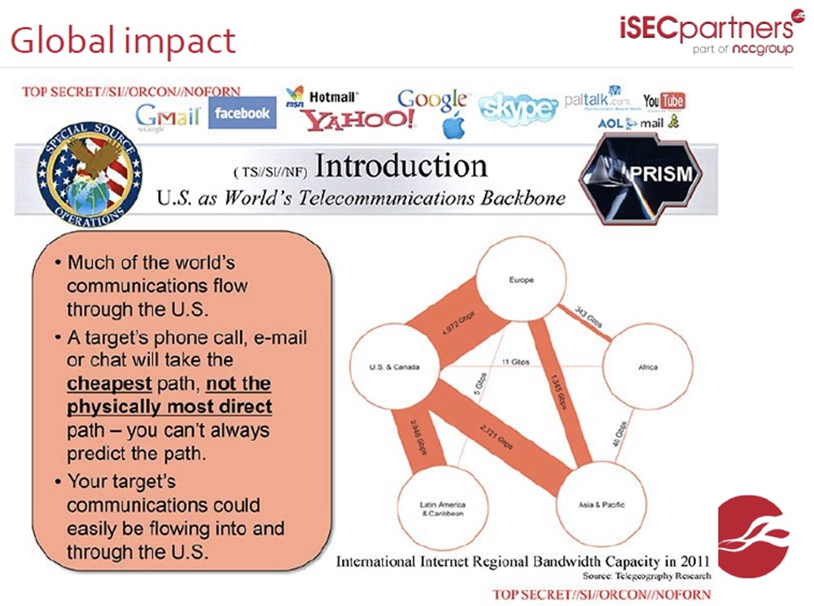

Государство оказывает глобальное воздействие на Интернет по всему миру. Большинство мировых коммуникаций осуществляется через США. Телефонные разговоры, электронная почта и чаты осуществляются по самым дешевым путям, физически не всегда прямым, и вы всегда можете проследить такой путь. Большинство мирового Интернет-трафика проходит через территорию США. В любом случае путь, по которому осуществляется связь с конечной целью вашего контакта, легко может быть перенаправлен в США, то есть государство может контролировать любые телекоммуникационные потоки по всему миру.

Приведу пример «отдачи» от такой деятельности. Государство вмешивается не только в связь частных особ, но и в работу компаний. В ноябре 2013 года газета «Вашингтон Пост» опубликовала информацию о том, что АНБ перехватывает трафик между дата-центрами **Google** через оптоволоконный кабель до того, как его шифруют между конечными серверами и компьютерами пользователей. Были опубликованы дополнительные данные о правительственной программе **MUSCULAR** и фрагменты пакетов, украденных из внутренней сети **Google**.

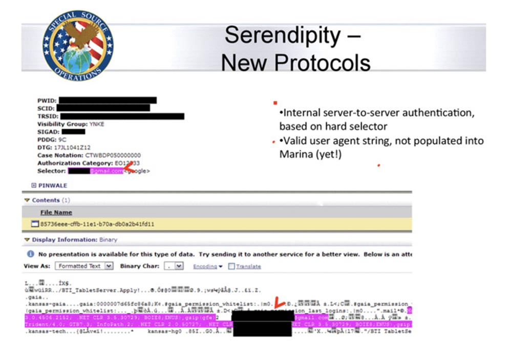

Сотрудники Google подтвердили факт взлома их сети силами АНБ, не стесняясь в выражениях – специалист по безопасности **Google** Брендон Дауни прямо написал: «Fuck these guys!», имея ввиду беспрецедентную наглость **NSA**.

Поэтому народу трудно доверять сетевому оборудованию США и услугам, предоставляемым сетевыми провайдерами США. Процитирую слова кардинала Ришелье: «Дайте мне шесть строчек, написанных рукой самого честного человека, и я найду в них что-нибудь, за что его можно повесить».

Я не хочу, чтобы вы стали параноиками в смысле недоверия правительству и видели вокруг тотальный шпионаж и нарушение конфиденциальности информации и частной жизни. Но как будущие разработчики программного обеспечения вы должны знать, как может действовать атакующий. Если вы работаете в большой компании, хакер может использовать государственные инструменты и техники для организации атаки. Поэтому вам нужно делать такие полезные вещи, как это делает **Google**, шифруя весь свой внутренний трафик и используя сертификаты прохождения тестирования на проникновение.

Хочу познакомить вас ещё с несколькими видами вредоносного программного обеспечения. Одно из них носит название **Flame**, или «Пламя».

Можно сказать, что это шпионское ПО является двоюродным братом червя **Stuxnet**. Оно способно совершать такие сумасшедшие вещи, как:

*   удалять все **GPS** метки с ваших фотографий на вашем компьютере;
*   украсть список ваших контактов через любой телефон, подсоединённый к вашему компьютеру или смартфону по каналу Bluetooth;
*   делать снимки экрана вашего устройства, перехватывать нажатия клавиатуры и записывать шпионское аудио.

**Flame** проделывает всё это благодаря взлому хешей **MD5**, в которых удалось найти противоречия, в особенности конфликт выбранного префикса. Это было продемонстрировано специалистами-криптографами в 2008 году, когда им удалось создать фальшивый **CA**-сертификат, выдающий себя за подлинный сертификат от **RapidSSL**. Им удалось обнаружить уязвимость в **Internet Public Key Infrastructure (PKI)**, используемой для выдачи цифровых сертификатов для сайтов.

Для генерации фальшивого сертификата было сделано 4 покупки действительных сертификатов у **RapidSSL**. Для поиска этой уязвимости потребовалась 3-х дневная коллизионная атака, произведённая с помощью 215 станций **Sony PlayStation 3**. После всеобщей паники, возникшей в результате опубликования этой информации, центры аутентификация **СА** вообще отказались от использования алгоритма шифрования **MD5**.

Отмечу, что **Microsoft** забыл про один свой **Microsoft Terminal Server**, который до сих пор использует сертификаты **MD5**. Атакующие постоянно ищут новые способы обнаружения уязвимостей в **MD5**, и определённые трудности для них представляет то, что окно для перехвата метки времени появляется всего на 1 мс. Однако создание всего одного произвольного фальшивого корневого сертификата **Microsoft** позволяет злоумышленнику подписывать всё что угодно, например, обновления **Windows**. Таким образом, обратившись на сервер **MS** за обновлением своего ПО, вы рискуете заодно подхватить **Flame**, поскольку обновление будет иметь легальную подпись. Этот случай особенно интересен для меня, потому что является примером, как очень хороший механизм для обновления программного обеспечения может быть использован злоумышленником благодаря наличию уязвимости системы безопасности.

А теперь рассмотрим последний вопрос нашей лекции – что мне делать, если я люблю заниматься компьютерной безопасностью? Во-первых, нужно знать, что означает понятие этики в безопасности и выяснить возможные направления карьеры.

Исторически сложилось так, что в мире постоянно ведутся дебаты на тему «Ответственность или полная открытость»? Эти споры переключаются в плоскость «Открытость или продажа оружия?», потому что в наше время раскрытие технологий защиты и всеобщая доступность конфиденциальной информации равносильна свободной торговле мощным оружием.

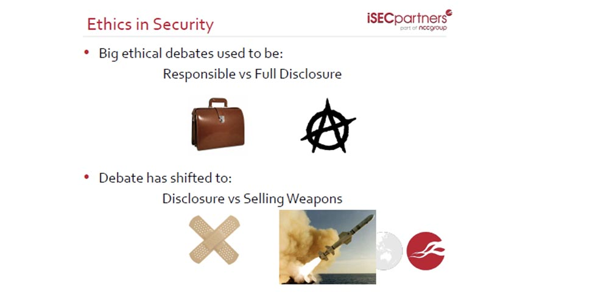

Ответственность заключается в том, чтобы находить уязвимости в ПО вендоров, исправлять их и опубликовывать результаты. Главное здесь устранить уязвимость, прежде чем она станет известна широкому кругу людей.

Открытость звучит прекрасно, однако разглашение уязвимостей собственной компании, особенно если она является крупным исследователем в области проблем безопасности и тратит на это много средств, вряд ли уместна. Но в настоящее время компании довольно быстро организуют ликвидацию уязвимостей, поэтому должны быть честными с пользователями их продуктов и своевременно раскрывать им полезную информацию об уязвимости и способе решения проблемы безопасности.

Вам следует придерживаться следующих этических принципов и помнить следующее:

*   можно пользоваться «чёрным рынком» уязвимостей и применять хакерские приёмы только для того, чтобы использовать полученную информацию на благо для решения проблем безопасности;
*   подумайте о сайте **jailbreakme.com**, который использует уязвимости **iOS** для получения root-прав на мобильных устройствах. Если вы посетите этот сайт, ваш телефон может быть тут же взломан, хакер получит права для удалённого управления вашим устройством и сможет делать с ним всё угодно, причём вы об этом даже не узнаете;
*   самый выгодный способ стать хакером – это продавать вредоносные эксплойты, однако при этом вы выступаете в роли незаконного торговца оружием, потому что вы не знаете, кому продаёте свои эксплойты и для чего они будут использованы;
*   будьте очень осторожны в своей деятельности, потому что граница между вредоносным хакерством и благородной защитой безопасности бывает очень тонкой;
*   помните, что существует множество путей зарабатывать деньги честным путём, поэтому воздерживайтесь от соблазнов использовать полученные вами знания во вред окружающим.

Карьера в области безопасности должна базироваться на соблюдении этических принципов.

Сосредоточьте свою работу вокруг принципов этики, но не наоборот. Пишите программное обеспечение, обеспеченное необходимой безопасностью. Создавайте менеджеры паролей, которые отлично работают. Создавайте решения для шифрования, которые отлично работают. Вы можете заработать много денег, если разработаете такие решения, которые будут повсюду востребованы.

Пишите ещё более безопасное программное обеспечение. Помните, что можно разобраться во всех уязвимостях, это очень понятная вещь. Вы должны полностью понимать, как работает система, как работают системные вызовы. Вы должны знать, что может произойти в случае непредвиденных ситуаций, чего следует от них ожидать и как они повлияют на работу системы.

Если вы создадите масштабную, обширную картину системы, то поймёте, как все её компоненты взаимодействуют друг с другом. Для того, чтобы понять, как можно использовать уязвимость системы, постарайтесь представить себя на месте преступника.

Вы можете сделать карьеру преступника или карьеру академика в зависимости от того, к чему имеете большую склонность.

Вы можете стать независимым исследователем проблем безопасности или испытателем по проникновению — пентестером.

Я расскажу, что делает пентестер в нашей компании iSEC Partners:

*   каждые 2 -3 недели находит порядка 20-30 новых компаний и опробует на них широкий спектр технологий. Про себя я скажу, что за год работы в компании узнал о безопасности больше, чем за всё время обучения в MIT;
*   проводит увлекательные исследования, одновременно являясь пентестером и исследователем в области безопасности;
*   обладает большим влиянием на то, чтобы сделать мир безопасней;
*   проводит большую часть времени в размышлениях и совершенствовании, потому что постоянно тренирует свой мозг решением самых разнообразных задач безопасности;
*   посмотрите, как мы работаем на Дне открытых дверей в пятницу!

Вы можете писать мне на адрес электронной почты **paul@isecpartners.com**. У нас есть ещё пару минут, и я постараюсь ответить на ваши вопросы.

Меня спрашивают об аппаратных модулях для обеспечения безопасности. Да, это новейшее решение безопасности, представляющее собой безопасное «железо». Можно сказать, что это коробка, которая хранит секретную информацию. Вы можете пользоваться этой информацией, но её невозможно извлечь из этого аппаратного обеспечения. Это решение основано на «железе» и технологиях компании **IBM**.

Могу сказать, что подобное решение для защиты сетей, в которых имеются миллиарды пользователей, обойдётся слишком дорого. Вы должны будете обеспечить персональными ключами шифрования каждое отдельное соединение с сервером каждого пользователя. Поэтому такое решение на данный момент не масштабируется так, чтобы, например, удовлетворить потребности пользователей **Facebook**, **Google** или **Yahoo** и оптимально для небольших локальных сетей различных компаний. Есть люди, которые обеспечивают безопасность на микроуровне, и люди, обеспечивающие безопасность на макроуровне.

Большое спасибо за внимание!

Полная версия курса доступна [здесь](https://ocw.mit.edu/courses/electrical-engineering-and-computer-science/6-858-computer-systems-security-fall-2014/).

Спасибо, что остаётесь с нами. Вам нравятся наши статьи? Хотите видеть больше интересных материалов? Поддержите нас оформив заказ или порекомендовав знакомым, **30% скидка для пользователей Хабра на уникальный аналог entry-level серверов, который был придуман нами для Вас:** [Вся правда о VPS (KVM) E5-2650 v4 (6 Cores) 10GB DDR4 240GB SSD 1Gbps от $20 или как правильно делить сервер?](https://habr.com/company/ua-hosting/blog/347386/) (доступны варианты с RAID1 и RAID10, до 24 ядер и до 40GB DDR4).

**Dell R730xd в 2 раза дешевле?** Только у нас **[2 х Intel Dodeca-Core Xeon E5-2650v4 128GB DDR4 6x480GB SSD 1Gbps 100 ТВ от $249](https://ua-hosting.company/serversnl) в Нидерландах и США!** Читайте о том [Как построить инфраструктуру корп. класса c применением серверов Dell R730xd Е5-2650 v4 стоимостью 9000 евро за копейки?](https://habr.com/company/ua-hosting/blog/329618/)