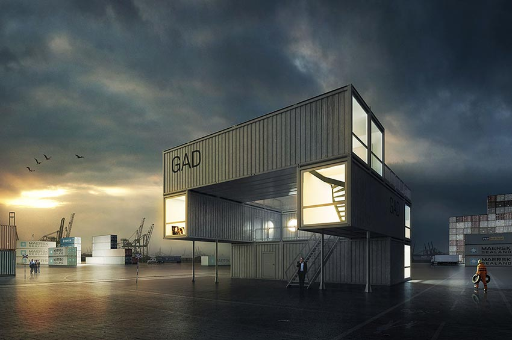
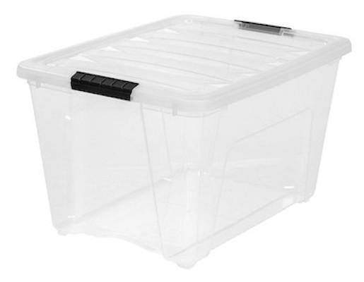
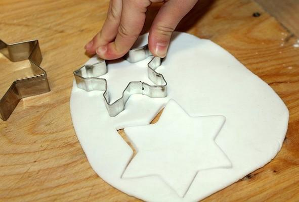

Изучаем Docker, часть 1: основы / Блог компании RUVDS.com

Технологии контейнеризации приложений нашли широкое применение в сферах разработки ПО и анализа данных. Эти технологии помогают сделать приложения более безопасными, облегчают их развёртывание и улучшают возможности по их масштабированию. Рост и развитие технологий контейнеризации можно считать одним из важнейших трендов современности.

Docker — это платформа, которая предназначена для разработки, развёртывания и запуска приложений в контейнерах. Слово «Docker» в последнее время стало чем-то вроде синонима слова «контейнеризация». И если вы ещё не пользуетесь Docker, но при этом работаете или собираетесь работать в сферах разработки приложений или анализа данных, то Docker — это то, с чем вы непременно встретитесь в будущем.

Если вы пока не знаете о том, что такое Docker, сейчас у вас есть шанс сделать первый шаг к пониманию этой платформы. А именно, освоив этот материал, вы разберётесь с основами Docker и попутно приготовите пиццу.  

## Метафоры и Docker

Мы постоянно сталкиваемся с метафорами. Если заглянуть в словарь Ожегова, то окажется, что метафора — это «скрытое образное сравнение, уподобление одного предмета, явления другому». Метафоры помогают нам ухватывать суть новых для нас явлений. Например, виртуальные контейнеры можно сравнить с обычными пластиковыми контейнерами. Такое сравнение, через сопоставление уже известных нам свойств обычных контейнеров со свойствами виртуальных контейнеров, поможет сначала с ними познакомиться, а потом и понять их сущность.

_Контейнер_

Как вы понимаете, мы собираемся начать разговор о Docker с понятия «контейнер».

## Контейнер

Как и обычный пластиковый контейнер, контейнер Docker обладает следующими характеристиками:

1.  В нём можно что-то хранить. Нечто может находиться либо в контейнере, либо за его пределами.
2.  Его можно переносить. Контейнер Docker можно использовать на локальном компьютере, на компьютере коллеги, на сервере поставщика облачных услуг (вроде AWS). Это роднит контейнеры Docker с обычными контейнерами, в которых, например, перевозят разные милые сердцу безделушки при переезде в новый дом.
3.  В контейнер удобно что-то класть и удобно что-то из него вынимать. У обычного контейнера есть крышка на защёлках, которую надо снять для того, чтобы что-то положить в контейнер или что-то из него вынуть. У контейнеров Docker есть нечто подобное, представляющее их интерфейс, то есть — механизмы, позволяющие им взаимодействовать с внешним миром. Например, у контейнера есть порты, которые можно открывать для того, чтобы к приложению, работающему в контейнере, можно было бы обращаться из браузера. Работать с контейнером можно и средствами командной строки.
4.  Если вам нужен контейнер, его можно заказать в интернет-магазине. Пустой контейнер можно купить, например, на сайте Amazon. В этот магазин контейнеры попадают от производителей, которые делают их в огромных количествах, используя пресс-формы. В случае с контейнерами Docker то, что можно сравнить с пресс-формой, а именно — образ контейнера, хранится в специальном репозитории. Если вам нужен некий контейнер, вы можете загрузить из репозитория соответствующий образ, и, используя его, этот контейнер создать.

Конечно, пластиковые контейнеры, в отличие от контейнеров Docker, никто вам не будет присылать бесплатно, да и когда вы их получите, они будут пустыми. А вот в контейнерах Docker всегда есть что-то интересное.

## Живые организмы

Ещё один подход к размышлениям о контейнерах Docker заключается в сравнении их с экземплярами живых организмов. «Экземпляр» — это нечто, существующее в некоей форме. Это не просто код. Это код, который стал причиной существования чего-то большего, чем он сам, чего-то, образно говоря, живого. Как и другие живые организмы, экземпляры контейнеров появляются на свет, живут и умирают.

_Монстр, вызванный к жизни_

Контейнеры Docker — это вызванные к жизни образы Docker.

## Программное обеспечение

Контейнеры Docker можно сравнивать не только с обычными контейнерами или с живыми организмами. Их можно сравнить и с программами. В конце концов, контейнеры — это программы. И, на фундаментальном уровне, контейнер представляет собой набор инструкций, который выполняется на некоем процессоре, обрабатывая какие-то данные.

_Контейнер — это программа_

Во время выполнения контейнера Docker внутри него обычно выполняется какая-то программа. Она выполняет в контейнере некие действия, то есть — делает что-то полезное.

Например, код, который работает в контейнере Docker, возможно, отправил на ваш компьютер тот текст, который вы сейчас читаете. Вполне возможно и то, что именно код, выполняющийся в контейнере Docker, принимает голосовые команды, которые вы даёте Amazon Alexa, и преобразует их в инструкции для ещё каких-нибудь программ, работающих в других контейнерах.

Благодаря использованию Docker можно, на одном и том же компьютере, одновременно запускать множество контейнеров. И, как и любые другие программы, контейнеры Docker можно запускать, останавливать, удалять. Можно исследовать их содержимое и создавать их.

## Концепции Docker

  

### ▍Виртуальные машины

Предшественниками контейнеров Docker были виртуальные машины. Виртуальная машина, как и контейнер, изолирует от внешней среды приложение и его зависимости. Однако контейнеры Docker обладают преимуществами перед виртуальными машинами. Так, они потребляют меньше ресурсов, их очень легко переносить, они быстрее запускаются и приходят в работоспособное состояние. В [этом](https://medium.freecodecamp.org/a-beginner-friendly-introduction-to-containers-vms-and-docker-79a9e3e119b) материале можно найти подробное сравнение контейнеров и виртуальных машин.

### ▍Образ контейнера Docker

Выше мы уже говорили об «образах». Что это такое? Хороший вопрос. То, что в терминологии Docker называется «образом», или, по-английски, «image», это совсем не то же самое, что, например, фотография (это — одно из значений слова «image»).

_Образы Docker — это не фотографии_

Образы контейнеров Docker можно сравнить с чертежами, с формочками для печенья, или с пресс-формами для изготовления пластиковых изделий. Образы — это неизменные шаблоны, которые используются для создания одинаковых контейнеров.

_Образы контейнеров Docker похожи на формочки для печенья_

В образе контейнера Docker содержится образ базовой операционной системы, код приложения, библиотеки, от которого оно зависит. Всё это скомпоновано в виде единой сущности, на основе которой можно создать контейнер.

### ▍Файл Dockerfile

Файл [Dockerfile](https://docs.docker.com/engine/reference/builder/) содержит набор инструкций, следуя которым Docker будет собирать образ контейнера. Этот файл содержит описание базового образа, который будет представлять собой исходный слой образа. Среди популярных официальных базовых образов можно отметить [python](https://hub.docker.com/_/python/), [ubuntu](https://hub.docker.com/_/ubuntu), [alpine](https://hub.docker.com/_/alpine).

В образ контейнера, поверх базового образа, можно добавлять дополнительные слои. Делается это в соответствии с инструкциями из `Dockerfile`. Например, если `Dockerfile` описывает образ, который планируется использовать для решения задач машинного обучения, то в нём могут быть инструкции для включения в промежуточный слой такого образа библиотек NumPy, Pandas и Scikit-learn.

И, наконец, в образе может содержаться, поверх всех остальных, ещё один тонкий слой, данные, хранящиеся в котором, поддаются изменению. Это — небольшой по объёму слой, содержащий программу, которую планируется запускать в контейнере.

### ▍Контейнер Docker

Для того чтобы запустить контейнер, нам нужен, во-первых, образ контейнера, во-вторых — среда, в которой установлен Docker, способная понять команду вида `docker run image_name`. Эта команда создаёт контейнер из образа и запускает его.

### ▍Репозиторий контейнеров

Если вы хотите дать возможность другим людям создавать контейнеры на основе вашего образа, вы можете отправить этот образ в облачное хранилище. Самым крупным подобным хранилищем является репозиторий [Docker Hub](https://hub.docker.com/). Он используется при работе с Docker по умолчанию.

Мы уже довольно много всего обсудили. Пришло время собрать всё это вместе и сравнить работу с контейнерами Docker с приготовлением пиццы.

## Готовим с Docker

_Готовая пицца — это контейнер_

*   Рецепт приготовления пиццы — это файл `Dockerfile`. Он сообщает нам о том, что нужно сделать для того, чтобы достичь цели, то есть — получить работающий контейнер.
*   Ингредиенты, из которых состоит пицца — это слои образа контейнера. Для нашей пиццы понадобится корж, соус и сыр.

Если положить на стол рецепт и ингредиенты, то получится, что в одном месте собрано всё, что нужно для того, чтобы приготовить пиццу. Это всё можно сравнить с образом контейнера Docker.  
Из рецепта (`Dockerfile`) можно узнать о том, какую последовательность действий нужно выполнить для того, чтобы приготовить пиццу:

*   Корж уже готов к использованию, мы его не меняем. Его можно сравнить с базовым образом ОС Ubuntu. Это — нижний слой образа, его в образ добавляют первым.
*   Затем на корж добавляют сыр. Это — всё равно что добавить в образ второй слой в виде какой-то внешней библиотеки наподобие NumPy.
*   Затем, поверх сыра, добавляют соус. Это — код приложения, которое должно запускаться в контейнере.

Теперь пришло время готовить пиццу в духовке.

_Духовка — это платформа Docker_

Духовка, в которой готовится пицца, напоминает платформу Docker. Духовку устанавливают на кухне, с её помощью можно готовить еду. Точно так же Docker устанавливают на компьютере для того, чтобы «готовить» контейнеры.

Духовку, если она электрическая, включают, поворачивая ручку регулятора температуры. Команда `docker run image_name` — это нечто вроде такого регулятора температуры, «поворот» которого приводит к тому, что система создаёт и запускает контейнер.

Готовая пицца — это и есть контейнер Docker.

А есть пиццу — значит пользоваться приложением, запущенным в контейнере.

Как и приготовление пиццы, подготовка к работе контейнеров Docker занимает некоторое время, но в финале и в том и в другом случаях получается что-то вкусное.

## Итоги

Здесь мы, на концептуальном уровне, рассмотрели основы Docker. Надеемся, приведённые здесь сравнения помогли вам разобраться в том, что такое Docker, и ощутить ценность метафор в деле освоения новых технологий.

**Уважаемые читатели!** Эта публикация представляет собой перевод первой статьи из серии учебных материалов по Docker. По словам автора, всего планируется выпустить 5 таких материалов. Уже готовы [вторая](https://towardsdatascience.com/learn-enough-docker-to-be-useful-1c40ea269fa8), [третья](https://towardsdatascience.com/learn-enough-docker-to-be-useful-b0b44222eef5) и [четвёртая](https://towardsdatascience.com/slimming-down-your-docker-images-275f0ca9337e) части. Подскажите нам, стоит ли переводить следующие статьи этой серии?

