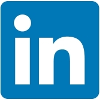
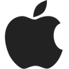

Как я успешно прошел шесть собеседований в Силиконовой долине / Блог компании Everyday Tools

За шесть дней, в период с 13 по 20 августа 2018 года, я прошел собеседования в шести компаниях Силиконовой долины (LinkedIn, Yelp, Apple, Amazon, Facebook и Google) и получил от каждой предложение о работе.

В процессе подготовки, который описываю ниже, я сильно опирался на вот этот [прошлогодний пост](https://medium.com/@XiaohanZeng/i-interviewed-at-five-top-companies-in-silicon-valley-in-five-days-and-luckily-got-five-job-offers-25178cf74e0f) — именно он в своё время побудил меня задуматься, не пора ли переходить в другую компанию. Мне не хотелось постоянно мотаться на другой конец страны и обратно в поисках идеальной работы, так что было ясно: придется собрать волю в кулак и спланировать все собеседования так, чтобы они шли одно за другим. Я нацеливался на вакансии, которые имеют отношение к мобильной разработке, но описываемый подход к обучению, советы и рекомендации годятся и для других случаев.

Надеюсь, моя история вдохновит кого-нибудь, кто сейчас в том же положении (не совсем доволен текущей работой, мечтает переехать в область залива, но несколько недотягивает в плане подготовки), дерзнуть — кто знает, что готовит для них будущее.  

#### Введение и статистика

Я твердо решил, что хочу работать именно в области залива, где могу устроиться в крупную компанию и серьезно вырасти как мобильный разработчик. Мне доводилось работать в стартапах, и это был хороший опыт, но на этот раз я по ряду причин искал рыбку покрупнее (я имею в виду не только размер команды, но и капитал). Также я знал, что какой-то конкретной компании на примете у меня пока нет, как и понимания, какую зарплату нужно запрашивать, чтобы не прогадать по сравнению с тем, что имею. Наконец, у меня не было никакого желания рассылать целую сотню резюме, как я уже делал сразу после университета.

Принимая все это во внимание, я отправил резюме в двадцать компаний. Четыре из них (Reddit, Nest, Stripe, Uber) отказали мне сразу же после получения письма. Из оставшихся шестнадцати десять (Lyft, Airbnb, Dropbox, Instagram, YouTube, Square, Robinhood, Twitter, Snap, Slack) вообще не дали никакой обратной связи. Простая арифметика подсказывает, что шесть компаний откликнулись и предложили мне побеседовать с рекрутером. В итоге я получил шесть приглашений на телефонное интервью, шесть — на собеседование в и офисе и шесть же предложений о работе.

Просмотрев свой календарь в Google, я прикидываю, что распределялось это все примерно так:

*   7 встреч с рекрутерами за 10 дней
*   7 технических собеседований за 11 дней
*   29 интервью в офисе за 8 дней
*   3 телефонных интервью по следам собеседований

Сложив эти цифры, можно подсчитать: я прошел 46 интервью за 73 дня (если считать промежутки между этапами). Было тяжело, и многие недели приходилось тратить все свои обеденные перерывы на встречи. Я стал приходить на работу спозаранку, чтобы иметь возможность уходить пораньше и проводить вечера за телефонными разговорами. Сложности создавало и то, что нужно было продолжать как следует выполнять свои обязанности на текущей работе — однако я всегда старался отдавать приоритет именно ей и переносил встречи, если того требовали обстоятельства. Отлынивать, чтобы удобнее было собеседоваться, я не собирался. Это неэтично, оставляет плохое впечатление, к тому же, может кончится тем, что и новое место не найдешь, и на старом испортишь себе репутацию.

#### Компании (в хронологическом порядке)

**LinkedIn (Саннивейл, штат Калифорния)**

LinkedIn, на самом деле, разрабатывает вполне симпатичные приложения, да и в open source сообщество они [делают немалый вклад](https://github.com/linkedin?utf8=%E2%9C%93&q=&type=&language=objective-c). Всё время нашего взаимодействия я был под впечатлением — и от корпоративной культуры, и от инженерных решений. Если сравнивать позиции в рейтинге престижа на рынке iOS в начале и в конце всего процесса, именно эта компания сильнее всего поднялась в моих глазах.

**Yelp (Сан-Франциско, штат Калифорния)**

Приложение Yelp отлично смотрится: чувствуется тонкость выделки, говорящая о доскональном знании платформы iOS. Мне понравилась атмосфера у них в офисе. Само здание очень красивое, и я был бы рад работать в одной команде с любым из тех людей, которые проводили собеседования. По сравнению с другими компаниями из моего списка эта совсем маленькая, и это сказывается на всем — но сказывается положительно. Команда кажется очень сработавшейся, а рабочие процессы разворачиваются крайне быстро.

**Apple (Купертино, штат Калифорния)**

Apple уже давно стал неотъемлемой частью iOS рынка (ха-ха). Я их бешеный фанат с самого детства (ну, лет с двенадцати точно). Именно благодаря их компьютерам Mac я вообще увлекся программированием. iPhone SDK стал мне подспорьем, чтобы сделать и выкатить первое моё приложение. Когда они пригласили меня пройти собеседование в офисе, а потом стать частью команды — это было как во сне. Не знаю даже, что еще сказать на их счет.

**Amazon (Пало-Алто, штат Калифорния)**

Я бы не назвал Amazon компанией ориентированной прежде всего на мобильную разработку, скорее наоборот. Однако должность и команда отвечали тем критериям, которые я установил для себя в начале. Тот офис в Пало-Алто, где я собеседовался, меня не впечатлил, но это временное прибежище и скоро они должны переехать в какое-то здание, более соответствующее стилю Amazon. Так что в этом плане мне просто не повезло со временем. Люди, с которыми я общался, показались мне весьма увлеченными своими проектами. Буквально от каждой компании я слышал: «У нас тут атмосфера совсем как в стартапах!», но у Amazon это действительно похоже на правду.

**Facebook (Менло-Парк, штат Калифорния)**

Собеседование я проходил в самом новом их здании. В целом и общем, всё вроде было круто, но детали встречи я помню довольно смутно: это был у меня пятый день собеседований подряд и недостаток сна давал о себе знать. Помню только, что получил много удовольствия от общения с сотрудниками и что встреча за обедом оказалось очень информативной.

**Google (Маунтин-Вью, штат Калифорния)**

В Google, насколько я понимаю, собеседования на определенную должность проводятся более или менее по шаблону. Мне удалось поговорить со многими членами команды, работающей над одним из крупнейших iOS продуктов компании, но претендовал я на должность, не связанную именно с их деятельностью. После того как комитет по найму дал добро, меня перевели на следующий этап, где подбирают нужную команду, и, наконец, подыскали подходящий вариант. Это о-о-о-очень длительный процесс, если сравнивать с темпами переговоров других команд, с которыми я общался. Приходилось постоянно держать других работодателей в курсе, как у нас идут дела с Google, а Google, соответственно, к чему мы пришли с остальными компаниями.

#### План подготовки

Внесу ясность: когда я стартовал, то был теоретически в состоянии решить большую часть заданий из раздела «Простые» на Leetcode минут за тридцать и примерно 25% заданий из раздела «Средней сложности», если не ставить ограничений по времени. Решать задания из раздела «Сложные» для меня тогда было всё равно что пытаться доказать равенство классов NP и P. Одним словом, мне предстояло много работы.

Чтобы подтянуть алгоритмы, я для начала обратился к книге [Cracking the Coding Interview](https://www.amazon.com/Cracking-Coding-Interview-Programming-Questions/dp/098478280X). По воскресеньям с самого утра я вставал, шел в кафе и там прорешивал задачи для Objective-C. Проработав приличное количество задач из книги (где-то около тридцати пяти), я переходил на Leetcode и пересматривал задания, которые соответствовали пройденным главам. После нескольких недель таких занятий я ощутил, что уже достаточно хорошо усвоил «основы», и перешел к следующему этапу.

Вооружившись своими базовыми знаниями, я взялся за [Elements of Programming Interviews](https://www.amazon.com/gp/product/1479274836/ref=ox_sc_act_title_1?smid=ATVPDKIKX0DER&psc=1). Эта книга значительно сложнее, чем предыдущая. Там приводятся рекомендуемые планы занятий, и я старался не слишком от них отклоняться. Если правильно помню, один был рассчитан на четыре недели обучения, и я прошел его почти полностью. По моему мнению, критически важно поупражняться в прорешивании заданий на доске или провести с кем-нибудь репетицию интервью по телефону. Причем под «критически важно» я подразумеваю не просто «полезно», а то, что это нужно рассматривать как обязательный элемент учебной программы. Не сомневаюсь, что кто-то и без этого сможет получить работу, но я для себя не нашел лучшего способа отработать навыки.

Если кому-то нужен партнер для репетиций собеседования на должности, связанные с iOS, то я буду рад помочь. Найти меня можно на [CS Career Hackers](https://www.cscareerhackers.org/) — обращайтесь, глядишь, как-нибудь договоримся, если буду не очень занят. А если нет, есть и другие люди, которые охотно вас поддержат. Конечно, вам будет неловко. В этом весь и смысл. Если бы всё получалось само собой, то и практиковаться смысла было не было, так ведь? Если во время репетиций у доски или на телефоне, вы сильно смущаетесь или чувствуете себя не в своей тарелке, значит, вы делаете именно то, что нужно — приучаете себя заранее. Лично я поначалу чувствовал себя очень скованно, а потом в какой-то момент это прошло, так что тренировки более чем окупились.

После месяца ежедневного прорешивания заданий (по два-три часа в будние дни, на выходных больше) я сосредоточился на разделе «[Популярные вопросы на собеседованиях](https://leetcode.com/problemset/top-interview-questions/)» на Leetcode. Все их я не перебрал, но перебрал достаточно. Для подготовки к интервью по алгоритмам главное — дойти до того уровня, когда можешь найти решение прямо по ходу интервью. Стремиться заучить все решения не стоит, это невозможно. Практически все задания, с которыми я сталкивался в ту неделю собеседований, были для меня новыми — но вместе с тем, смахивающими на то, что я уже видел. Ведь и сам процесс разработки происходит по той же схеме. Многие задачи в общих чертах повторяют друг друга, но каждый случай отличается особым набором ограничений.

#### Чему я научился

Ниже я перечислю списком те выводы, которые для себя сделал, в произвольном порядке. Все эти рекомендации были бы мне очень полезны, если бы я знал их заранее — и те, что касаются подготовки к техническим интервью, и те, в которых говорится о планировании и прочих нюансах, не связанных с программированием. В них нет ничего такого, что применимо только и исключительно к iOS, так что думаю, они в общих чертах подходят для всех проходящих собеседования в нашей индустрии.

*   **Не бросайте.** Когда я искал первую свою серьезную работу после колледжа, меня хватило всего на неделю-другую занятий. Я рассудил так: видимо, мне просто это не дано. Ведь прошло уже больше недели, а практически никакого прогресса не наблюдается, так какой смысл и дальше тратить время впустую? Но на этот раз я решил, что выбора у меня нет. Спустя какое-то время картина начала складываться. Труда придется вложить немало, но именно желание учиться выделяет успешных соискателей на фоне прочих.
*   **Тренировки — наше (почти) всё.** Разумеется, здесь нужен и определенный уровень врожденных способностей, но практика (то есть обучение) способна изменить очень и очень многое. Людей нанимают не за то, с чем они родились. Их нанимают за то, что они способны выполнять успешно определенные обязанности, а где и когда они получили необходимые знания — не имеет значения.
*   **Тренировки совместно с друзьями — наше остальное.** Неважно, репетируете вы у доски или пользуетесь чем-то вроде [Codeshare](https://codeshare.io/), суть в том, что когда на продолжительное время с чьей-то помощью погружаешься в атмосферу собеседования, оно уже далеко не так пугает. Если во время интервью мозг вдруг даст сбой и вы выдадите какую-нибудь глупость, это уже не выбьет вас из колеи. Ну а если вам удастся найти человека, который знает решения даже для тех заданий, которые вам непонятны, и может подтолкнуть вас в нужном направлении — будет вообще идеально. Серьезно, такие тренировки — на вес золота.
*   **Охват решает.** Можно тренироваться до одурения (и даже продуктивно) — и все равно не получить работу, потому что ваше резюме не попало к нужному человеку или на вас напал ступор у доски и вы не решили задачу вовремя. Лучшая гарантия — обеспечить себе максимум шансов. То есть посылать резюме всем, кто вас устраивает и кому вы подходите под требования, а не только наилучшему варианту. Я вот отобрал целый топ-двадцать компаний!
*   **Решение — процесс, а не результат.** Заучиванием ничего не добьешься. За неделю мне предложили около двадцати заданий по алгоритмам, и только одно из них было мне знакомо (о чем я сразу и сообщил, хотя многие сочли бы это лишним). Но я научился выявлять паттерны, и поэтому мне удавалось находить решения с ходу.
*   **Не опускайте руки.** Не раз и не два я застревал, и сотруднику, проводящему собеседование, приходилось подводить меня к правильному ответу. Это не помешало мне получить предложения о работе от всех компаний. Было и одно собеседование, которое я, по ощущениям, безнадежно завалил (четыре из пяти сессий, на мой взгляд, тянули только на однозначное «нет»), а на деле, они в итоге пригласили меня в команду. Короче, чего только не бывает в жизни.
*   **Не спешите отметать задания.** Когда я занимался с другом, он часто отмахивался от самых сложных заданий, говоря, что это мне не пригодится. Что интересно, из тех четырех типов задач, которые, по его словам, «точно не попадутся», два попались. Не совсем в том виде, в каком мы их прорешивали, но в очень похожем. Если в процессе обучения вы регулярно сталкиваетесь с каким-то концептом — проработайте его.
*   **Не недооценивайте важность «мягких навыков».** Думаю, большой частью своего успеха я обязан тому, что мои (вполне честные) ответы на вопросы соответствовали политике компании. У меня есть теория, что очень сильные разработчики иногда с трудом находят достойное место работы просто потому, что ведут себя грубо, лгут или не знают, как держаться в ситуациях, которые не имеют отношения к программированию. На мой взгляд, всё это — веские причины отказать кандидату. Поэтому отрабатывайте своё поведение так же, как и технические навыки.
*   **Показывайте свои знания.** На собеседованиях часто возникали ситуации, когда, отвечая на вопрос, я упоминал какое-то еще из своих умений с оговоркой, что за недостатком времени не могу подробно рассказать о внедрении этого решения. Разговор идёт о строках? Покажите в своём решении, что умеете работать с Unicode, или расскажите, как его поддерживать. Вызываете приватный метод? Объясните, как обстоят дела с методами в Objective-C. Обновляете данные в table view? Перечислите анимации, которые можете поддерживать. Если вы разбираетесь в чём-то слабо, поднимать эту тему, конечно, не стоит. Но вот если вам есть что сказать — воспользуйтесь возможностью выйти за узкие рамки, в которые загоняет вас исходный вопрос, и покажите своё преимущество перед теми, кто не сходит с проторенной дорожки.
*   **Старайтесь не дотянуться до планки, а поднять ее.** От впечатления, которое вы произведете на собеседовании, зависит не только то, предложат ли вам работу, но и то, на каких условиях ее предложат. Если в какой-то момент к вам придет уверенность, что ваших знаний для этой вакансии достаточно — отлично! Но не забывайте: между «более-менее дотягивает» и «абсолютно точно подходит» есть огромная разница. Вашей целью должно быть второе. Условия, которые мне предлагали изначально (то есть до переговоров), были очень и очень неплохими, и я думаю, собеседования сыграли здесь не последнюю роль.

  

#### В заключение

Ну, вот и всё! Марафон был тот ещё, но я ни о чем не жалею. Искренне надеюсь, что всё, что я тут написал, кому-нибудь поможет сойти с мёртвой точки в погоне за работой мечты. Если кому-то интересны советы, актуальные именно для iOS сегмента, могу поделиться, так что пишите [в комментарии](https://blog.usejournal.com/i-interviewed-at-six-top-companies-in-silicon-valley-in-six-days-and-stumbled-into-six-job-offers-fe9cc7bbc996).

Если вас это обнадежит: это моя вторая работа после колледжа, у меня около двух с половиной лет опыта работы, никаких громких имён в резюме, я закончил очень скромный колледж, у которого на «ярмарке вакансий» никогда не появлялись крупные компании, я начал процесс подготовки в конце апреля, а резюме стал рассылать в июне-июле, и наконец, всего за несколько месяцев я получил работу, о которой мог только мечтать.

Напоследок хочу ещё раз прорекламировать сообщество [CS Career Hackers](https://www.cscareerhackers.org/). Если вы ищите, где бы попрактиковаться, или просто хотите пообщаться с людьми, которые находятся в вашем положении (или хорошо с ним знакомы, с любой стороны), пожалуйста, не проходите мимо. Мне оно попалось только через несколько месяцев после подписания контракта, но всё равно, там здорово. Удачи в подготовке!