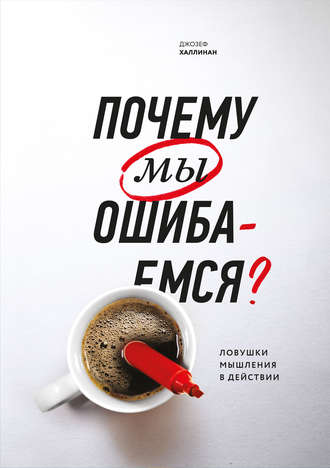

Книга «Почему мы ошибаемся. Ловушки мышления в действии». Выдержки часть 1

Что увеличивает шанс на ошибку?  
Чего мы не замечаем когда ошибаемся?  
Насколько сильно предпосылки влияют на наше решение?

Автор более 20 лет коллекционирует истории об ошибках, эксперименты и исследования в этой области.  
Предлагаю здесь наиболее интересные, на мой взгляд, истории.

Для примера, в рамках исследования двум группам людей по-разному представили одного и того же человека. Затем их попросили описать как он выглядел. Так вот, те кому сказали, что он водитель грузовика, описали его как довольно крупного парня, а те, кому сообщили, что он танцор, описали, что мужчина был изящного телосложения.  

#### Несколько историй без темы

В ресторане решили налить посетителям в подарок бокал вина.  
Половине посетителей сказали, что в их бокалы налито превосходное калифорнийское вино, а второй половине, что их угостили обычным вином. Люди выпившие «обычное» вино ушли из ресторана раньше и их чек был меньше, чем те что пили «превосходное».

Леворукость и праворукость в значительной степени определяют предпочтение в выборе направления. При прочих равных, правши ( американские =) ) чаще предпочитают повернуть направо, а левши налево. Учитывая, что левшей меньше, существует рекомендация в поисках короткой очереди сначала посмотреть налево.

Проверял в аэропорту, не работает. Там меньше очередь на дальнем окошке.

В ходе эксперимента вор мужчина украл у женщины кошелек, так вот, женщины, наблюдавшие это больше описывали реакцию и действия жертвы, а мужчины больше описывали вора.

#### Мы видим то, что нужно увидеть

Дэниел Саймонс и Дэниел Левин из Корнельского университета провели простой эксперимент на слепоту к изменениям.

«Чужак» на территории университета просил проходящих студентов подсказать как попасть в нужное место. Пока он разговаривал с «местным» между ними, довольно бесцеремонно, проходили двое мужчин с дверью и перегораживали визуальный контакт между ними, буквально на пару секунд.

За это время один из мужчин, несущих дверь, менялся с изначальным «чужаком». И «местный» оказывался лицом к лицу уже с другим человеком, который, как ни в чем не бывало, продолжал их разговор.

Лишь семеро из пятнадцати заметили подмену.

Но почему так? Ведь мы уверены, что, если что-то изменится, мы автоматически заметим это.

Глаз человека имеет высокое разрешение только под углом 2 градуса, если вытянуть руку перед собой и выставить большой палец, это и будут примерно 2 градуса. Вот сколько картинки мы видим абсолютно четко и точно все замечаем.

#### Первое впечатление и роль сожаления

Известна сила первого впечатления, как верного, так и неверного. Обратимся к студенческой практике.

Трое из четырех студентов считают, что при тестировании лучше держаться первоначального ответа, а не менять его. Хотя свыше 70 лет исследований результатов тестирования студентов однозначно говорят о том, что при тестировании чаще ответы меняются, как раз, с неправильного на правильный. То есть смена первоначального мнения чаще оказывается верной.

> Большинство людей чрезвычайно удивляет тот факт, что эта идея (первоначальное мнение обязательно верное) может быть ошибочной, — отмечает Джастин Крюгер, профессор Школы бизнеса Стерна при Нью-Йоркском университете. — Они убеждены в верности правила: первое решение верное. Но, увы, доказательств в поддержку этой идеи практически нет.

Джастин Крюгер и его коллеги проанализировали сдачу экзамена более полутора тысячи человек. Они выявили, что студенты менявшие первоначальные ответы получали более высокий балл. Число замен с неправильного на правильный более чем в два раза выше чем с правильного на неправильный.

Но это не самое интересное. В рамках этих же исследований была выявлена еще одна интересная особенность. Участие эмоции сожаления при принятии решения.

Опросы студентов после экзамена показали, что риск изменить правильный ответ на неправильный вызывал большее сожаление, чем перспектива оставить ошибку, не сменив неправильный ответ на правильный.  
То есть тут не только уверенность в правильности первого варианта.

Люди чувствуют б**о**льшую ответственность за действия, нежели чем за бездействие.  
И сожалеют о бездействии меньше, чем о действии, хотя в обоих случаях дали неправильный результат.

Человек рассматривает бездействие как пассивность, я ничего не делал, а раз ничего не делал то и ответственности меньше или нет совсем.

#### Мы не способны точно оценивать прошлые события

На восприятие и запоминание прошлых событий влияет то как все произошло в действительности.

Эксперимент Баруха Фишхоффа, профессора университета Карнегги-Меллона в Питтсбурге.

В 1972 году Ричард Никсон совершил две исторические поездки, в Китай и Советский Союз. Перед этим Фишхофф попросил группу израильских студентов оценить вероятность конкретных событий. Например, «Какова вероятность, что Никсон встретится с Мао?» или «Какова вероятность, что Никсон посетит мавзолей Ленина?».

После возвращения Никсона из поездок Фишхофф снова опрашивал тех же студентов. Он просил вспомнить свои прогнозы, а также спрашивал, произошли ли прогнозируемые события на самом деле.

Результаты показали, что по прошествии долгого времени люди не слишком помнили свои первоначальные прогнозы. Однако если человек предсказывал событие, и оно действительно произошло, то он преувеличивал оценку степени вероятности своего прогноза. Например, если его прогноз составлял вероятность в 30% и событие случилось, то вспоминал он его как прогноз вероятности в 50%. И наоборот, занижал если событие не случилось.

Практически все участники эксперимента вспоминали свой прогноз как более дальновидный, чем он был на самом деле.

Надеюсь было интересно, если так перечитаю найду еще интересных.  
[Читал на MyBook.](https://mybook.ru/author/dzhozef-hallinan/pochemu-my-oshibaemsya-lovushki-myshleniya-v-dejst/)  
Так же, прошу прощения у прочитавших вчера, что выложил с ошибками в тексте, без должной вычитки до публикации.