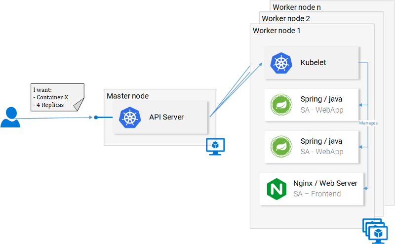
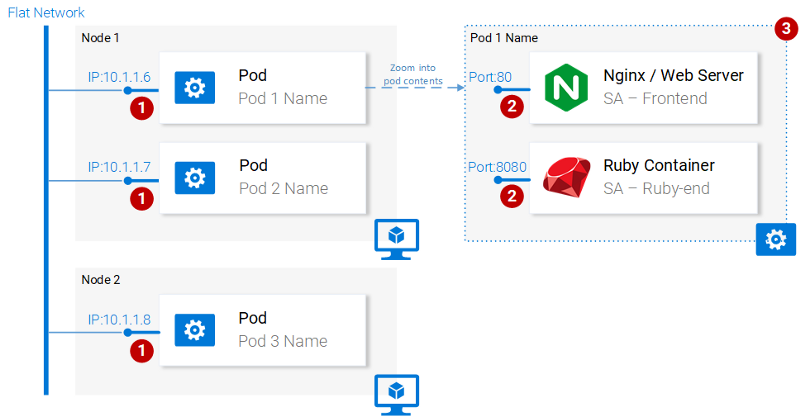
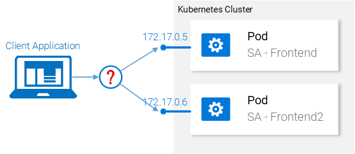
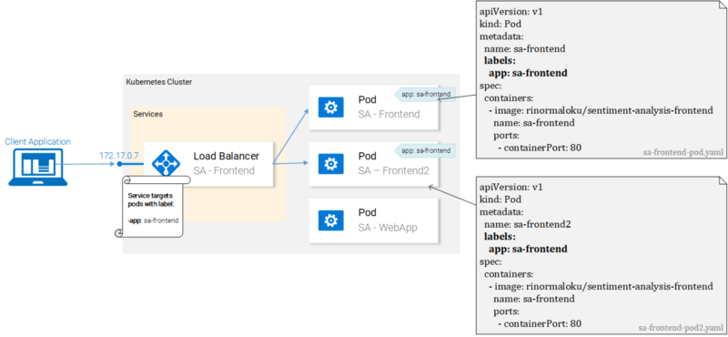
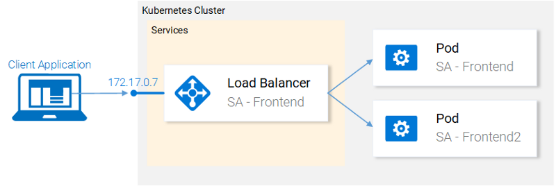
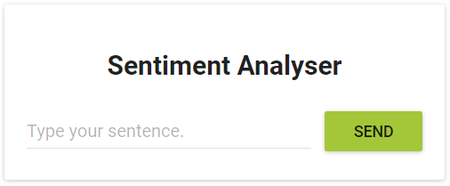
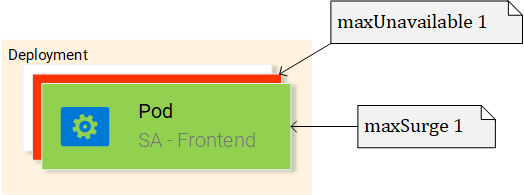
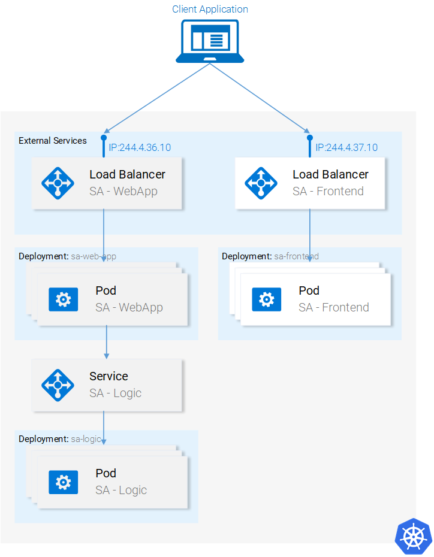
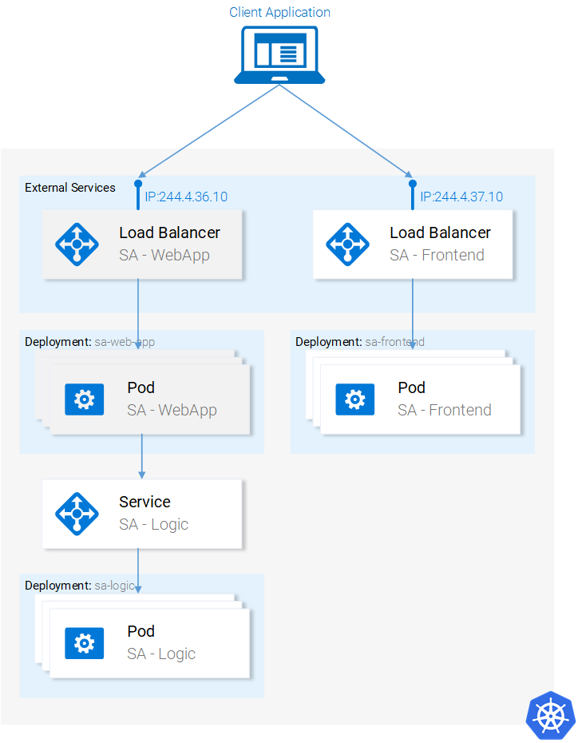

Руководство по Kubernetes, часть 2: создание кластера и работа с ним / Блог компании RUVDS.com

В [прошлый](https://habr.com/ru/company/ruvds/blog/438982/) раз мы рассмотрели два подхода к работе с микросервисами. В частности, один из них подразумевает применение контейнеров Docker, в которых можно выполнять код микросервисов и вспомогательных программ. Сегодня же мы, используя уже имеющиеся у нас образы контейнеров, займёмся работой с Kubernetes.

  

## Знакомство с Kubernetes

Я обещаю, и при этом ничуть не преувеличиваю, что вы, когда дочитаете эту статью, спросите себя: «А почему Kubernetes не называют Supernetes?».

_Supernetes_

Если вы читали предыдущую часть этого материала, то вы знаете, что там мы разобрали множество вещей, касающихся подготовки приложений к контейнеризации и работы с контейнерами Docker. Вам может показаться, что сейчас вас ждёт самое сложное, но, на самом деле, то, о чём мы будем здесь говорить, гораздо проще того, с чем мы уже разобрались. Единственной причиной, по которой изучение Kubernetes может показаться кому-то весьма сложной задачей, заключается в том объёме дополнительных сведений, которым нужно обладать для понимания Kubernetes и для эффективного использования этой системы. Мы же все необходимые для успешного освоения Kubernetes «дополнительные сведения» уже обсудили.

### ▍Что такое Kubernetes?

В первой части этого материала, после запуска микросервисов в контейнерах, вам было предложено подумать над вопросом о масштабировании контейнеризированных приложений.  
Предлагаю поразмышлять над ним вместе, в формате вопросов и ответов:

**Вопрос:** Как масштабируют контейнеризированные приложения?  
**Ответ:** Запускают дополнительные контейнеры.

**Вопрос:** А как между ними распределяют нагрузку? Что если некий сервер уже используется по максимуму, и контейнер нужно развернуть на другом сервере? Как найти наиболее эффективный способ использования аппаратного обеспечения?  
**Ответ:** Так… Поищу-ка в интернете…

**Вопрос:** Как обновлять программы не нарушая работоспособность системы? И, если обновление содержит ошибку, как вернуться к рабочей версии приложения?

На самом деле, достойные ответы на эти и на многие другие вопросы позволяет дать именно технология Kubernetes. Попытаюсь ужать определение Kubernetes до одного предложения: «Kubernetes — это система управления контейнерами, которая абстрагирует базовую инфраструктуру (среду, в которой выполняются контейнеры)».

Полагаю, что сейчас вы не особенно ясно представляете себе понятие «управление контейнерами», хотя об этом мы уже упоминали. Ниже мы рассмотрим эту технологию на практике. Однако понятие «абстрагирование базовой инфраструктуры» нам встречается впервые. Поэтому сейчас мы рассмотрим именно его.

### ▍Абстрагирование базовой инфраструктуры

Kubernetes позволяет приложениям абстрагироваться от инфраструктуры, давая нам простое API, к которому можно отправлять запросы. Эти запросы Kubernetes старается выполнить, используя все свои возможности. Например, на обычном языке подобный запрос можно описать так: «Kubernetes, разверни 4 контейнера образа X». Получив команду, Kubernetes найдёт не слишком загруженные узлы (их ещё называют «нодами» — от английского «node»), на которых можно развернуть новые контейнеры.

_Запрос к API-серверу_

Что это означает для разработчика? Это означает, что ему не нужно заботиться о количестве узлов, о том, где именно запускаются контейнеры, о том, как они взаимодействуют. Ему не приходится иметь дело с оптимизацией аппаратного обеспечения или беспокоиться об узлах, работа которых может быть нарушена (а нечто подобное, согласно закону Мёрфи, обязательно произойдёт), так как, при необходимости, в кластер Kubernetes можно добавлять новые узлы. Если с некими существующими узлами что-то не так, Kubernetes развернёт контейнеры на тех узлах, которые ещё находятся в работоспособном состоянии.

Многое из того, что изображено на предыдущем рисунке, вам уже знакомо. Но есть там и кое-что новое:

*   API Server. Выполнение обращений к этому серверу — единственный способ взаимодействия с кластером, который у нас есть, идёт ли речь о запуске или остановке контейнеров, о проверке состояния системы, о работе с логами, или о выполнении других действий.
*   Kubelet. Это — агент, который осуществляет мониторинг контейнеров, находящихся внутри узла, и взаимодействует с главным узлом.

Обратите внимание на то, что в паре предыдущих предложений мы используем термин «контейнер», но тут правильнее было бы использовать термин «pod». Эти сущности в русскоязычных публикациях часто называют «подами», а иногда — «pod’ами», в [документации](https://kubernetes.io/docs/concepts/workloads/pods/pod/), уточняя понятие «pod», говорят о «стае китов» (pod of whales) или о «стручке гороха» (pea pod), но никто не зовёт их «стаями» или «стручками». Мы, говоря о них, будем использовать слово «под». Сейчас вы вполне можете считать их контейнерами, подробнее о подах мы поговорим ниже.

Мы пока на этом остановимся, так как обо всём этом мы можем поговорить и далее, и, к тому же, есть множество хороших материалов, касающихся теории Kubernetes. Например, это официальная документация, хотя читать её и непросто, или книги, наподобие [этой](https://www.amazon.com/Kubernetes-Action-Marko-Luksa/dp/1617293725).

### ▍Стандартизация работы с провайдерами облачных услуг

Ещё одна сильная сторона Kubernetes заключается в том, что эта технология способствует стандартизации работы с провайдерами облачных услуг (Cloud Service Provider, CSP). Это — смелое заявление. Рассмотрим следующий пример. Специалисту, хорошо знающему Azure или Google Cloud Platform, приходится работать над проектом, рассчитанным на совершенно новую для него облачную среду, с которой он незнаком. В такой ситуации многое может пойти не так. Например, могут быть сорваны сроки сдачи проекта, компании-заказчику проекта может понадобиться арендовать больше облачных ресурсов, чем планировалось, и так далее.

При использовании Kubernetes подобная проблема возникнуть просто не может, так как, вне зависимости от того, о каком именно провайдере облачных услуг идёт речь, работа с Kubernetes всегда выглядит одинаково. Разработчик, в декларативном стиле, сообщает API-серверу о том, что ему нужно, а Kubernetes работает с ресурсами системы, позволяя разработчику абстрагироваться от деталей реализации этой системы.

Задержитесь немного на этой идее, так как это — очень сильная возможность Kubernetes. Для компаний это означает, что их решения не привязываются к конкретному CSP. Если компания находит на рынке облачных услуг более выгодное предложение, она свободно может этим предложением воспользоваться, перейдя к новому провайдеру. При этом опыт, наработанный специалистами компании, никуда не теряется.

Теперь поговорим о практическом использовании Kubernetes

## Практика работы с Kubernetes: поды

Мы настроили запуск микросервисов в контейнерах, процесс настройки был довольно-таки утомительным, но нам удалось выйти на работающую систему. Кроме того, как уже говорилось, наше решение плохо масштабируется и не отличается устойчивостью к сбоям. Эти проблемы мы решим с помощью Kubernetes. Далее мы приведём нашу систему к виду, соответствующему следующей схеме. А именно, контейнерами будет управлять Kubernetes.

_Микросервисы работаю в кластере, управляемом Kubernetes_

Здесь мы, для локального развёртывания кластера и для испытания возможностей Kubernetes, будем использовать Minikube, хотя всё то, чем мы тут будем заниматься, можно сделать и средствами облачных платформ, таких, как Azure или Google Cloud Platform.

### ▍Установка и запуск Minikube

Для установки Minikube следуйте указаниям, которые можно найти в [документации](https://kubernetes.io/docs/tasks/tools/install-minikube/). В процессе установки Minikube вы также установите Kubectl. Это — клиент, который позволяет выполнять запросы к API-серверу Kubernetes.

Для запуска Minikube выполните команду `minikube start`, а после того, как она отработает, выполните команду `kubectl get nodes`. В результате вы должны увидеть примерно следующее:

    kubectl get nodes
    NAME       STATUS    ROLES     AGE       VERSION
    minikube   Ready     <none>    11m       v1.9.0

Minikube даёт в наше распоряжение кластер, который состоит лишь из одного узла. Правда, нас это вполне устраивает. Тому, кто работает с Kubernetes, не нужно заботиться о том, сколько именно узлов присутствует в кластере, так как Kubernetes позволяет абстрагироваться от подобных деталей.

Теперь поговорим о подах.

### ▍Поды

Мне очень нравятся контейнеры, и вам они тоже теперь, наверняка, нравятся. Почему же Kubernetes предлагает нам пользоваться подами, сущностями, являющимися в этой системе минимальными развёртываемыми вычислительными единицами? Какие именно функции выполняет под? Дело в том, что в состав пода могут входить один или несколько контейнеров, которые совместно используют одну и ту же среду выполнения.

Но обязательно ли выполнять, например, два контейнера в одном поде? Как сказать… Обычно на один под приходится лишь один контейнер, и именно так собираемся поступать и мы. Но для тех случаев, когда, например, двум контейнерам нужен общий доступ к одному и тому же хранилищу данных, или если между ними налажена связь с использованием техники межпроцессного взаимодействия, или если они тесно связаны по какой-то другой причине, всё это можно реализовать, запустив их в одном поде. Ещё одна возможность, которой отличаются поды, заключается в том, что в них необязательно использовать контейнеры Docker. Если нужно, тут можно применить и другие технологии контейнеризации приложений, например — [Rkt](https://coreos.com/rkt/).

На следующей схеме показаны пронумерованные свойства подов.

_Свойства подов_

Рассмотрим эти свойства.

1.  У каждого пода в кластере Kubernetes есть уникальный IP-адрес.
2.  В поде может содержаться множество контейнеров. Они совместно используют доступные номера портов, то есть, например, могут обмениваться друг с другом информацией через `localhost` (естественно, они не могут пользоваться одними и теми же портами). Взаимодействие с контейнерами, находящимися в других подах, организуется с использованием IP-адресов этих подов.
3.  Контейнеры в подах совместно используют тома хранилища данных, IP-адрес, номера портов, пространство имён IPC.

Надо отметить, что контейнеры имеют собственные изолированные файловые системы, но они могут совместно использовать данные, пользуясь ресурсом Kubernetes, который называется [Volume](https://kubernetes.io/docs/concepts/storage/volumes/).

Нам того, что уже сказано о подах, достаточно для того, чтобы продолжать осваивать Kubernetes. Подробнее почитать о них можно [здесь](https://kubernetes.io/docs/concepts/workloads/pods/pod/).

### ▍Описание пода

Ниже показан файл описания пода (manifest file) для приложения `sa-frontend`.

    apiVersion: v1
    kind: Pod                                            # 1
    metadata:
      name: sa-frontend                                  # 2
    spec:                                                # 3
      containers:
        - image: rinormaloku/sentiment-analysis-frontend # 4
          name: sa-frontend                              # 5
          ports:
            - containerPort: 80

Поясним некоторые заданные в нём параметры.

1.  `Kind`: задаёт вид ресурса Kubernetes, который мы хотим создать. В нашем случае это `Pod`.
2.  `Name`: имя ресурса. Мы назвали его `sa-frontend`.
3.  `Spec`: объект, который описывает нужное состояние ресурса. Самое важное свойство здесь — это массив контейнеров.
4.  `Image`: образ контейнера, который мы хотим запустить в данном поде.
5.  `Name`: уникальное имя для контейнера, находящегося в поде.
6.  `ContainerPort`: порт, который прослушивает контейнер. Этот параметр можно считать указанием для того, кто читает этот файл (если этот параметр опустить, это не ограничит доступ к порту).

  

### ▍Создание пода SA-Frontend

Файл описания пода, о котором мы говорили, можно найти по адресу `resource-manifests/sa-frontend-pod.yaml`. В эту папку нужно либо перейти средствами терминала, либо, при вызове соответствующей команды, указать полный путь к файлу. Вот эта команда и пример реакции системы на неё:

    kubectl create -f sa-frontend-pod.yaml
    pod "sa-frontend" created

Для того чтобы выяснить, работает ли под, выполните следующую команду:

    kubectl get pods
    NAME                          READY     STATUS    RESTARTS   AGE
    sa-frontend                   1/1       Running   0          7s

Если состояние пода при выполнении этой команды будет `ContainerCreating`, то вы можете запустить эту же команду с ключом `--watch`. Благодаря этому, при переходе пода в состояние `Running`, сведения об этом будут выведены автоматически.

### ▍Доступ к приложению извне

Для того чтобы организовать доступ к приложению извне правильно будет создать ресурс Kubernetes вида `Service`, о чём мы поговорим ниже, но мы тут, для краткости, воспользуемся простым перенаправлением портов:

    kubectl port-forward sa-frontend 88:80
    Forwarding from 127.0.0.1:88 -> 80

Если теперь перейти с помощью браузера по адресу `127.0.0.1:88`, можно будет увидеть страницу React-приложения.

### ▍Неправильный подход к масштабированию

Мы уже говорили о том, что одной из возможностей Kubernetes является масштабирование приложений. Для того чтобы эту возможность испытать, запустим ещё один под. Создадим описание ещё одного ресурса `Pod`, поместив в файл `sa-frontend-pod2.yaml` следующий код:

    apiVersion: v1
    kind: Pod                                            
    metadata:
      name: sa-frontend2      # Единственное изменение
    spec:                                                
      containers:
        - image: rinormaloku/sentiment-analysis-frontend 
          name: sa-frontend                              
          ports:
            - containerPort: 80

Как видите, если сравнить это описание с тем, что мы рассматривали выше, единственным изменением в нём является значение свойства `Name`.

Создадим новый под:

    kubectl create -f sa-frontend-pod2.yaml
    pod "sa-frontend2" created

Убедимся в том, что он запущен:

    kubectl get pods
    NAME                          READY     STATUS    RESTARTS   AGE
    sa-frontend                   1/1       Running   0          7s
    sa-frontend2                  1/1       Running   0          7s

Теперь у нас два пода! Правда, радоваться тут особо нечему. Обратите внимание на то, что в показанном здесь решении задачи масштабирования приложения множество недостатков. О том, как это сделать правильно, мы поговорим в разделе, посвящённом ещё одному ресурсу Kubernetes, который называется Deployment (развёртывание).

Рассмотрим теперь то, что у нас получилось после запуска двух одинаковых подов. А именно, веб-сервер Nginx теперь выполняется в двух разных подах. В этой связи мы можем задаться двумя вопросами:

1.  Как дать доступ к этим серверам извне, по URL?
2.  Как организовать балансировку нагрузки между ними?

_Неправильный подход к масштабированию_

Среди средств Kubernetes есть ресурсы вида Service (сервис). Поговорим о них.

## Практика работы с Kubernetes: сервисы

Сервисы Kubernetes играют роль точек доступа к наборам подов, которые предоставляют тот же функционал, что и эти поды. Сервисы выполняют решение непростых задач по работе с подами и по балансировке нагрузки между ними.

_Сервис Kubernetes обслуживает IP-адреса_

В нашем кластере Kubernetes будут поды, реализующие разные функции. Это — фронтенд-приложение, веб-приложение Spring и Flask-приложение, написанное на Python. Тут возникает вопрос о том, как сервису понять, с какими именно подами ему нужно работать, то есть — как узнать о том, на основе каких сведений система должна генерировать список конечных точек для подов.

Делается это с помощью ещё одной абстракции Kubernetes, которая называется Label (метка). Работа с метками состоит из двух этапов:

1.  Назначение метки подам, с которыми должен работать сервис.
2.  Применение к сервису «селектора», который и определяет то, с какими именно подами, которым назначены метки, будет работать сервис.

Пожалуй, это легче представить в виде иллюстрации, чем описывать.

_Поды с метками и их файлы-манифесты_

Мы видим тут два пода, которым, с использованием конструкции `app: sa-frontend` назначены одинаковые метки. Сервис интересуют поды именно с такими метками.

### ▍Метки

Метки дают разработчику простой способ организации ресурсов Kubernetes. Они представляют собой пары вида ключ-значение, назначать их можно любым ресурсам. Модифицируйте файлы описания подов фронтенд-приложения и приведите их к виду, показанному на предыдущем рисунке. После этого сохраните эти файлы и выполните следующие команды:

    kubectl apply -f sa-frontend-pod.yaml
    Warning: kubectl apply should be used on resource created by either kubectl create --save-config or kubectl apply
    pod "sa-frontend" configured
    kubectl apply -f sa-frontend-pod2.yaml 
    Warning: kubectl apply should be used on resource created by either kubectl create --save-config or kubectl apply
    pod "sa-frontend2" configured

При выполнении этих команд система выдаст предупреждения (её не устраивает то, что мы пользуемся `apply` вместо `create`, мы это поняли), но, после предупреждения, сообщает о том, что соответствующие поды сконфигурированы. Проверить, были ли подам назначены метки, мы можем, отфильтровав поды, информацию о которых хотим вывести:

    kubectl get pod -l app=sa-frontend
    NAME           READY     STATUS    RESTARTS   AGE
    sa-frontend    1/1       Running   0          2h
    sa-frontend2   1/1       Running   0          2h

Ещё один способ проверки того, что подам были действительно назначены метки, заключается в присоединении к предыдущей команде ключа `--show-labels`. Благодаря этому в состав сведений о подах будут включены и данные об их метках.

Теперь подам назначены метки и мы готовы настроить сервис на работу с ними. Поэтому займёмся описанием сервиса типа `LoadBalancer`.

_Балансировка нагрузки с помощью сервиса типа LoadBalancer_

### ▍Описание сервиса

Вот YAML-описание сервиса типа `LoadBalancer`:

    apiVersion: v1
    kind: Service              # 1
    metadata:
      name: sa-frontend-lb
    spec:
      type: LoadBalancer       # 2
      ports:
      - port: 80               # 3
        protocol: TCP          # 4
        targetPort: 80         # 5
      selector:                # 6
        app: sa-frontend       # 7

Поясним этот текст:

1.  `Kind`: мы создаём сервис, ресурс `Service`.
2.  `Type`: тип ресурса, указываемый в его спецификации. Мы выбрали тип `LoadBalancer`, так как с помощью этого сервиса мы хотим решить задачу балансировки нагрузки между подами.
3.  `Port`: порт, по которому сервис принимает запросы.
4.  `Protocol`: протокол, используемый сервисом.
5.  `TargetPort`: порт, на который перенаправляются входящие запросы.
6.  `Selector`: объект, содержащий сведения о том, с какими подами должен работать сервис.
7.  `app: sa-frontend`: это свойство указывает на то, с какими подами будет работать сервис. А именно — это поды, которым назначена метка `app: sa-frontend`.

Для того чтобы создать сервис нужно выполнить следующую команду:

    kubectl create -f service-sa-frontend-lb.yaml
    service "sa-frontend-lb" created

Проверить состояние сервиса можно так:

    kubectl get svc
    NAME             TYPE           CLUSTER-IP      EXTERNAL-IP   PORT(S)        AGE
    sa-frontend-lb   LoadBalancer   10.101.244.40   <pending>     80:30708/TCP   7m

Тут можно заметить, что свойство `EXTERNAL-IP` находится в состоянии `<pending>`, при этом можно не ждать его изменения. Происходит это из-за того, что мы используем Minikube. Если бы мы создали подобный сервис, работая с неким провайдером облачных услуг, вроде Azure или Google Cloud Platform, тогда у сервиса был бы общедоступный IP-адрес, который дал бы возможность обращаться к нему из интернета.

Несмотря на это Minikube не позволит нам бездельничать, давая в наше распоряжение полезную команду для локальной отладки системы:

    minikube service sa-frontend-lb
    Opening kubernetes service default/sa-frontend-lb in default browser...

Благодаря этой команде будет запущен браузер, который обратится к сервису. После того, как сервис получит запрос, он перенаправит его к одному из подов (при этом неважно — какой именно это будет под). Эта абстракция позволяет нам воспринимать группу подов как единую сущность и работать с ними, используя сервис как единую точку доступа к ним.

В этом разделе мы поговорили о том, как назначать ресурсам метки, как использовать их при настройке сервисов в качестве селекторов. Здесь же мы описали и создали сервис типа `LoadBalancer`. Благодаря этому мы решили задачу по масштабированию приложения (масштабирование заключается в добавлении в кластер новых подов с соответствующими метками) и по организации балансировки нагрузки между подами с использованием сервиса в качестве точки входа.

## Практика работы с Kubernetes: развёртывания

Развёртывание (Deployment) — это абстракция Kubernetes, которая позволяют нам управлять тем, что всегда присутствует в жизненном цикле приложения. Речь идёт об управлении изменениями приложений. Приложения, которые не изменяются, это, так сказать, «мёртвые» приложения. Если же приложение «живёт», то можно столкнуться с тем, что периодически изменяются требования к нему, расширяется его код, этот код упаковывается и разворачивается. При этом на каждом шаге данного процесса могут совершаться ошибки.

Ресурс вида Deployment позволяет автоматизировать процесс перехода от одной версии приложения к другой. Это делается без прерывания работы системы, а если в ходе этого процесса произойдёт ошибка, у нас будет возможность быстро вернуться к предыдущей, рабочей версии приложения.

### ▍Использование развёртываний

Сейчас в кластере имеется два пода и сервис, дающий доступ к ним извне и балансирующий нагрузку на них.

_Текущее состояние кластера_

Мы говорили о том, что запуск двух разных подов с одинаковым функционалом — это не лучшая идея. При использовании такой схемы нам приходится работать с каждым подом в индивидуальном порядке, создавая, обновляя, удаляя каждый конкретный под, наблюдая за его состоянием. При таком подходе не приходится говорить о быстром обновлении системы или об оперативном откате неудачного обновления. Нас такое положение дел не устраивает, поэтому мы собираемся прибегнуть к возможность ресурса Deployment, который направлен на решение вышеозначенных проблем.

Прежде чем мы продолжим работу, давайте сформулируем её цели, что даст нам ориентиры, которые пригодятся при разборе файла-манифеста развёртывания. Итак, вот что нам нужно:

1.  Мы хотим иметь возможность создать два пода на основе одного контейнера `rinormaloku/sentiment-analysis-frontend`.
2.  Нам нужна система развёртывания приложения, позволяющая ему, при его обновлении, работать без перерывов.
3.  Мы хотим, чтобы подам была бы назначена метка `app: sa-frontend`, что позволит обнаруживать эти поды сервису `sa-frontend-lb`.

Сейчас мы выразим эти требования в виде описания ресурса Deployment.

### ▍Описание развёртывания

Вот YAML-описание ресурса вида Deployment, которое создано с учётом вышеописанных требований к системе:

    apiVersion: extensions/v1beta1
    kind: Deployment                                          # 1
    metadata:
      name: sa-frontend
    spec:
      replicas: 2                                             # 2
      minReadySeconds: 15
      strategy:
        type: RollingUpdate                                   # 3
        rollingUpdate: 
          maxUnavailable: 1                                   # 4
          maxSurge: 1                                         # 5
      template:                                               # 6
        metadata:
          labels:
            app: sa-frontend                                  # 7
        spec:
          containers:
            - image: rinormaloku/sentiment-analysis-frontend
              imagePullPolicy: Always                         # 8
              name: sa-frontend
              ports:
                - containerPort: 80

Разберём это описание:

1.  `Kind`: тут указано, что мы описываем ресурс вида `Deployment`.
2.  `Replicas`: свойство объекта спецификаций развёртывания, которое задаёт то, сколько экземпляров (реплик) подов нужно запустить.
3.  `Type`: описывает стратегию, используемую в данном развёртывании при переходе с текущей версии на новую. Стратегия `RollingUpdate` обеспечивает нулевое время простоя системы при обновлении.
4.  `MaxUnavailable`: это свойство объекта `RollingUpdate`, которое задаёт максимальное число недоступных подов (в сравнении с желаемым количеством подов) при выполнении последовательного обновления системы. В нашем развёртывании, подразумевающем наличие 2 реплик, значение этого свойства указывает на то, что после завершения работы одного пода ещё один будет выполняться, что делает приложени�� доступным в ходе обновления.
5.  `MaxSurge`: это свойство объекта `RollingUpdate`, которое описывает максимальное число подов, которое можно добавить в развёртывание (в сравнении с заданным числом подов). В нашем случае его значение, 1, означает, что, при переходе на новую версию программы, мы можем добавить в кластер ещё один под, что приведёт к тому, что у нас могут быть одновременно запущены до трёх подов.
6.  `Template`: этот объект задаёт шаблон пода, который описываемый ресурс `Deployment` будет использовать для создания новых подов. Вам эта настройка, наверняка, покажется знакомой.
7.  `app: sa-frontend`: метка для подов, создаваемых по заданному шаблону.
8.  `ImagePullPolicy`: определяет порядок работы с образами. В нашем случае это свойство установлено в значение `Always`, то есть, в ходе каждого развёртывания соответствующий образ будет загружаться из репозитория.

Разобрав это всё, перейдём к практике. Запустим развёртывание:

    kubectl apply -f sa-frontend-deployment.yaml
    deployment "sa-frontend" created

Проверим состояние системы:

    kubectl get pods
    NAME                           READY     STATUS    RESTARTS   AGE
    sa-frontend                    1/1       Running   0          2d
    sa-frontend-5d5987746c-ml6m4   1/1       Running   0          1m
    sa-frontend-5d5987746c-mzsgg   1/1       Running   0          1m
    sa-frontend2                   1/1       Running   0          2d

Как видно, теперь у нас есть 4 пода. Два из них созданы с помощью ресурса Deployment, ещё два — это те, которые мы создавали самостоятельно. Теперь можно удалить те поды, что мы создавали сами, воспользовавшись командами следующего вида:

    kubectl delete pod <pod-name>

Кстати, вот вам задание для самостоятельной работы. Удалите один из подов, созданных с помощью ресурса Deployment, и понаблюдайте за системой. Подумайте о причинах происходящего прежде чем читать дальше.

При удалении одного пода ресурс Deployment узнаёт о том, что текущее состояние системы (1 под) отличается от желаемого (2 пода), поэтому производится запуск ещё одного пода.

В чём же заключается польза ресурсов Deployment, помимо того, что при их использовании система поддерживается в нужном состоянии? Рассмотрим сильные стороны этих ресурсов.

### ▍Выполнение развёртываний с нулевым временем простоя системы

Предположим, к нам приходит менеджер по продукту и сообщает о том, что клиент, для которого мы этот продукт создали, хочет, чтобы в клиентском приложении присутствовала бы зелёная кнопка. Разработчики это требование реализуют и передают нам единственное, что нам от них нужно — контейнер образа, который называется `rinormaloku/sentiment-analysis-frontend:green`. Теперь приходит наше время. Нам, команде DevOps, нужно выполнить развёртывание обновлённой системы и обеспечить нулевое время её простоя. Посмотрим теперь, оправдаются ли усилия по освоению и настройке ресурса Deployment.

Отредактируем файл `sa-frontend-deployment.yaml`, заменив имя контейнера образа на новое, на `rinormaloku/sentiment-analysis-frontend:green`, после чего сохраним этот файл под именем `sa-frontend-deployment-green.yaml` и выполним следующую команду:

    kubectl apply -f sa-frontend-deployment-green.yaml --record
    deployment "sa-frontend" configured

Проверим состояние системы следующей командой:

    kubectl rollout status deployment sa-frontend
    Waiting for rollout to finish: 1 old replicas are pending termination...
    
    Waiting for rollout to finish: 1 old replicas are pending termination...
    
    Waiting for rollout to finish: 1 old replicas are pending termination...
    
    Waiting for rollout to finish: 1 old replicas are pending termination...
    
    Waiting for rollout to finish: 1 old replicas are pending termination...
    
    Waiting for rollout to finish: 1 of 2 updated replicas are available...
    
    deployment "sa-frontend" successfully rolled out

В соответствии с данными, выведенными в ответ на эту команду, мы можем сделать вывод о том, что развёртывание обновления прошло успешно. В ходе обновления старые реплики, по одной, заменялись на новые. Это означает, что наше приложение, в ходе процесса обновления, всегда было доступно. Прежде чем мы продолжим работу, давайте убедимся в том, что приложений действительно обновилось.

#### Проверка развёртывания

Для того чтобы взглянуть на то, как приложение выглядит в браузере, воспользуемся уже известной вам командой:

    minikube service sa-frontend-lb

В ответ на неё будет запущен браузер, а в нём откроется страница приложения.

_Зелёная кнопка_

Как видно, кнопка и правда стала зелёной, значит — обновление системы действительно удалось.

#### Закулисье обновления системы по схеме RollingUpdate

После того, как мы выполнили команду `kubectl apply -f sa-frontend-deployment-green.yaml --record`, Kubernetes сравнил состояние системы, к которому мы стремимся прийти, с её текущим состоянием. В нашем случае для перехода в новое состояние нужно, чтобы в кластере имелись бы два пода, основанные на образах `rinormaloku/sentiment-analysis-frontend:green`. Так как это отличается от того состояния, в котором пребывает система, запускается операция обновления.

_Замена подов в ходе обновления системы_

Механизм `RollingUpdate` действует в соответствии с заданными нами правилами, а именно, речь идёт о параметрах `maxUnavailable: 1` и `maxSurge: 1`. Это значит, что ресурс Deployment может, при наличии двух работающих подов, остановить один из них, или запустить ещё один под. Этот процесс, показанный на предыдущем рисунке, повторяется до тех пор, пока все старые поды не будут заменены на новые.

Теперь поговорим об ещё одной сильной стороне ресурсов Deployment. Для того чтобы было интересней, добавим повествованию драматизма. Вот рассказ про ошибку в продакшне.

### ▍Откат к предыдущему состоянию системы

Менеджер по продукту, сгорая от волнения, влетает в офис. «Баг! В продакшне! Верните всё как было!», — кричит он. Но его беспокойство не заражает вас нездоровым энтузиазмом. Вы, не теряя хладнокровия, открываете терминал и вводите следующую команду:

    kubectl rollout history deployment sa-frontend
    deployments "sa-frontend"
    REVISION  CHANGE-CAUSE
    1         <none>         
    2         kubectl.exe apply --filename=sa-frontend-deployment-green.yaml --record=true

Вы смотрите на ранее выполненные развёртывания и спрашиваете у менеджера: «Так, свежая версия даёт сбои, но предыдущая работала отлично?».

«Да. Вы что, меня не слышали?», — продолжает надрываться менеджер.

Вы же, не обращая внимания на очередную его попытку вас растревожить, просто вводите в терминале следующее:

    kubectl rollout undo deployment sa-frontend --to-revision=1
    deployment "sa-frontend" rolled back

После этого вы открываете страницу приложения. Зелёная кнопка исчезла, а вместе с ней и ошибки.

Менеджер застывает с отвисшей от удивления челюстью.

Вы только что спасли компанию от катастрофы.

Занавес!

На самом деле, скучновато получилось. До существования Kubernetes в подобных рассказах было куда больше неожиданных поворотов сюжета, больше действия, и они так быстро не заканчивались. Эх, старые добрые времена!

Большинство вышеупомянутых команд и результатов их работы говорят сами за себя. Пожалуй, непонятной тут может быть лишь одна деталь. Почему `CHANGE-CAUSE` у первой ревизии имеет значение `<none>`, а у второй — `kubectl.exe apply –filename=sa-frontend-deployment-green.yaml –record=true`?

Если вы предположите, что причиной появления таких сведений стало использование флага --`record` при развёртывании новой версии приложения, то окажетесь совершенно правы.

В следующем разделе мы воспользуемся всем тем, что уже изучили, для того, чтобы выйти на полноценно работающее приложение.

## Практика работы с Kubernetes: совместное использование изученных механизмов

Мы уже разобрались с ресурсами Kubernetes, необходимыми нам для того, чтобы построить полноценное кластерное приложение. На следующем рисунке выделено всё то, что нам ещё нужно сделать.

_Текущее состояние приложение_

Начнём работу с нижней части этой схемы.

### ▍Развёртывание подов sa-logic

Перейдите с помощью терминала в папку проекта `resource-manifests` и выполните следующую команду:

    kubectl apply -f sa-logic-deployment.yaml --record
    deployment "sa-logic" created

Развёртывание `sa-logic` создаёт три пода. В них выполняются контейнеры Python-приложения. Им назначены метки `app: sa-logic`. Это позволяет нам работать с ними с помощью сервиса `sa-logic`, используя соответствующий селектор. Откройте файл `sa-logic-deployment.yaml` и ознакомьтесь с его содержимым.

В общем-то, ничего нового для себя вы там не найдёте, поэтому давайте займёмся следующим ресурсом — сервисом `sa-logic`.

### ▍Сервис sa-logic

Подумаем о том, зачем нам нужен этот ресурс вида Service. Дело в том, что наше Java-приложение, которое будет выполняться в подах с меткой `sa-webapp`, зависит от возможностей по анализу текстов, реализуемых Python-приложением. Но сейчас, в отличие от ситуации, в которой всё работает на локальной машине, у нас нет единственного Python-приложения, прослушивающего некий порт. У нас есть несколько подов, количество которых, при необходимости, можно увеличить.

Именно поэтому нам и нужен сервис, который, как мы уже говорили, действует в качестве точки доступа к сущностям, реализующим одинаковые возможности. Это означает, что мы можем использовать сервис `sa-logic` в качестве абстракции, дающей возможность работать со всеми подами `sa-logic`.

Выполним следующую команду:

    kubectl apply -f service-sa-logic.yaml
    service "sa-logic" created

Теперь посмотрим на то, как изменилось состояние приложения после выполнения этой команды.

_Изменённое состояние приложения_

Теперь сервис `sa-logic` позволяет, из подов `sa-webapp`, работать с набором подов, реализующих функционал анализа текста.

Развернём поды `sa-webapp`.

### ▍Развёртывание подов sa-webapp

Мы уже не раз выполняли развёртывания, но в данном случае в файле описания соответствующего ресурса Deployment вы можете встретить кое-что новое. Так, если заглянуть в файл `sa-web-app-deployment.yaml`, там можно обратить внимание на следующее:

    - image: rinormaloku/sentiment-analysis-web-app
      imagePullPolicy: Always
      name: sa-web-app
      env:
        - name: SA_LOGIC_API_URL
          value: "http://sa-logic"
      ports:
        - containerPort: 8080

Какую роль играет свойство `env`? Можно предположить, что оно объявляет, внутри подов, переменную окружения `SA_LOGIC_API_URL` со значением `http://sa-logic`. Если это так, то хорошо бы понять, почему значение переменной содержит такой необычный адрес. На что он указывает?

Для того чтобы ответить на этот вопрос нам нужно познакомиться с концепцией kube-dns.

### ▍DNS-сервер кластера Kubernetes

В Kubernetes есть специальный под, который называется `kube-dns`. По умолчанию все поды используют его как DNS-сервер. Одной из важных особенностей `kube-dns` является тот факт, что этот под создаёт DNS-запись для каждого сервиса кластера.

Это означает, что когда мы создаём сервис `sa-logic`, ему назначается IP-адрес. В `kube-dns` делается запись со сведениями об имени и IP-адресе сервиса. Это позволяет всем подам преобразовывать адрес вида `http://sa-logic` в IP-адрес.

Теперь продолжим работу с ресурсом Deployment `sa-webapp`.

### ▍Развёртывание подов sa-webapp

Выполните следующую команду:

    kubectl apply -f sa-web-app-deployment.yaml --record
    deployment "sa-web-app" created

Теперь нам осталось лишь обеспечить доступ к подам `sa-webapp` с помощью сервиса, организующего балансировку нагрузки. Это позволит React-приложению выполнять запросы к сервису, который является точкой доступа к подам `sa-webapp`.

### ▍Сервис sa-webapp

Если вы откроете файл `service-sa-web-app-lb.yaml`, то поймёте, что всё, что там можно увидеть, уже вам встречалось. Поэтому, без ненужных пояснений, выполним следующую команду:

    kubectl apply -f service-sa-web-app-lb.yaml
    service "sa-web-app-lb" created

Теперь кластер полностью готов. Но, чтобы всё было совсем хорошо, нам надо решить ещё одну задачу. Так, когда мы разворачивали поды `sa-frontend`, контейнеризированное приложение было рассчитано на обращение к Java-приложению `sa-webapp`, находящемуся по адресу `http://localhost:8080/sentiment`. Теперь же нам нужно сделать так, чтобы оно обращалось бы к балансировщику нагрузки, к сервису `sa-webapp`, который обеспечит взаимодействие React-приложения с подами, в которых запущены экземпляры Java-приложения.

Исправление этого недостатка даст нам возможность быстро пробежаться по всему тому, изучением чего мы тут занимались. Кстати, если хотите извлечь из проработки этого материала максимум эффективности — вы можете, не читая пока дальше, попытаться исправить этот недостаток самостоятельно.

Собственно говоря, вот как выглядит пошаговое решение данной проблемы:

1.  Узнаем IP-адрес балансировщика нагрузки `sa-webapp`, выполнив следующую команду:
    
    `minikube service list  
    |-------------|----------------------|-----------------------------|  
    |  NAMESPACE  | NAME         | URL       |  
    |-------------|----------------------|-----------------------------|  
    | default     | kubernetes         | No node port       |  
    | default     | sa-frontend-lb       | http://192.168.99.100:30708 |  
    | default     | sa-logic         | No node port       |  
    | default     | sa-web-app-lb        | http://192.168.99.100:31691 |  
    | kube-system | kube-dns             | No node port |  
    | kube-system | kubernetes-dashboard | http://192.168.99.100:30000 |  
    |-------------|----------------------|-----------------------------|`
    
2.  Используем найденный IP-адрес в файле `sa-frontend/src/App.js`. Вот фрагмент файла, в который мы вносим изменения:
    
        analyzeSentence() {
                fetch('http://192.168.99.100:31691/sentiment', { /* убрано ради краткости */})
                    .then(response => response.json())
                    .then(data => this.setState(data));
            }
    
3.  Соберём React-приложение, перейдя с помощью терминала в папку `sa-frontend` и выполнив команду `npm run build`.
4.  Соберём образ контейнера:
    
        docker build -f Dockerfile -t $DOCKER_USER_ID/sentiment-analysis-frontend:minikube.
    
5.  Отправим образ в репозиторий Docker Hub:
    
        docker push $DOCKER_USER_ID/sentiment-analysis-frontend:minikube
    
6.  Отредактируем файл `sa-frontend-deployment.yaml`, внеся в него сведения о новом образе.
7.  Выполним следующую команду:
    
        kubectl apply -f sa-frontend-deployment.yaml
    

Теперь можно обновить страницу приложения, открытую в браузере, или, если вы уже закрыли окно браузера, можно выполнить команду `minikube service sa-frontend-lb`. Испытайте систему, попытавшись проанализировать какое-нибудь предложение.

_Готовое кластерное приложение_

## Итоги

Использование технологии Kubernetes способно принести пользу командам разработчиков, это благотворно сказывается на работе над различными проектами, упрощает развёртывание приложений, помогает их масштабировать, делает их устойчивыми к сбоям. Благодаря Kubernetes можно пользоваться ресурсами, предоставляемыми самыми разными облачными провайдерами, и при этом не зависеть от решений конкретных поставщиков облачных услуг. Поэтому предлагаю переименовать Kubernetes в Supernetes.

Вот что вы узнали, освоив этот материал:

*   Сборка, упаковка и запуск приложений, основанных на React, Java и Python.
*   Работа с контейнерами Docker, а именно, их описание и сборка с использованием файла `Dockerfile`.
*   Работа с репозиториями контейнеров, в частности, с Docker Hub.

Кроме того, вы освоили важнейшие понятия Kubernetes:

*   Поды
*   Сервисы
*   Развёртывания
*   Важные концепции наподобие выполнения обновления приложений без остановки работы системы
*   Масштабирование приложений

В процессе работы мы превратили приложение, состоящее из микросервисов, в кластер Kubernetes.

**Уважаемые читатели!** Пользуетесь ли вы Kubernetes?

