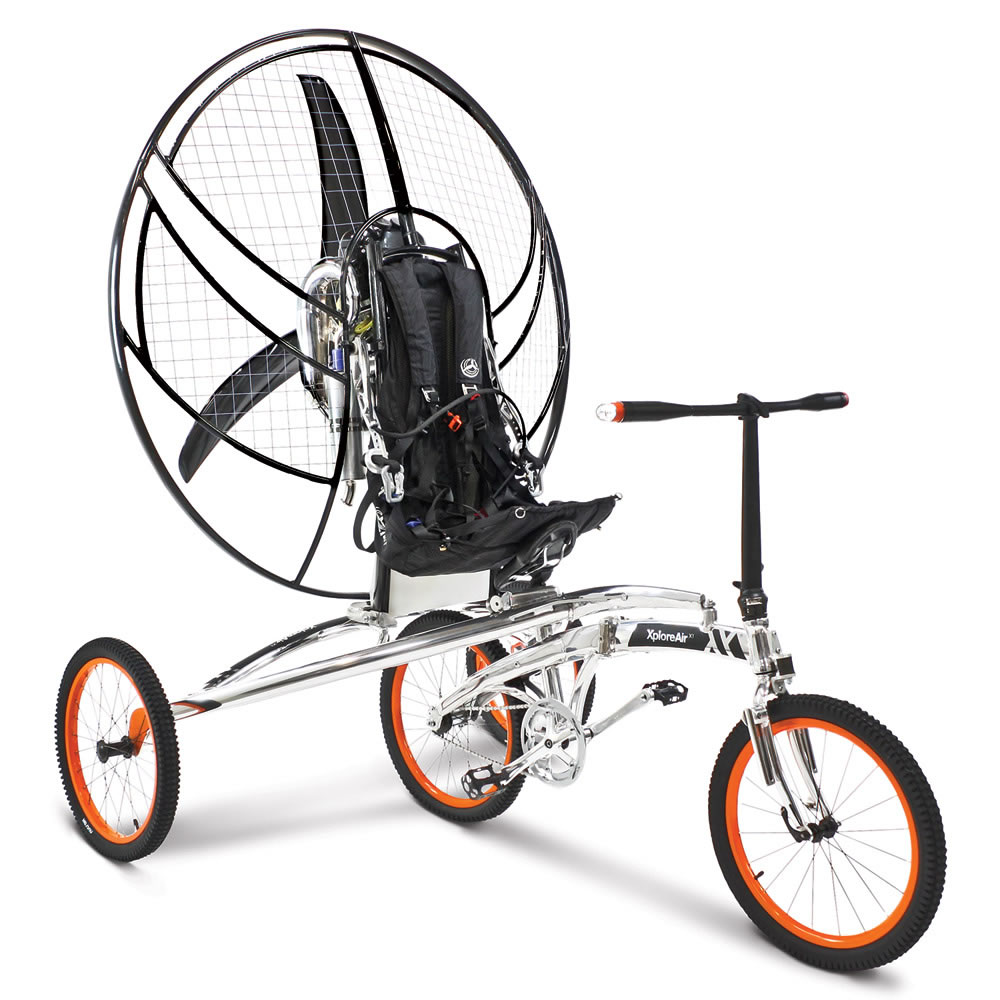

Своя видео-платформа или чем занять много вычислительных ресурсов. Part 1

На фото — первый летающий четырёхколёсный велосипед. [Источник.](https://www.hammacher.com/product/first-flying-bicycle)

Сегодня, благодаря доступности нужных сервисов, размещение видео в сети не является сложной задачей. Однако материалов по внутреннему устройству подобных систем не так уж и много, особенно в русскоязычном сегменте.

Я в течение некоторого времени занимался проектированием и разработкой качественной видео-платформы. В этой статье я хочу описать те моменты, которые сам бы хотел знать в начале разработки.

Статья не претендует на статус руководства, в ней я постараюсь описать только интересные или неочевидные моменты, затрагивающие обработку и доставку видео-контента на базе HTML5.  
Материал рассчитан на тех, кто уже в теме, либо готов искать расшифровку аббревиатур, терминов и понятий.

[Вторая часть.](https://habr.com/ru/post/437936/)  

### Формат

H264 High-profile, несмотря на свою популярность, оказывается, работает не везде — некоторые браузеры не включают его поддержку. К счастью, на современных устройствах, почти везде, где не поддерживается H264, работают VP8/9. VP9 использовать предпочтительнее, т.к. старых версий декодеров, умеющих VP8, но не VP9 или H264, я не встречал. VP9 даёт сравнимое с H264 качество картинки при битрейте на ~30% ниже — это важно для снижения нагрузки на каналы. Дополнительно, если к использованию MPEG-кодека потенциально могут быть юридические претензии (очень запутанная история), то у VP9 с этим всё хорошо. Правда, скорость кодирования у VP9 ниже примерно на порядок, поэтому на его обработку нужно выделять больше ресурсов.

Если есть необходимость поддержки старого оборудования, которое не справляется с H264 High, то можно в качестве третьего формата добавить 480p H264 Main с битрейтом пониже.

Hi10P массово лучше не использовать из-за слабой поддержки аппаратного декодирования.  
H265 же явно будет требовать лицензионных выплат, что подходит далеко не всем.

### Soft vs Hard

Аппаратные кодировщики не используют большую часть продвинутых возможностей кодеков (сказывается экономия места на чипах), выдавая неоптимально скодированные файлы. Выбор формата ограничен, настроить параметры кодирования тоже можно не все — зачастую, из реально влияющих на результат значений есть только битрейт, да и тот воспринимается весьма своеобразно. Если всё сделать как следует, то на нормальных чипах можно получить вполне вменяемый результат с линейным (скажется в динамичных сценах) и несколько завышенным битрейтом.

И, разумеется, для работы аппаратного кодировщика нужен аппарат — видеокарта или процессор с видеоядром, которые есть не во всех серверах.

Но зато они быстрые. Очень. По сравнению с программной обработкой скорость может вырасти в пару сотен раз, до уровня, на котором может не хватить дискового IO.

Обработка аппаратными способами очень сильно зависит от поставщика решения — каждый вендор имеет свой набор библиотек и утилит для этого, и выбрать есть из чего: Intel Quick Sync, NVenc, AMD VCE.

При программной обработке таких ограничений нет и при эквивалентном битрейте результат лучше. Для работы с различными форматами и кодеками есть ffmpeg; у «аппаратчиков» такой роскоши нет (с оговорками).

### Критерии качества видео

Для определения целевого качества, проще всего считать в битах на пиксель, BPP. Этот параметр не зависит от разрешения, частоты кадров и длительности. От него уже считать битрейт по формуле

    BPP * Framerate * Width * Height

Оптимальные значения BPP лучше подбирать самостоятельными экспериментами под то видео, которое планируется обрабатывать. Хорошее начальное значение для H264 находятся в районе 0.09 бит/пиксель. Для высокоэффективных кодеков, вроде H265 и VP9, этот параметр можно уменьшить пропорционально сравнительному коэффициенту сжатия. Также BPP можно несколько уменьшить для видео высокого разрешения, т.к. эффективность кодеков немного растёт с разрешением, однако для этой поправки нужно учитывать разрешение секции кодирования (slices, фича кодеков, позволяющая кодировать видео полунезависимыми блоками дробного разрешения).

Для получившегося по формуле выше битрейта желательно предопределить максимальные значения, исходя из ожидаемой скорости интернета у клиента — мало кому будет комфортно смотреть хоть и очень качественное, но постоянно буферизующееся видео.

Именно поэтому неудобно использовать Q-параметры кодеков (попугаи качества) — фиксированные значения дают непредсказуемый итоговый битрейт.

maxRate лучше сделать с запасом, т.к. кодеки могут неточно выдерживать требуемые значения, даже при двухпроходном кодировании.

Для сохранения качества динамичных сцен лучше включить VBR-режим работы кодеков, однако minRate лучше ставить не ниже 90% итогового битрейта, чтобы rate-пики не приводили к опустошению буфера.

При контроле качества полезны утилиты, вроде Intel VPA, ffprobe и Python. С помощью последнего удобно делать сравнения исходника и преобразованного видео, считать произвольные метрики, вроде средней девиации пикселей.

Рассчёт PSNR и SSIM на практике оказывается крайне неэффективным из-за психовизуальных оптимизаций, по умолчанию включённых в кодеках. Если есть желание посчитать именно эти метрики более-менее адекватно, можно отключить оптимизации через

    -tune [psnr|ssim]

Однако итоговый файл, разумеется, будет отличаться от сделанного без этих флагов.

### Превью

Главной проблемой генерации превью картинок является нечёткий источник. Определение и поиск чётких изображений — весьма нетривиальная и ресурсозатратная задача. К счастью, решение этой задачи в большинстве кодеков включено в процесс кодирования видео. Можно взять ближайший к некоторой позиции ключевой кадр, из всех окружающих его кадров он будет наиболее чётким. В ffmpeg это можно сделать так:

    -ss [позиция] -vf \"select='eq(pict_type,PICT_TYPE_I)'\" -vsync vfr

Стандартные кодировщики сжимают не самым лучшим образом, поэтому после получения изображения его лучше дожать чем-нибудь вроде optipng — экономия в среднем 500кБ на FHD превью.

Изображения высокого разрешения лучше делать чересстрочными (interlaced). Таким образом, мы несколько увеличим размер (на 5-10%), но серьёзно уменьшим время отображения на загружающейся странице.

Статья уже получилась плотная, и у меня есть сомнения, что всю информацию нужно упаковывать в один огромный текст. Если интересно продолжение на эту тему, напишите в комментариях или отметьте в опросе.

Платформа закрытая, но посмотреть на её работу можно [здесь](http://policat.tk/).

*Я не имею никакого отношения к авторам соответствующих сайтов и могу не разделять их взгляды и мнение. Решения о том, кому и как предоставляется доступ к коду, я комментировать не могу.

Готов ответить на вопросы.