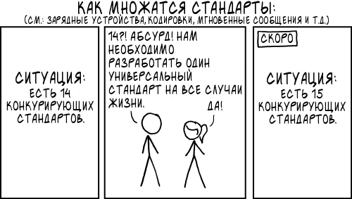

Своя видео-платформа — ffmpeg и качество кодирования видео. Part 2

  
Lenna любит хорошо выглядеть — фотомодель в конце концов. Ходят легенды, что добавление её в заголовок статьи, связанной с обработкой визуальных данных даёт +5 к шансу на плюсы.

Продолжаю раскрывать особенности работы видео сервисов. Сегодня заметки про параметры кодирования и их выбор.  
[Первая часть](https://habr.com/ru/post/436568/)

Большинство кодеков предлагают достаточно сбалансированные значения по умолчанию, позволяя получить нормальный результат без долгого подбора параметров. Однако, когда речь идёт о большом архиве видеоматериала, об ограничениях на битрейт, соображениях совместимости с оборудованием клиента и разумном желании сохранить качество оригинала, всё становится интереснее.  
К сожалению, волшебной кнопки «скодировать совсем хорошо» не предусмотрено. Как и аналога [caniuse](http://caniuse.com/) для параметров кодирования. Придётся разбираться в особенностях работы кодеков.  

### Вводная часть: профили

Настроек и параметров у H264 такое количество, что сами разработчики для того, чтобы в них не запутаться, решили сделать список профилей — «хороших» конфигураций для разных целей. Стандартных профилей определили много; дополнительно, устанавливая собственные параметры кодирования, вы, фактически, создаёте собственный профиль, запутывая всех окончательно. Так что, к сожалению, получилось как всегда.

Изначально профили создавались для определения, будет ли проигрываться итоговое видео на нужном типе устройств, однако сейчас какого-то однозначного разделения проигрывателей по типам устройств и профилям нет.

На практике я бы выделил, по уровню ресурсоёмкости декодирования, три группы параметров:  
— с отключённым CABAC; условно main- и baseline- профили. Их всё ещё можно использовать для поточного вещания, чувствительного к задержкам;  
— со включённым CABAC; условно high-профиль. Для всего. Большая часть современного (и не очень) оборудования умеет такое проигрывать. Прирост эффективности по сравнению с main — 20%+;  
— с поддержкой десятибитного сэмплирования и других продвинутых параметров. Условно Hi10P. Проблемой таких профилей является практически полное отсутствие аппаратной поддержки и повышенные требования к декодирующему оборудованию; телефоны, даже топовые, могут с такими файлами не справиться. Можно использовать для личной медиатеки, если вы уверены в своём оборудовании. Ещё 10-20% прироста эффективности.

Понятие профилей для других кодеков не так развито, как у H264. Для них можно считать, что если кодек поддерживается, то он поддерживается целиком, и ограничением при проигрывании может быть только черезмерно высокий битрейт, или другой, явно завышенный, параметр. Впрочем, с распространением аппаратных декодеров VP8 и VP9 ситуация может измениться.

Теперь к отдельным параметрам.

### Цветовое пространство

Выбор цветового пространства практически не влияет на эффективность кодирования; этот параметр можно было бы оставить на выбор кодека (он важен при обработке сырых, некодированных данных), если бы не одна особенность: многие плееры весьма специфически обрабатывают информацию о цветовом пространстве, так что у большой части пользователей видео может отображаться с искажениями цвета (в основном зелёного).  
Чтобы сохранить цвета для большинства плееров, разные H264 видео нужно кодировать в разных пространствах:  
— для SD (ширина < 1280) — BT.601  
— для HD (ширина >= 1280) — BT.709  
Есть отличное [исследование](https://www.wiggler.gr/2012/02/27/bt-601-and-bt-709-compatibility/) от 2012г. на эту тему. К сожалению, ситуация с подобными багами меняется очень медленно, и, хоть некоторые из результатов тестов из той статьи уже неактуальны, такие особенности всё ещё нужно учитывать. Есть шанс, что вы всё это время смотрели видео с неправильными цветами — и, оказывается, это не было режиссёрским решением.  
Проблема известна для H264 декодеров, у других форматов этой проблемы может и не быть.

### Фреймрейт

Если ваш источник — не стримы игр или экшн-видео, то имеет смысл ограничить верхнее значение фреймрейта 25-30 кадрами — чем их меньше, тем больше остаётся данных для описания отдельного кадра. Уменьшать это значение лучше кратно — так, чтобы пропуск кадров был равномерным, иначе от видео может возникнуть ощущение подтормаживания.  
Есть ещё такая вещь, как переменная частота кадров. Работать с VFR неудобно по двум причинам: во-первых, это даёт пики битрейта на участках с высокой частотой, которые мгновенно опустошают буфер; во-вторых, VFR усложняет составление плана конвертации, заставляя использовать Q-параметры (о них я писал в первой статье).

### GOP size

Группы изображений — блоки, в пределах которых одни изображения могут ссылаться на данные других. Увеличение размера GOP повышает эффективность кодека в обмен на повышение требований к памяти. Большие значения особо эффективны для файлов с однотипными, циклическими движениями (вы же понимаете, о чём я). Также, при больших значениях могут возникнуть проблемы с перемоткой видео, т.к. нужно будет восстановить больший объём данных.  
Название параметра, также, как и единицы измерения, могут отличаться от кодека к кодеку — смотрите документацию.

### Slices

Для ускорения декодирования (и кодирования) видео можно разделить на части более низкого разрешения. Идея в том, что обработать четыре видео с разрешением, например, 1280x720 проще, чем одно, но 2560x1440. Имеет смысл при разрешениях выше FHD. Чем больше частей, тем ниже эффективность кодека. Также, использование такого разделения упрощает многопоточную обработку.

### Анаморфные пиксели

Прямоугольные пиксели появляются тогда, когда соотношение сторон и отношение пиксельной ширины к высоте отличаются — широкоформатные DVD, где 16:9 видео имеет разрешение 702×576 (4:3 с аналоговым НДС и поправкой на ветер). Проигрывание таких видео проблем не вызовет, однако при кодировании нужно учитывать одновременно и разрешение и соотношение сторон, иначе легко преобразовать анаморфные либо в стандартные квадратные пиксели с потерей эффективности (до ~35%!), либо вообще получить что-то сплющенное по горизонтали.

### Контроль битрейта

Есть три основных режима работы кодеков, связанных с битрейтом:  
— постоянный битрейт, CBR, когда качество падает пропорционально сложности сцены;  
— постоянное качество, const Q VBR, когда пропорционально сложности сцены растёт битрейт;  
— ограниченные битрейт и качество — классический VBR.  
Стоит отметить, что большинство программ-кодировщиков (включая ffmpeg) при задании какого-то битрейта не переводят кодеки в режим CBR — файлы делаются VBR, с не всегда определёнными в документации ограничениями (CBR режим включается, обычно, заданием одинаковых minrate и maxrate).  
Для онлайн проигрывания (да и для стриминга) хорошо подходит constrained VBR, т.к. он даёт лучшее, чем CBR, качество и позволяет уместить поток в интернет-канал.  
Выбор maxrate/minrate зависит от канала клиента, разброс больше 20% лучше не делать.

### Многопроходное кодирование

Распределение данных по файлу в VBR-режиме предсказать сложно, кодекам приходится угадывать, что получается не всегда. В многопроходном режиме кодек сперва составляет карту требующегося битрейта, а потом кодирует. Таким способом улучшается качество видео в сложных и динамических сценах ([пример](http://btoa.tk/?show=view&id=7i9j9lc#t=30). Обратите внимание на количество «муарных» элементов и количество переходов между сценами). Так как при первом проходе кодек только анализирует исходный файл, вопреки распространённому мнению, обработка в таком режиме требует времени больше не в два раза, а только на 10-15%.

### -tune

Для разных типов исходного материала подготовлено несколько пресетов, подстраивающих некоторые базовые параметры кодирования — такие, как уровни деблокинг-филитра, параметры психовизуальной оптимизации. Использование этих пресетов улучшает восприятие видео и хорошо работает, если вы заранее знаете тип источника, или у вас структурированный набор видео (в случае массовой обработки).  
Пресеты:  
— film — для фильмов и всего со сложной структурой кадра. [Это](http://policat.tk/?show=view&id=cxoh9lu#t=30) — однозначно film;  
— animation — для видео с большими однотонными областями. То есть, [это](http://btoa.tk/?show=view&id=tjdf5jt) лучше кодировать с пресетом animation, а [это](http://btoa.tk/?show=view&id=wnoxh7n) — film, несмотря на то, что анимация;  
— stillimage — для видео, где почти нет движения; хорошая оптимизация для тех песен в формате mp4, где в течение всего видео фоном — обложка альбома (кто-нибудь, скажите им, что даже flac на 10 минут не может весить 300MB!);  
— grain — для кодирования «шумных» источников, вроде камер наблюдения;  
— psnr/ssim — для оценки эффективности остальных параметров кодека;  
— fastdecode — форсированный main-профиль для слабых устройств;  
— zerolatency — как и следует из названия, для стриминга с низкой задержкой.

### Формат пикселей

Формат и битность сильно влияют на то, как сжимаются и разжимаются файлы, в каком виде теряется качество. Основные параметры, которые описывает пиксельный формат:  
— способ разложения цвета на компоненты — YUV, RGB;  
— параметры цветовой субдискретизации (о как! chroma subsampling привычнее), когда некоторые цветовые компоненты сохраняются с меньшим разрешением;  
— глубина цветовых компонентов в битах.  
Осознанный выбор пиксельного формата требует отдельного анализа, сбора материала и сильно зависит от типа исходного материала.  
Кратко:  
— не все кодеки (и, главное, декодеры) поддерживают возможные форматы;  
— работа с некоторыми форматами требовательнее к ресурсам — Hi10P отличается от просто high-профиля именно этим;  
— работа с субдискретизированными форматами может дать заметное повышение эффективности сжатия, однако регулировать потери качества сложнее.

### Чересстрочность

Чересстрочность придумали для удвоения воспринимаемой частоты кадров минимальными затратами — битрейт и разрешение те же, а частота выше. Однако, при быстром движении становятся заметны зубцы — строки предыдущего кадра. Избавиться от эффекта, не отбрасывая кадры и не уменьшая вертикальное разрешение, можно фильтрами, но они уменьшат чёткость. Если видео будет проигрываться в браузере, чересстрочность лучше отфильтровать при кодировании, т.к. реалтайм-фильтрация на клиенте даст не лучшие визуальные результаты.

### Собираем всё вместе

Пример для x264:

    ffmpeg -i [источник]
    -c:v libx264
    -b:v [bitrate] 
    -maxrate [bitrate] 
    -r [framerate]
    -g [size] 
    -aspect [соотношение, например 16:9] 
    -profile high 
    -color_primaries bt709 
    -color_trc bt709
    -colorspace bt709
    -slices 4 
    -threads 4
    -tune [value]
    -map_metadata:g -1 
    -map_metadata:s:v -1
    -map_metadata:s:a -1
    -map_chapters -1
    -pass [1|2] 
    -passlogfile [file] 
    
    [назначение]
    

Разумеется, в одной статье всё охватить не получилось, но уверен, этого материала будет достаточно для улучшения качества многих видео.  
Читайте документацию и экспериментируйте.  
Материалы;  
[ffmpeg.org/ffmpeg-all.html](https://ffmpeg.org/ffmpeg-all.html)  
[en.wikipedia.org/wiki/H.264/MPEG-4_AVC#Profiles](https://en.wikipedia.org/wiki/H.264/MPEG-4_AVC#Profiles)  
[en.wikipedia.org/wiki/Chroma_subsampling](https://en.wikipedia.org/wiki/Chroma_subsampling)  
[en.wikipedia.org/wiki/Color_space](https://en.wikipedia.org/wiki/Color_space)  
[en.wikipedia.org/wiki/YUV](https://en.wikipedia.org/wiki/YUV)

В дополнение к [примеру](http://policat.tk/) из прошлой статьи, я узнал о ещё одной инсталяции моего кода — [клик](http://btoa.tk/). Примеры в статье постарался брать с этих сайтов, но не смотря на это:  
*Я не имею прямого отношения к авторам упоминаемых сайтов и могу не разделять их взгляды и мнение. Решения о том, кому и как предоставляется доступ к коду я комментировать не могу.

Готов ответить на вопросы.