Тренинг Cisco 200-125 CCNA v3.0. Сертифицированный сетевой специалист Cisco (ССNA). День 3. Подсети / Блог компании ua-hosting.company

Сегодня мы будем говорить о подсетях. Как я рассказывал в последнем видеоуроке, подсети – это очень простая концепция, и для того, чтобы её понять, вам не понадобится ручка и бумага. Я уверен, что если вы внимательно посмотрите этот видеоурок и постараетесь выучить всё, о чём я рассказываю, то знания надёжно закрепятся в вашей голове.

Когда я начал готовить эту презентацию, то понял, что подсети представляют собой обширную тему, которую нельзя уместить в одно видео, поэтому решил разделить так – дневной урок мы посвятим IP-адресам класса С, а для IP-адресов класса А и В у меня есть другое видео, которое я решил назвать вечерним уроком. Кроме того, на последнем уроке третьего дня мы рассмотрим концепцию суперсетей.

Что же такое подсети? Как мы обсудили в предыдущем видео, подсети появляются в результате разбиения на части одной большой сети.

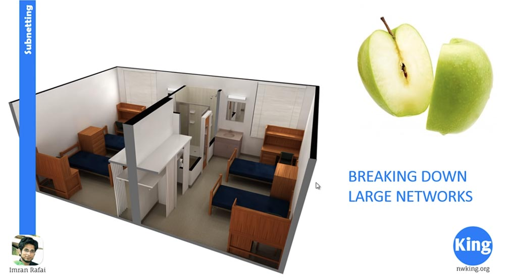

Если посмотреть на приведённый рисунок, вы увидите одно большое помещение, разделенное внутренней стеной на 2 отдельные комнаты. Точно также одну большую сеть можно разделить на несколько сетей и использовать их как отдельные сети. Для понимания сущности подсетей нам нужно немного поговорить об IP-адресах. Есть два типа IP-адресов: частные IP-адреса и публичные IP-адреса. Что же представляет собой частный IP-адрес?

В классе А эти адреса расположены в диапазоне 10.0.0.0 – 10.255.255.255, то есть имеется 16 777 216 частных IP-адресов этого класса. В классе В для частных адресов предусмотрен диапазон 172.16.0.0 – 172.31.255.255, и их общее число равно 1 048 576. В классе С эти адреса расположены в диапазоне 192.168.0.0 – 192.168.255.255, здесь есть ещё 65 536 частных адресов.

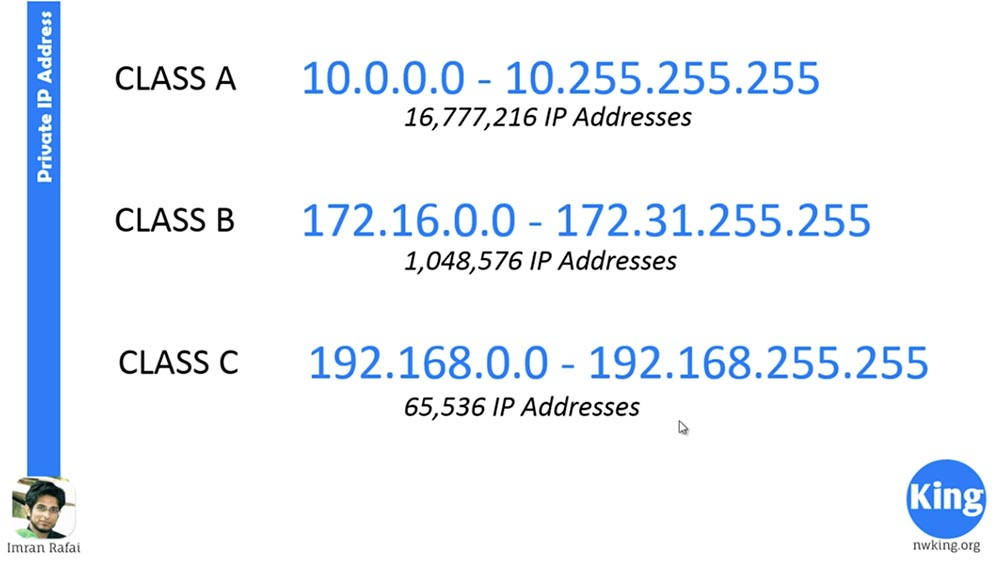

Чем отличаются публичные и частные IP-адреса? Частные IP-адреса – это адреса, которые не могут быть доступны в интернете. Так что если вы, вернее, ваш веб-сервер получает пакет, в котором сказано, что исходный IP — адрес 192 168 1.1, этот пакет будет немедленно отброшен, потому что получен с частного адреса, который может существовать только в локальной сети.

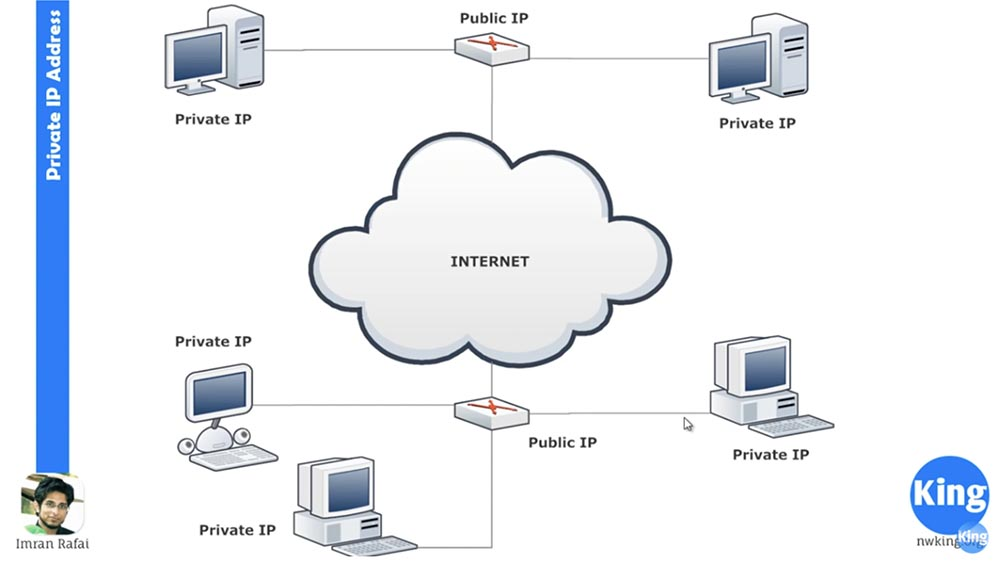

В современной ситуации, изображенной на рисунке, Интернет присваивает вашим роутерам публичные IP-адреса, обеспечивая общую доступность, и ваши компьютеры, которые имеют частные IP-адреса в локальной сети, подсоединены к роутеру, обеспечивающему доступ к Интернету. Сегодня интернет работает таким образом, но когда разработчики создавали IP — адреса версии 4, они надеялись, что все компьютеры в сети будут иметь отдельный уникальный общедоступный IP-адрес, уникальную IP-версию адреса.

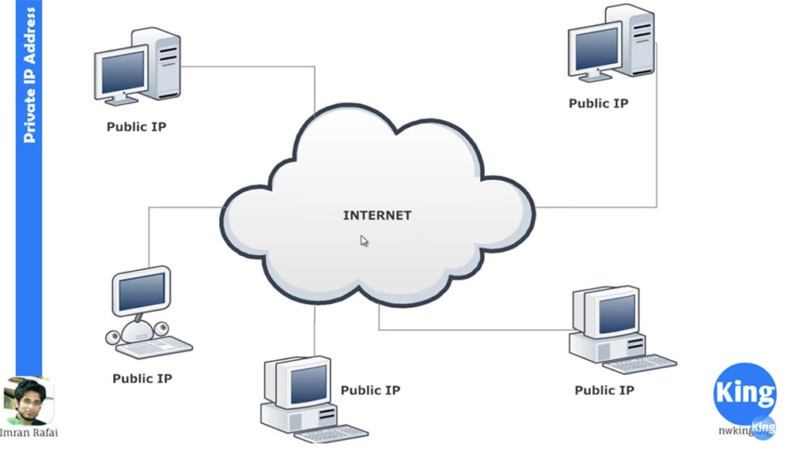

Они считали, что 4,2 миллиарда адресов в 32-х битной версии IPv4 будет вполне достаточно для всего мира, потому что не ожидали, что Интернет будет расти и развиваться с такой скоростью на протяжении последних десятилетий. Однако вскоре они поняли, что свободные IP-адреса версии 4 заканчиваются, и создали IP-адреса версии 6 вместе с соответствующими концепциями, такими, как NAT, о которой мы будем говорить позже. Понятие NAT расшифровывается как «Преобразование сетевых адресов». Таким образом, в IPv6 появились частные IP-адреса, которые решили проблему нехватки IP-адресов в общей сети интернет.

По мере развития техники все компьютеры, планшеты, мобильные устройства стали пытаться подключиться к интернету, поэтому на сегодня 4,2 миллиарда адресов составляют очень маленькое адресное пространство для быстро растущего интернета. С внедрением концепции NAT и появлением частных и общедоступных адресов резко уменьшилось количество адресов, которые присваивались каждому компьютеру, и теперь ни один компьютер не имеет IP-адрес, который обеспечивал бы прямую связь с интернетом. Поэтому, как только адреса IPv4 стали заканчиваться, возникла необходимость изменить весь дизайн интернета. Компании, в которых имеется несколько компьютеров, были вынуждены обращаться к провайдеру интернета, чтобы он назначал им частные IP-адреса для каждого из имеющихся в компании устройств. При этом происходило так, что интернет провайдер выделял им, например, диапазон 192.168. 1.0 — 192.168. 1.255, и как мы говорили в последнем видео, это составляло 254 действующих IP-адреса. Но если компания имела всего 10 компьютеров, получалось, что 244 адреса пропадали зря. Возникла ситуация, когда IP-адреса интернета стали очень быстро заканчиваться, и разработчики поняли, что им необходимо создавать подсети, которые бы делили общую сеть на отдельные сегменты.

Перед тем, как мы переедем к рассмотрению подсетей, давайте рассмотрим, как работают классы IP-адресов. Предположим, у нас имеется адрес 192.168.100.225 класса С и маска подсети 255.255.255.0.

Если преобразовать его в двоичную форму, мы получим вот что:

Из предыдущего видеоурока мы знаем, что разделение на номер сети и номер хоста для этого класса адресов происходит после третьего октета, а три октета из единиц в маске подсети означают ни что иное, как /24\. Воспользовавшись уже известной нам формулой, мы увидим, что наша сеть имеет 254 адреса хостов.

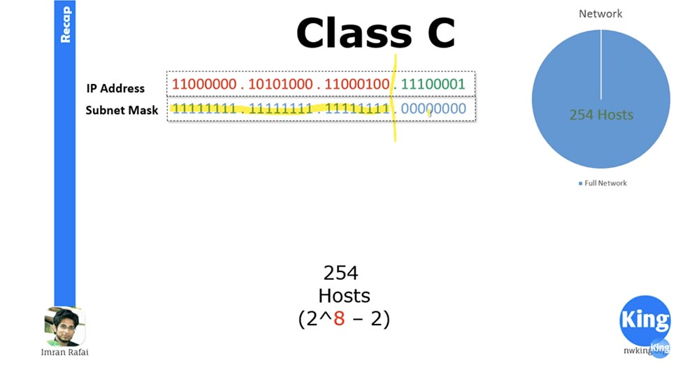

Когда мы приравниваем биты хоста нулю, получается нулевой адрес, который является идентификатором данной сети. Далее биты номера хоста начинают расти от единицы до тех пор, пока все биты последнего октета не превратятся в единицы, что в десятичном эквиваленте соответствует числу 255\. Таким образом, у нас образуется сеть, первый адрес которой будет равен 0, последний – 255, а между ними расположатся 254 действующих адресов хостов.

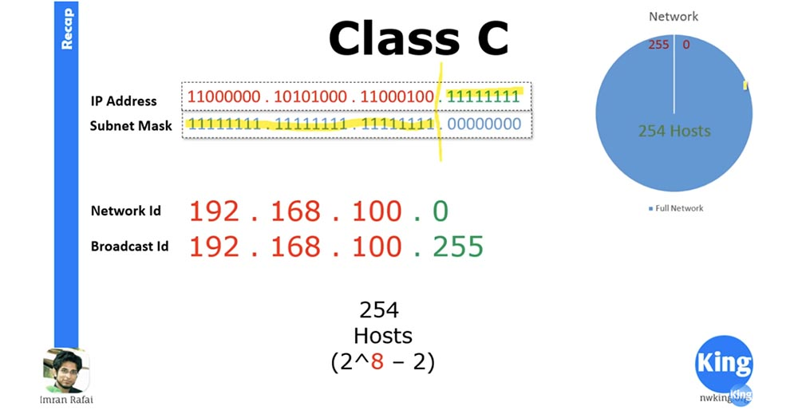

Давайте перейдём непосредственно к рассмотрению подсети. Возьмём тот же адрес 192.168.100.225 класса С и маску подсети 255.255.255.0.

Когда мы переходим к подсетям, у нас возникает понятие бесклассовых адресов.

Косая черта в данном случае обозначает собой CIDR (Classless Inter-Domain Routing) — метод бесклассовой адресации в компьютерных сетях на основе IP-протокола. Как только вы приступаете к созданию подсетей, вы берёте всю концепцию классов IP-адресов и выбрасываете её в окно, так как с этих пор мы будем иметь дело с бесклассовыми IP-адресами.

Итак, мы возьмём адрес 192.168.100.225, это IP-адрес класса C, это /24, но при этом мы не можем сказать, что у него есть класс C, потому что мы делаем подсети и теперь будем иметь дело с CIDR. Давайте попробуем разбить нашу сеть на две части, как это показано на рисунке. Представим яблоко, которое мы разрезаем пополам.

Мы занимаем один бит из номера хоста в последний октет, где у нас изначально были одни нули. Тогда линия, разделяющая номер сети и номер хоста, переместится на один знак вправо, и теперь все единицы, расположенные левее нулей, представляют собой сетевую часть адреса – я выделю её желтым цветом.

Итак, у нас имеются две отдельные сети — подсеть 1 и подсеть 2, для каждой из которых мы должны назначить идентификатор сети Network ID и широковещательный адрес Broadcast ID. Как же мы это сделаем? Мы видим маску подсети и её последний бит, который равен 1 и принадлежит месту значений 128, если вы помните таблицу преобразования двоичных чисел в бинарные – в этой таблице у нас имеется 8 столбцов, в которых слева направо расположены значения 128, 64, 32, 16, 8, 4, 2, 1. Это означает, размер блока адресов каждой из наших подсетей имеет размер 128, включая 0, таким образом, число хостов в каждой подсети будет равно 126, то есть 128-2.

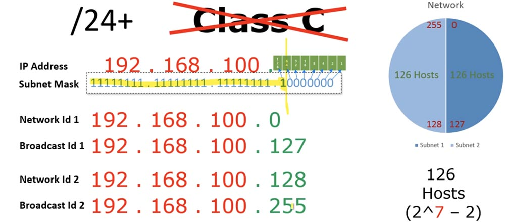

То есть у нас имеется 126 адресов плюс идентификатор сети и широковещательный адрес для каждой подсети. Теперь мы поступаем так: для первой сети идентификатор будет выглядеть как 192.168.100.0, а для второй идентификатор сети будет 192.168.100.128. Тогда широковещательный адрес первой подсети будет равен 128-1 = 127, и поскольку мы не можем превысить значение 255, то этот номер и будет означать широковещательный адрес второй подсети.

Это все, что нужно знать о том, откуда берутся подсети – они получаются заимствованием бита из номера хоста, служащего для создания сети, то есть вы разбиваете одну сеть на две. Говоря о заимствовании, давайте вспомним, что маска подсети у нас была 255.255.255.0.

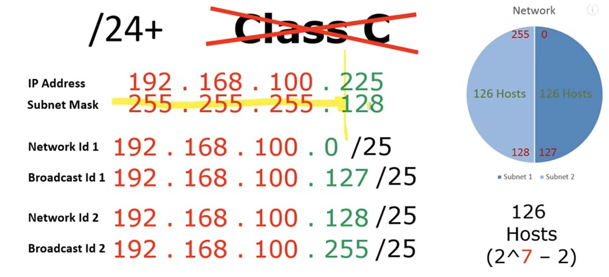

Из-за того, что мы одолжили один бит и добавили его в адрес маски подсети, наши адреса можно представить в виде /25, так как теперь маска подсети содержит не 24, а 25 бит. Для того, чтобы лучше понять концепцию подсети, рассмотрим другой пример. Возьмём IP-адрес 192.168.100.225 и маску подсети 255.255.255.192.

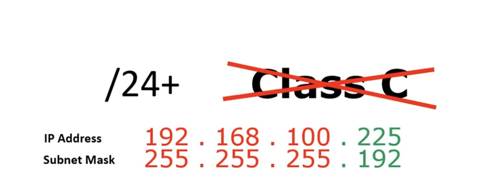

Преобразуем маску подсети в двоичную фору, так, что она будет выглядеть таким образом, то есть займём еще один бит из места значений 64.

Предыдущее разделение номера сети и номера хоста располагалось по синей линии, а новое разделение расположено по желтой линии. Поскольку последний бит находится в области 64, каждая из 4-х получившихся подсетей будет иметь размер блока, равный 64. То есть если целую сеть размером 256 разделить на 4, получается 64. При таком размере блока каждая подсеть будет иметь 62 действующих IP-адреса. Это число рассчитывается по формуле (26-2), где 6 – это количество 0 в бинарном выражении последнего октета маски подсети.

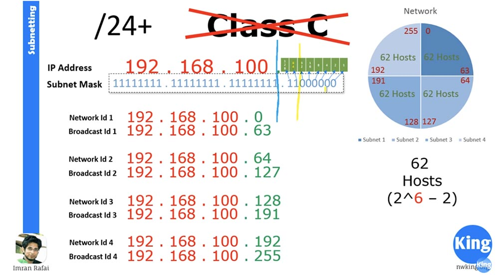

При этом идентификатор первой подсети будет иметь адрес 192.168.100.0, второй сети — 192.168.100.64, третьей 192.168.100.128 и четвертой 192.168.100.192. Широковещательные адреса получаются отниманием 1 от идентификатора последующей сети: 64-1 = 63, 128-1 = 127, 192-1 = 191 и последний равен 255. Эти адреса можно представить с /26, так как 192 ни что иное, как 2 заимствованных бита.

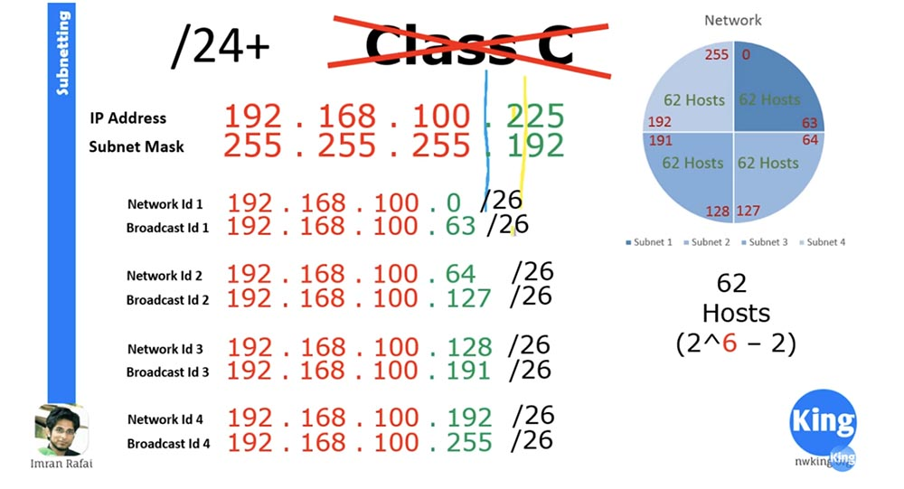

Я составил небольшую таблицу заимствований для IP-адресов класса С.

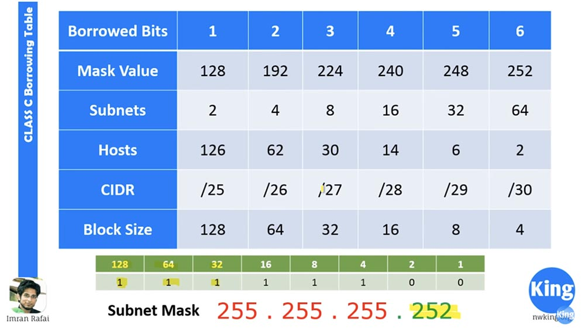

Если мы одалживаем 1 бит, значение маски равно 128, и адрес маски подсети будет иметь вид 255.255.255.128. При этом у нас получается 2 подсети. Откуда берётся такое количество? Это очень просто – нужно просто возвести 2 в степень, равную числу позаимствованных битов, поэтому 21 = 2. Как видно из нижней таблицы, при заимствовании 1 бита размер блока будет равен 128, а количество хостов, то есть число действующих адресов, всегда рано размеру блока минус 2, что в нашем случае будет равно 126.

CIDR будет равно /25, потому что если прибавить 1 заимствованный бит к выражению CIDR для адресов класса С, то есть к /24, то мы получим /25.

Если позаимствовать 2 бита, то значение маски будет 192, и адрес маски подсети примет вид 255.255.255.192. Из нижней таблицы видно, откуда взялось это число 192 – мы позаимствовали 1 бит пространства 128 и 1 бит пространства 64, а сумма 128 и 64 равна 192.

Заимствование 2-х битов создаёт 4 подсети, потому что 22 = 4. Размер блока равен 64, количество хостов 64-2 = 62, CIDR = /26.

Аналогично происходит при заимствовании 3-х битов: маска равняется 224, так как заимствование 3-х единичных битов согласно нижней таблице даёт в сумме 128+62+32 = 224, и адрес маски подсети будет 255.255.255.224. При этом у нас образуется 23= 8 подсетей с размером блока 32, количество хостов будет равно 32-2 = 30, а CIDR = /27.

Точно также происходит при заимствовании 4,5 и 6 бит, при этом образуется соответственно 16,32 и 64 подсети с количеством действующих IP-адресов 14,6 и 2.

Я не призываю вас запоминать все таблицу, достаточно помнить значения маски во второй строке: 128, 192, 224, 240, 248 и 252, которые соответствуют заимствованию 1,2,3,4,5 и 6 битов. Запомнить эти числа довольно просто. Размер блоков вы можете запомнить из нижней «волшебной» таблицы, просто суммируя значения из верхней строки над количеством заимствованных битов.

Значение CIDR также довольно просто запоминается, если прибавлять каждый раз 1 к /24. Всё это касается адресов класса С, об IP-адресах класса А и В мы поговорим в последнем видеоуроке 3-го дня.

Для лучшего понимания принципа создания подсетей рассмотрим пример. У нас имеются такие условия:

1). Требуется создать 3 подсети;  
2). Нужно использовать IP-адреса класса С вида 192.168.1.0;  
3). Определить идентификатор сети и широковещательный адрес для каждой подсети.

Во-первых, мы должны разобраться, можно ли разделить сеть на 3 подсети. Это невозможно, так как сеть можно разделить только на 2 или 4 подсети, количество подсетей всегда представляет собой четное число. Поэтому, чтобы получить 3 подсети, мы должны разбить общую сеть на 4 сегмента. Для этого мы должны одолжить 2 бита, и поскольку последний единичный бит расположен в таблице под числом 64, размер блока каждой из 4-х подсетей будет равен 64. Отняв от 64 два, получим 62 действующих адреса хостов.

Для получения идентификаторов сети каждой подсети Network ID начнём с адреса 192.168.1.0, каждый раз прибавляя в последний октет число 64:

192.168.1.0  
192.168.1.64  
192.168.1.128  
192.168.1.192

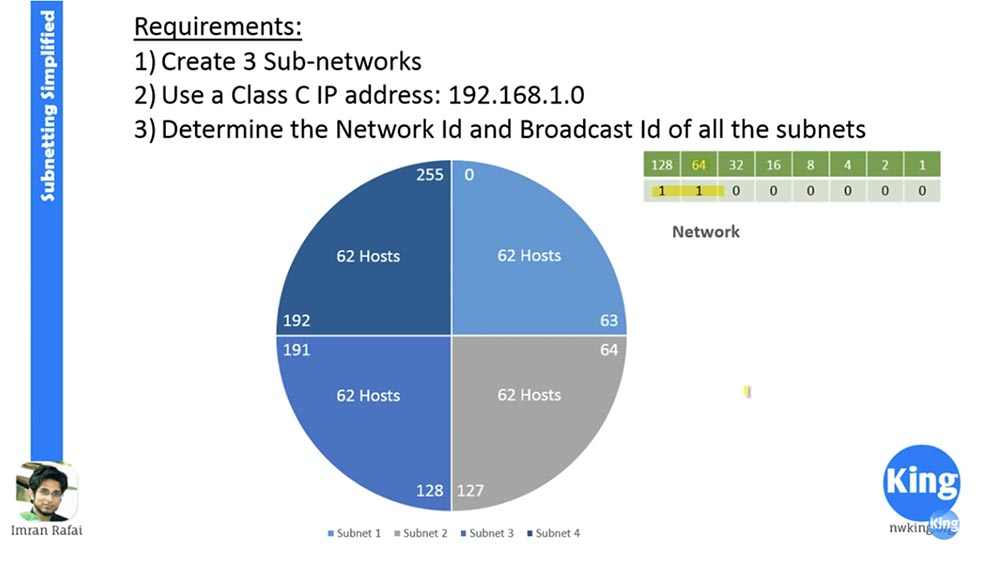

Для получения широковещательных адресов Broadcast ID мы будем отнимать единицу от идентификатора следующей сети: для первой подсети это будет 64-1=63, для второй 128-1=127, для третьей 192-1=1 и для четвертой это будет число 255. Как видите, это довольно просто. Вопрос типа «определите Network ID и Broadcast ID» является частью вашей работы в качестве CCNA, поэтому выполнение подобных вычислений в уме не должно составлять для вас никакого труда.

Обычно эти вопросы задают на экзамене, и если вы сейчас потратите достаточно времени на то, как быстро производить подобные вычисления в уме, то сэкономите время на экзаменационные ответы, чтобы как только вы увидите подобный вопрос, сразу же смогли вычислить значение идентификатора сети и широковещательного адреса и дать ответ.

Теперь попробуем ответить на такой вопрос: найдите Network ID и Broadcast ID для IP- адреса 192.168.225.212/27, то есть вам будет дана маска подсети, для которой нужно будет определить идентификатор сети и широковещательный адрес. Так как у нас имеется /27, мы знаем, что согласно «волшебной» таблице это число получается при заимствовании 3-х единичных битов: /24 +1 +1 +1 = /27, значит, каждая из имеющихся подсетей имеет размер блока 32, то есть каждая из подсетей имеет по 30 хостов.

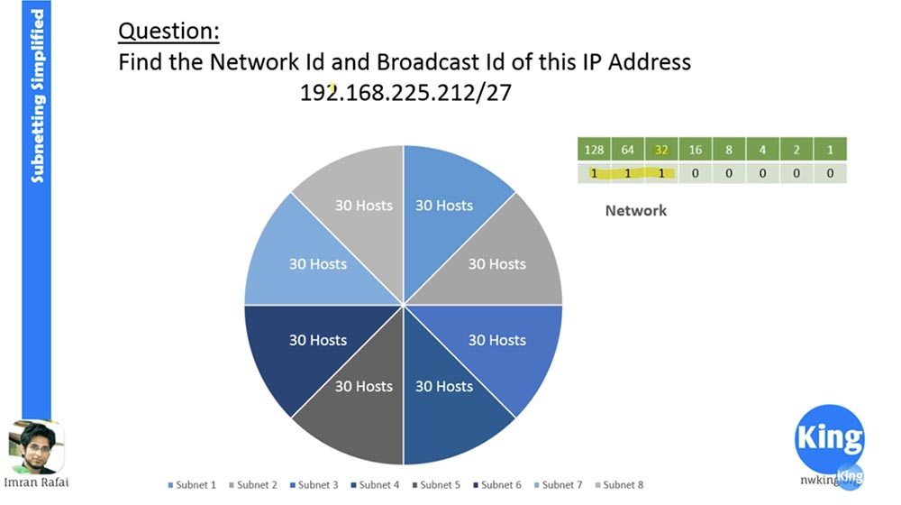

Поэтому мы начнём с адреса 192.168.255.0 – это будет идентификатор первой подсети, и начнём прибавлять по 32, получая таким образом идентификаторы всех остальных подсетей. Для определения широковещательных адресов нам надо будет отнимать 1 от идентификатора каждой следующей сети.

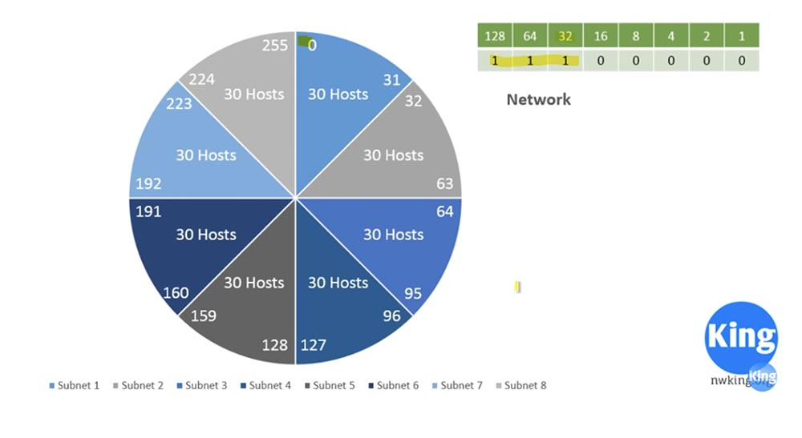

Если теперь посмотреть на последний октет нашего адреса 192.168.225.212, то мы увидим, что 212 находится между 192 и 223, то есть этот IP-адрес находится в седьмой подсети. В таком случае ответом на поставленный вопрос будет:

На экзамене вам будут задаваться подобные вопросы и будут предложены 4 варианта ответа, и если вы хорошо в этом разбираетесь, то сразу сможете выбрать правильный ответ и, не теряя времени, перейти к следующему вопросу.

Теперь давайте рассмотрим концепцию под названием VLSM, это сокращение от Variable Length of Subnet Mask, или «переменная длина маски подсети». Во всех предыдущих примерах мы делили сеть на части одинакового размера, то есть размеры всех подсетей были одинаковыми. Однако во многих случаях это не очень удобно или не соответствует потребностям. Давайте рассмотрим пример с такими условиями:

1). Требуется создать 3 сети для отделов маркетинга, продажи и управления;  
2). В сети отдела маркетинга используется 60 компьютеров, в сети отдела продаж – 100 компьютеров;  
3). Сеть отдела управления использует 34 компьютера.

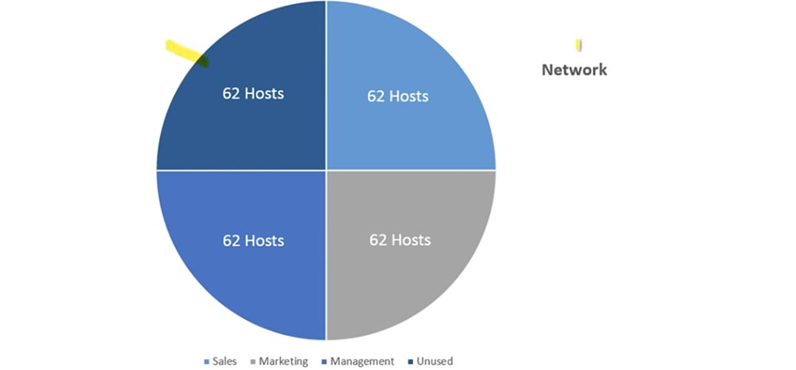

Как и в предыдущем примере, невозможно разбить сеть на 3 подсети, поэтому мы делим её на 4 подсети. Но в этом случае каждая из подсетей будет иметь только по 62 хоста, а в отделе продаж у нас имеется 100 компьютеров. Поскольку нам нужно всего 3 сети, последний четвертый сегмент является лишним. Поэтому мы попробуем разбить сеть таким образом:

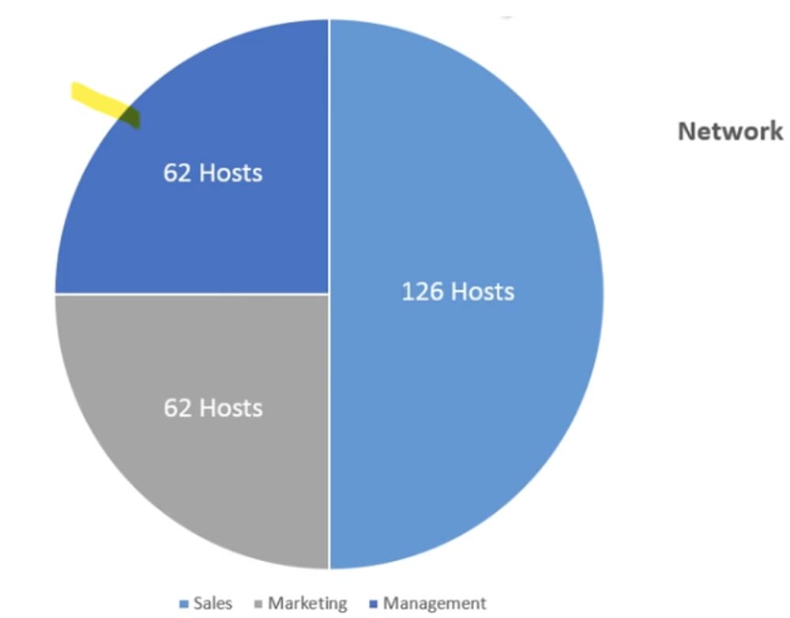

Теперь у нас получится 126 хостов для отдела продаж и по 62 хоста для отделов маркетинга и управления. Как мы это проделали?

Во-первых, нам нужно удовлетворить максимальные требования, в данном случае это создание сети на 100 компьютеров. Обратимся к «волшебной» таблице и посмотрим, сколько битов мы должны позаимствовать для такой сети. Если позаимствовать 1 бит, то у нас получится 126 действующих адресов. Можем ли мы позаимствовать 2 бита? Если мы это сделаем, то получим всего 62 действующих хоста, то есть не впишемся в условия задачи. Если мы позаимствуем 1 бит, то получим подсеть со следующими характеристиками:

Network ID: 192.168.1.0 /25  
Broadcast ID: 192.168.1.127 /25

Поскольку мы одолжили 1 бит, следующая сеть будет начинаться с идентификатора 128, поэтому широковещательный адрес первой подсети будет 128 — 1 = 127. Таким образом мы получим 126 действующих IP-адресов, что полностью удовлетворить потребности отдела продаж.

Следующим максимальным требованием является наличие 60 компьютеров в отделе маркетинга. В данном случае можно позаимствовать 2 бита, потому что согласно таблице при этом получится блок размером 64 адреса, из которых действующими будут 62 адреса. Поскольку последний адрес предыдущей подсети равен 127, идентификатор последующей сети будет 128.

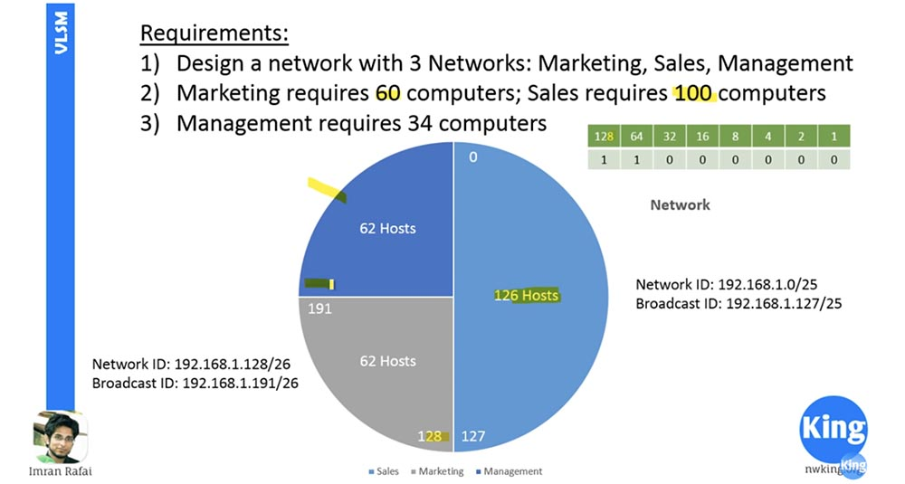

Тогда идентификатор второй подсети, подсети отдела маркетинга будет 192.168.1.128 /26, а широковещательный адрес — 192.168.1.191 /26, при этом 191 = 128+62+1. В предыдущей подсети у нас было /25, в этой появляется /26. Итак, мы получили 62 действующих адреса, которых вполне хватает для 60 компьютеров отдела маркетинга.

Теперь мы переходим к отделу управления, в котором имеется 34 компьютера. Мы не можем позаимствовать 3 бита, потому что в этом случае согласно таблице получим всего 32 адреса. Нам придётся использовать размер блока, равный 64, поэтому мы оставляем 2 заимствованных бита. Нам известно, что следующий IP-адрес, который служит идентификатором третьей подсети, будет иметь в конце число 192. Поскольку мы одолжили 2 бита, и размер блока будет 64, широковещательный адрес будет 192+64-1 = 255.

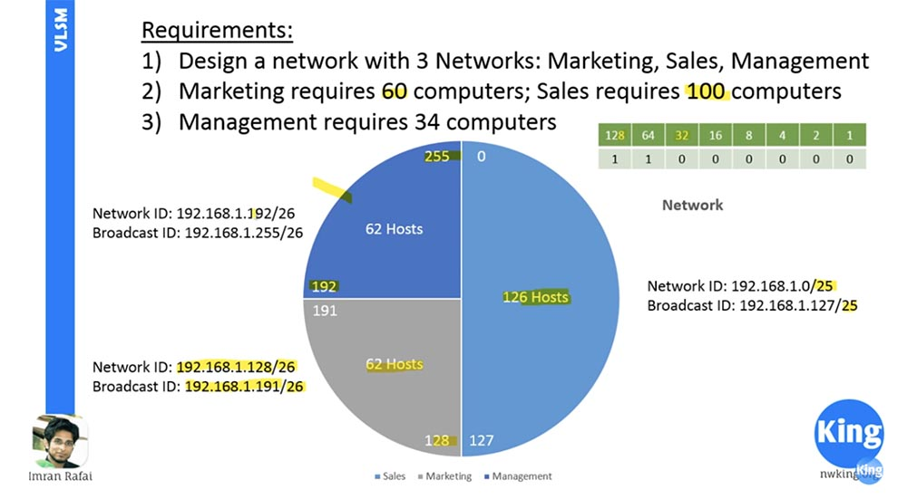

Идентификатор этой сети будет 192.168.1.192 /26, а широковещательный адрес 192.168.1.255 /26.

Как видите, всё это довольно просто. Конечно, вам понадобиться попрактиковаться в решении подобных задач, но зато потом вы легко сможете решать задачи на эту тему. Как я уже говорил, в следующем видеоуроке мы рассмотрим подсети с IP-адресами класса А и класса В и концепцию, которая носит название «суперсети». Мы также рассмотрим ряд экзаменационных вопросов CCNA и попрактикуемся в их решении. Повторю ещё раз – вы можете пересматривать это видео до тех пор, пока изложенный в нём контекст о строении подсетей не станет вам полностью понятен, и вы сможете решать эти задачи в уме, не пользуясь при этом ручкой, бумагой или калькулятором. Потому что понятно, что вы не сможете взять калькулятор на экзамен, так что даже не думайте об этом. Производите все вычисления в уме, так чтобы ответы на эти вопросы «отскакивали от зубов».

Выучите правила бинарных умножений и запомните двоичные таблицы, чтобы это стало вашей второй натурой, тогда вы легко быстро найти ответы на любые вопросы о строении подсетей.  
Как я обычно говорю, если у вас остались вопросы – обращайтесь непосредственно ко мне или оставляйте свои комментарии под этим видео. Благодарю за внимание!

Спасибо, что остаётесь с нами. Вам нравятся наши статьи? Хотите видеть больше интересных материалов? Поддержите нас оформив заказ или порекомендовав знакомым, **30% скидка для пользователей Хабра на уникальный аналог entry-level серверов, который был придуман нами для Вас:** [Вся правда о VPS (KVM) E5-2650 v4 (6 Cores) 10GB DDR4 240GB SSD 1Gbps от $20 или как правильно делить сервер?](https://habr.com/company/ua-hosting/blog/347386/) (доступны варианты с RAID1 и RAID10, до 24 ядер и до 40GB DDR4).

**VPS (KVM) E5-2650 v4 (6 Cores) 10GB DDR4 240GB SSD 1Gbps до весны бесплатно** при оплате на срок от полугода, заказать можно [тут](https://ua-hosting.company/vpsnl).

**Dell R730xd в 2 раза дешевле?** Только у нас **[2 х Intel Dodeca-Core Xeon E5-2650v4 128GB DDR4 6x480GB SSD 1Gbps 100 ТВ от $249](https://ua-hosting.company/serversnl) в Нидерландах и США!** Читайте о том [Как построить инфраструктуру корп. класса c применением серверов Dell R730xd Е5-2650 v4 стоимостью 9000 евро за копейки?](https://habr.com/company/ua-hosting/blog/329618/)